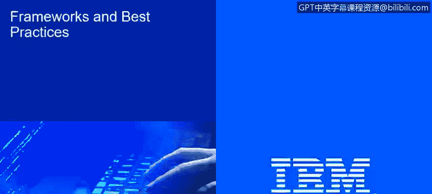
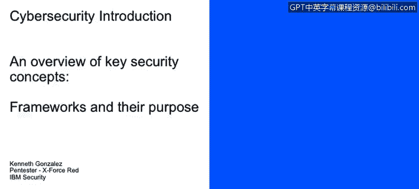
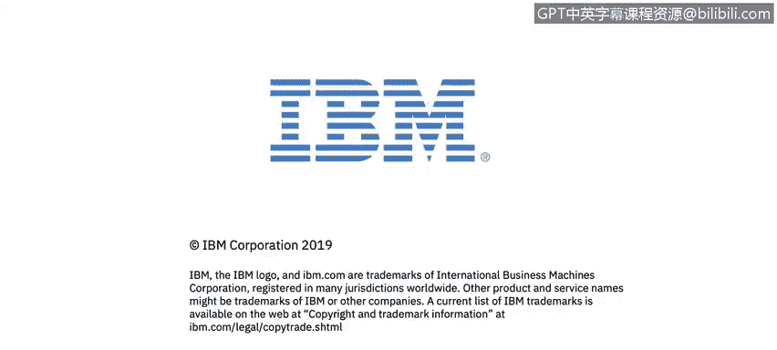

# 课程2：《网络安全角色、流程与操作系统安全》：42：3_01 框架及其目的

在本节课中，我们将学习如何描述框架、基线和最佳实践在有效网络安全策略中的目的。

本部分的主题是框架及其目的。我们将讨论框架，也将讨论最佳实践。这里需要明确区分**最佳实践、基线、框架**与**规范性要求和合规性**之间的不同。

在一个组织中，我们会接触到许多内容。例如，我们会接触到最佳实践、基线或框架。

框架的一个典型例子是 **COBIT**，而最佳实践的例子则有很多。在某些情况下，采用何种框架取决于你的业务性质。例如，**ITIL** 就是一个很好的框架。这些框架、基线和最佳实践都是很好的控制措施，能够提升和增强你的IT治理、IT流程、IT政策和IT程序。

这些框架、基线和最佳实践能够提升你系统的性能。例如，如果你遵循微软关于其数据库服务器加固的最佳实践，你将获得一个性能更优的 **Microsoft SQL Server**。然而，这些最佳实践和框架并非强制要求。它们是“锦上添花”的部分。遵循它们，你会获得许多良好的实践和控制措施，但如果不遵循，也不一定会对你的业务造成直接损害。

如果你没有遵循微软的服务器实施指南，没有遵循思科设备的配置指南，或者没有采用 **COBIT** 来改进公司的IT治理，你的业务不会因此倒闭，通常也不会因此与监管机构或政府产生问题。

在另一面，我们则有**规范性要求和合规性**。这里的区别在于，如果你的业务要求，你就**必须**实施规范性要求，**必须**达到合规标准。例如，**HIPAA** 是美国任何医疗保健公司都必须遵守的规范性法案。

在你的医疗保健公司里，你可以实施 **COBIT**，可以采用许多 **ITIL** 流程，可以在系统中应用所有供应商的最佳实践。但如果你不满足、不遵守 **HIPAA**，哪怕只是遗漏了两个要求或流程，你可能就无法在美国运营，并将面临美国政府的处罚，因为你没有遵守 **HIPAA**。

这就是基线、框架、最佳实践与规范性要求、合规性之间的主要区别。

😡 正如我们提到的，我们有许多可用的资源。例如，我们有最佳实践和框架这类方法论，可以在业务中实施，以改进业务处理技术的方式。

实际上，我们已经提到了其中的几个。我们可以提到 **COBIT**，可以提到 **ITIL**。在网络安全方面，我们有 **ISO 27000** 系列标准。我们还有 **CMMI**。我们有项目管理协会 **PMI** 提供的众多项目管理方法论。我们还有开发建议。

一旦你开始使用某种编程语言进行工作，你将获得大量文档和信息，其中包含了关于在软件和系统中应遵循的最佳实践，以避免任何可能损害或破坏你软件的安全事件或其他事故。

---

**总结**

本节课中，我们一起学习了网络安全中框架、基线和最佳实践的核心概念及其目的。我们明确了“锦上添花”的**最佳实践/框架**（如COBIT、ITIL）与“必须遵守”的**规范性要求/合规性**（如HIPAA）之间的关键区别。理解这些概念有助于构建更有效、更符合要求的网络安全策略。