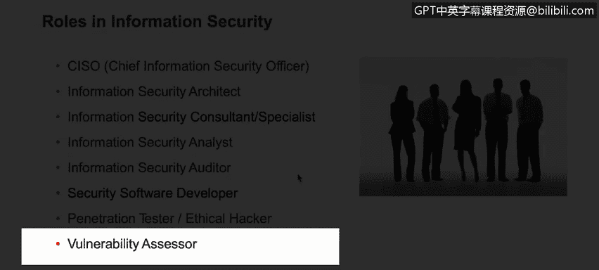

# 课程2：《网络安全角色、流程与操作系统安全》：43：4_02_信息安全中的角色

在本视频中，你将学习描述网络安全组织中典型的各类角色。

信息安全中的角色。

尽管这不是一份完整的角色列表，因为每个组织可能针对不同的信息安全领域设有特定角色，但这些都是你在大型组织中非常常见的角色。

以下是这些常见角色的列表：

*   **首席信息安全官**：这是一个相对较新的角色，其设立是为了确保信息安全部门有负责人来监督、管理并领导整个信息安全体系。
*   **信息安全架构师**
*   **信息安全顾问/专家**
*   **信息安全分析师**
*   **安全审计员**
*   **安全软件开发人员**
*   **渗透测试员**：也被称为红队成员。
*   **漏洞评估员**
*   **数字取证分析师**：例如，属于蓝队成员。
*   **安全工程师**：熟悉不同安全技术的人员。

所有这些角色都非常重要。如果你注意到，这些角色早已存在于IT领域，但现在我们为其增加了安全部分，使其更加专业化，并确保它们是安全导向的。它们确保并保证组织遵循安全最佳实践和标准。

接下来，我们简要介绍其中几个关键角色。

**首席信息安全官**：如前所述，这是一个高级管理职位，是安全部门的负责人。此人负责监督整个安全部门及其员工。这是一个非常重要的角色，在过去并不常见，但现在在组织中看到这个特定职位或角色已非常普遍。

**信息安全分析师**：这更像是一个日常分析岗位。此人负责分析事件、警报以及任何可能有助于识别威胁的信息。因此，此人应该能够验证或分析由安全信息和事件管理平台收集的事件，例如能够理解和调查来自这些特定SIEM平台的警报，或与特定设备健康检查相关的任何警报，以及任何可能实际导致潜在威胁的信息。例如，如果入侵防御系统向SIEM发送了威胁警报，信息安全分析师应该能够前往SIEM获取警报、调查事件，甚至前往IPS了解具体是什么触发了警报，并能够跟进直至问题解决。

**信息安全审计员**：另一方面，此人负责测试计算机信息系统的有效性，以确保它们遵循最佳实践和特定标准，例如ISO 27001或27002。他们确保组织至少遵循这些法规中定义的最佳实践，并使组织得到尽可能充分的保护。

---

**本节课总结**

本节课中，我们一起学习了网络安全组织中常见的各类角色。我们了解到，许多IT角色通过增加安全职责而演变为专门的信息安全岗位，例如首席信息安全官、信息安全分析师和安全审计员。这些角色共同确保组织能够遵循安全标准、分析威胁并维护系统的整体安全。理解这些角色是构建有效网络安全团队的基础。