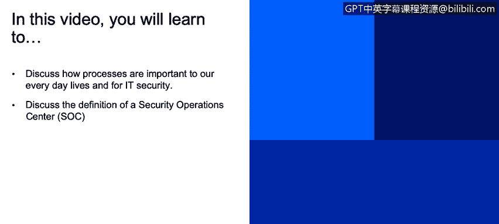
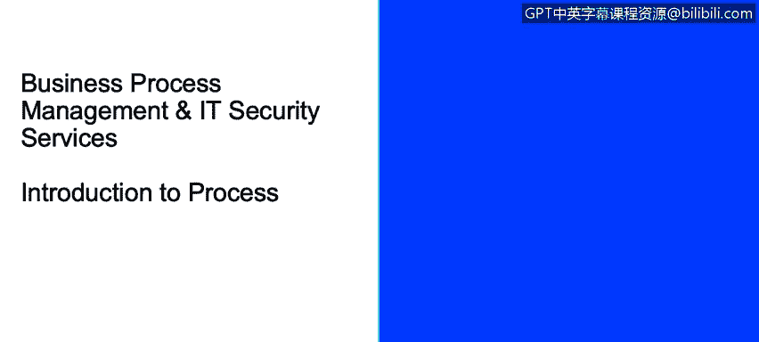
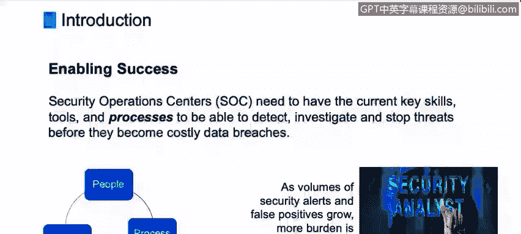

# 课程2：《网络安全角色、流程与操作系统安全》：44：5_01 流程简介

在本节课程中，我们将学习流程如何影响我们的日常生活和IT安全，并探讨安全运营中心的定义。

大家好，欢迎来到业务流程管理与IT安全服务的培训课程。

我是乔·斯皮诺，IBM公司的业务流程分析师。

今天，在简要介绍业务流程管理之后，我将提供一些见解和培训内容。

我们将涉及业务流程管理、IT基础架构库，以及深入探讨一些ITIL流程。所有这些都与IT安全服务相关。

现在让我们开始。

流程是我们日常生活的一部分。无论是在个人生活还是职业工作中，我们都在参与各种流程。

以下是一个例子。

这或许是我昨天的经历：我需要从支票账户中取一些钱。于是我开车去了当地的银行，找到自动取款机。

我插入借记卡，这实际上启动了整个流程。在内部，作为外部客户的我所看不到的是，银行系统正在进行一系列验证检查。

系统会检查我的卡片，试图确保没有欺诈行为，确认我的卡片没有被报失。这是一个验证流程，是内部执行的一系列步骤。

接着，我输入个人识别码，系统对其进行验证。系统检索我的账户信息，查看我的账户余额，确认我有足够的钱可以提取。

在完成所有检查后，它询问我想取多少钱。我在键盘上输入金额。它询问我需要的钞票面额。

然后，系统更新我的账户并发放现金。现金吐出，我的小卡片弹出。流程的最后一步是，它吐出一张小收据，我拿着收据开车离开。

这个清晰的流程有明确的开始和结束。我通过插入借记卡启动了它。

现在，作为IT安全专业人员，流程在我们的工作中非常重要。

众所周知，网络攻击和警报正在增加。管理这种环境的复杂性也在增加。攻击持续不断，针对我们的IT资源和资产。

因此，我们IT安全专业人员需要投入更多时间、精力和注意力在这方面，尤其是安全分析师。

因此，掌握流程、方法和标准方面的技能非常重要。因为保护我们的公司免受外部网络攻击是一项关键的工作，在当今时代非常必要。

作为IT专业人员，我们将使用的人员、流程和工具都需要为特定流程和谐地协同工作。

安全运营中心在你们公司或根据你们的经验可能有不同的称呼，但它基本上是一个技能和资源的集合体，致力于检测、调查和阻止威胁。

在IBM，我们称之为安全运营中心。在这些SOC中，我们必须拥有具备正确技能的员工和正确的工具集。

例如，自动化工具。因为如果我们能够将以前的手动任务自动化，就能提高我们解决出现问题的速度。

所以，技能、工具集和流程，即人员、工具和流程，是业界看待这个三重模型的一种方式。

成功的关键在于实施标准化、可重复且可衡量的流程。

---

**课程总结**

在本节课中，我们一起学习了流程在日常生活和IT安全中的重要性。我们通过一个银行取款的例子，理解了流程具有明确的起点、终点和一系列步骤。作为网络安全分析师，认识到标准化、可重复的流程对于有效管理安全事件、协调人员与工具至关重要。我们还了解了安全运营中心的核心职能是整合资源以应对威胁。掌握这些基础概念，是构建高效安全防御体系的第一步。