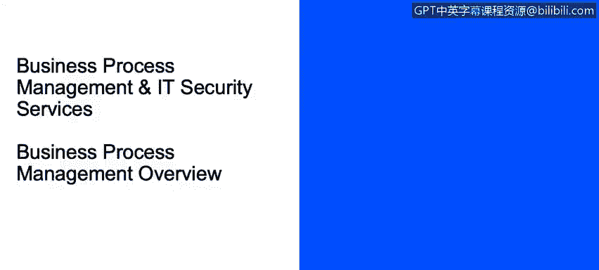
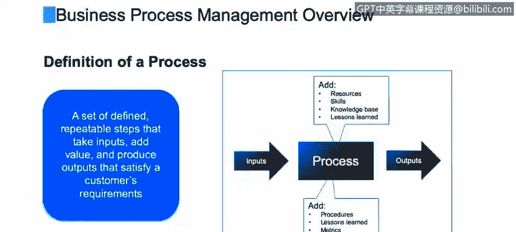
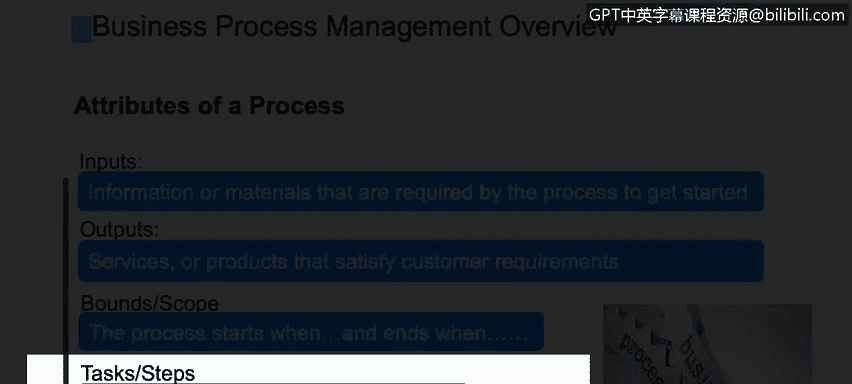

# 课程2：《网络安全角色、流程与操作系统安全》：45：6_02 业务流程管理概述

在本视频中，你将学习如何定义一个流程及其属性，描述标准的流程角色，解释流程成功的关键因素，并描述流程绩效指标。

我们将对业务流程管理（通常简称为BPM）进行一个概述。

关于流程的定义多种多样，这取决于作者或信息来源。在你的公司里，它可能被称为BPM、QPM（质量流程管理）、六西格玛、敏捷、精益或CP等不同名称。但无论名称如何，其核心都应包含我们共同追求的基本要素。

一个流程本质上是一系列**定义明确、可重复的步骤**。这些步骤接收输入（如图所示），通过应用知识、技能和资源进行处理并增加价值，最终产生符合客户（无论是内部还是外部客户）要求的输出。

## 流程的属性

每个流程都应具备以下属性：

*   **输入**：进入流程的信息、数据或原材料，它们被流程使用，并常常是启动流程的触发点。例如，将借记卡插入ATM机就是一个输入。
*   **起点与终点**：每个流程都应有明确的开始和结束。
*   **输出**：流程产生的成果，可以是服务、支持或实体产品。输出必须满足最初的客户要求。
*   **边界**：流程应有明确的边界，即“从这里开始，到这里结束”，不能无限延伸。
*   **任务/步骤**：流程中执行的具体操作或行动，是导致产出的“执行”部分。

## 流程文档与角色

流程文档至关重要，它用于培训、统一理解、审计和合规。在IBM，我们通常采用三层文档方法：

1.  **高层级**：一页纸的概要，展示流程的起点、终点和中间的主要环节。
2.  **中层级**：泳道图，从左到右展示流程，每个角色占据一条“泳道”，清晰描述任务和交接。
3.  **低层级**：详细的操作指南，描述“如何”完成每个具体任务。

流程中通常涉及以下角色：

*   **供应商**：为流程团队提供输入。
*   **请求者**：向流程团队提出需求，通常是流程的启动者。
*   **团队领导/主题专家**：监督流程执行，提供支持并解决问题。
*   **处理者**：执行流程中的一个或多个步骤。
*   **审批者/评审者**：在流程继续前，对某些任务进行批准或质量检查。

一个关键原则是**职责分离**。例如，请求者不应同时是审批者，以确保良好的业务实践。

## 流程成功的关键因素

以下是确保流程成功的一些关键要素：

*   **章程**：描述流程的目的、存在原因、目标及利益相关者，是理解流程的“菜单”。
*   **明确的目标**：清晰、可衡量的目标，达成这些目标意味着实现了整体目的。
*   **治理与所有权**：指定一位**流程负责人**，他对流程的成功负责，是向上级管理层汇报的对接人。
*   **可重复性**：确保每次执行的输出一致，减少因人员操作偏好不同而导致的**变异**。
*   **自动化**：减少容易出错的手动操作，节省时间和成本。
*   **绩效指标**：收集可量化的指标，定期评估流程表现。

## 流程绩效指标

我们需要测量流程以理解和改进它。以下是一些常见的绩效指标类别：

*   **周期时间**：衡量一个事件、一系列步骤或端到端流程所需的时间。公式可表示为：`周期时间 = 流程结束时间 - 流程开始时间`。
*   **质量**：包括输入质量、输出质量以及过程中的质量。许多公司会进行抽样检查。
*   **成本**：与流程相关的各项成本，如缺陷成本、延误成本、员工加班成本等。
*   **返工**：指需要“重做”的工作。返工会导致时间、资源和材料的浪费，需要测量并找到根本原因以消除它。

## 持续流程改进

持续流程改进（CPI）是一个持续循环的过程，关键在于定期审查流程绩效指标、收集客户反馈、进行成熟度评估以及审视财务表现。组建小型改进团队非常有效，因为实际执行流程的员工往往能提出宝贵的改进想法。

## 总结

本节课我们一起学习了业务流程管理的基础知识。我们定义了流程及其核心属性，介绍了流程中的标准角色和职责分离原则，探讨了确保流程成功的关键因素，并学习了如何通过周期时间、质量、成本和返工等指标来衡量与改进流程。理解这些概念是构建高效、可靠业务流程的基础。