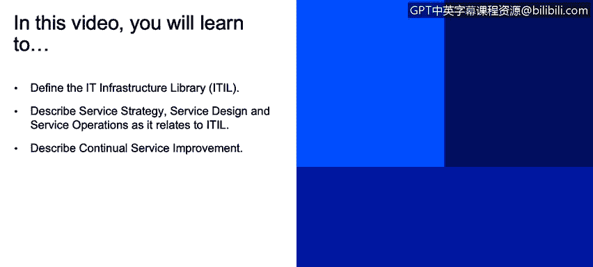
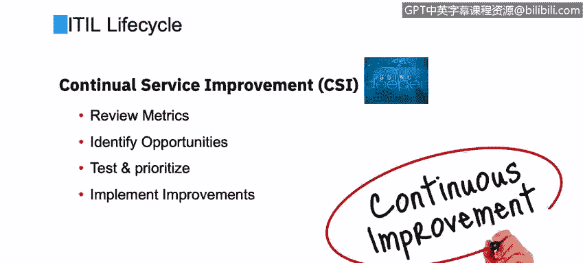

# 课程2：《网络安全角色、流程与操作系统安全》：46：7_03 ITIL概述

在本节课程中，我们将学习定义IT基础设施库，并描述与ITIL相关的服务战略、服务设计和服务运营。我们还将描述持续服务改进。

## 概述

在本节中，我们将介绍ITIL及其生命周期。ITIL并非IBM的发明或开发成果，它是由行业专业人士和顾问在多年前制定的。它是一个优秀的方法和框架，被视为一种最佳实践框架。许多不同类型的公司，包括公共和私营部门，以及IBM内部的许多组织，都在使用它。这个框架为公司提供了指导，它描述了IT组织如何更好地组织并通过实施的IT流程提供业务价值。

## ITIL生命周期阶段

ITIL的开发者提出了一个非常符合逻辑流程的生命周期阶段，包括：战略、设计、转换、运营和改进。这是一个非常合乎逻辑的进程。

### 服务战略

上一节我们介绍了ITIL的整体框架，本节中我们首先来看看服务战略。作为公司IT组织的一员，我需要制定一个战略，说明我将如何支持我的客户，即公司内部的许多业务部门，如财务、营销、广告和销售团队。IT组织将如何支持他们并提供什么服务？这实际上是关于理解我的服务产品、能力以及我能为客户提供什么。

在服务战略下，ITL定义了一系列子流程，以下是一些例子：

*   **服务组合管理**：管理我们提供的服务组合。例如，我们为内部组织提供帮助台支持。
*   **财务管理**：为实现IT或安全组织的战略目标进行预算、会计等工作。
*   **需求管理**：理解和预测客户（无论是外部客户还是内部业务部门）可能提出的需求。
*   **业务关系管理**：维护与内部或外部客户的积极关系，确保我们听取他们的意见并采取行动。

服务战略是许多组织的起点。虽然我们可能已经有一些IT流程，不一定在制定新战略，但ITIL提供了一种审视和改进现有战略的方法。

### 服务设计

在了解了战略之后，接下来我们进入服务设计阶段。这个阶段涉及设计新的IT安全服务，以及对现有服务进行更改。

以下是服务设计阶段的一些关键子流程：

*   **服务目录管理**：确保创建并维护一个包含我们所提供所有服务准确信息的目录。
*   **服务级别管理**：有时称为SLA管理，即与客户就性能水平达成的书面或共识条款，设定目标并衡量绩效。
*   **信息安全管理**：确保组织信息的机密性、完整性和可用性。
*   **供应商管理**：确保与必要的供应商签订合同，以支持IT安全团队开展工作。

### 服务转换

设计完成后，我们需要将服务付诸实施，这就是服务转换阶段的目标。服务转换旨在构建和部署IT服务，无论是新的还是变更的，并将其从当前状态过渡到稳定状态。

以下是服务转换阶段的一些核心流程：

*   **变更管理**：控制所有变更的生命周期，确保变更的质量。
*   **项目管理**：协调资源以部署项目，例如在环境中发布新版本。
*   **发布与部署管理**：规划、调度和控制版本向测试及生产环境的移动。
*   **服务验证与测试**：确保部署的版本和最终的服务满足客户期望。
*   **知识管理**：收集、分析、存储知识和信息，以便在组织内共享。

在所有转换活动中，沟通至关重要，以避免因变更导致意外中断。

### 服务运营

经过转换阶段，我们进入了服务运营阶段。我称之为“稳定状态”，因为此时我们正在执行和监控服务。

以下是服务运营阶段的一些关键流程：

*   **事件管理**：确保配置项和服务被持续监控，对事件进行分类并采取适当行动。
*   **事故管理**：管理所有事故的生命周期。
*   **问题管理**：管理所有问题的生命周期。

服务运营的目标是确保我们向业务部门或外部客户提供的IT服务能够有效且高效地交付。通过标准化、可重复的IT安全流程来减少差异，是实现这一目标的关键。

### 持续服务改进

最后，我们来到ITL生命周期的最后一个阶段，也是我个人非常喜欢的阶段——持续服务改进。顾名思义，它正如我们之前讨论的，是一个持续的过程。

持续服务改进包括以下活动：

*   持续审查指标。
*   识别当前服务流程中的差距。
*   寻找改进方向，努力缩小差距。
*   测试并确定优先改进项。
*   选择并实施最佳改进机会。

这是一个持续的循环，始终致力于改进。

## 总结

本节课中，我们一起学习了IT基础设施库的核心概念及其生命周期。我们详细探讨了ITIL的五个关键阶段：服务战略、服务设计、服务转换、服务运营和持续服务改进。每个阶段都包含一系列旨在帮助IT组织更高效、更规范地交付和管理服务的子流程。理解并应用ITIL框架，有助于网络安全团队更好地组织流程，为业务提供持续稳定的价值。