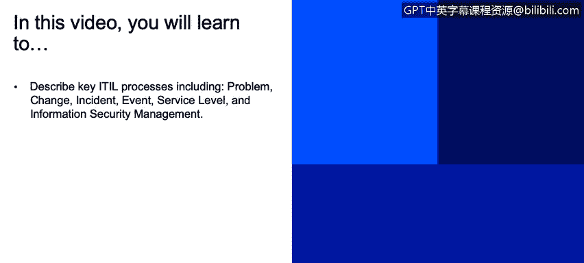

# 课程2：《网络安全角色、流程与操作系统安全》：47：8_04 关键ITIL流程

在本节课程中，我们将学习描述关键的ITIL流程，包括问题管理、变更管理、事件管理、服务级别管理和信息安全管理。

上一节我们简要介绍了ITIL框架，本节我们将深入探讨其中几个核心流程。网络上有很多资源，你可以通过搜索ITIL找到详细的维基百科页面和提供咨询服务的组织。这里提供的内容只是一个高度概括的概述，并非详尽无遗。

**问题管理**
问题管理负责管理所有问题的生命周期。在ITIL中，问题被定义为一个或多个事件的未知原因。问题管理的目标不仅是解决出现的问题，更是要找出事件的根本原因，从而最大限度地减少此类事件的再次发生或降低未来事件的影响。其核心在于寻找并解决问题的根源，而事件管理则侧重于将服务恢复到正常水平。

**变更管理**
顾名思义，变更管理涉及对基线服务资产、流程或ITIL生命周期中五个阶段的配置项进行更改。其目标是确保使用标准化的方法和程序来有效地实施变更。变更可能涉及配置项、流程步骤、任务或系统。沟通在此过程中至关重要，以减少服务中断并支持回退活动。

以下是ITIL变更管理中的一些典型阶段：
*   **识别变更**：确定需要进行哪些变更。
*   **规划变更**：制定变更的实施计划。
*   **评估影响**：分析变更可能带来的影响。
*   **获取批准**：获得必要的授权。
*   **调度与实施**：安排并执行变更。
*   **变更评审**：在实施后进行回顾，分析成功与不足之处。
*   **关闭**：完成变更流程。

ITIL在线文档对这些阶段有更详细的描述。

**事件管理**
我们之前简要讨论过事件管理。其目标是尽快恢复正常服务运营，并将对业务运营的负面影响降至最低。这与我们制定的服务级别协议直接相关。事件是指对IT服务的非计划性中断或IT服务质量的降低。

以下是事件管理生命周期中常见的阶段：
*   **记录**：将事件记录下来。
*   **分配**：指派给负责解决的人员。
*   **跟踪**：监控事件处理进度。
*   **分类**：按照组织或ITIL的标准对事件进行分类。
*   **优先级排序**：确定处理的先后顺序。
*   **解决**：处理并修复事件。
*   **关闭**：完成事件处理流程。

**事件管理**
事件可能表明某些功能运行不正常。事件是指任何对IT基础设施管理或IT服务交付具有重要意义的、可检测或可辨别的发生情况。在事件管理中，我们创建和检测通知。监控功能对于检查状态也至关重要。

**服务级别管理**
这涉及SLA的规划、协调、起草、监控和报告。我们之前讨论过，我们应该与内部或外部客户签订SLA，并设定一个客观的绩效标准。通过测量，如果我们未能达到该水平，就知道需要进行调整。

**信息安全管理**
最后一个要概述的是信息安全管理。它描述了在管理组织中结构化地融入信息安全。这是我们作为信息安全专业人员参与的核心。它涉及制定和维护信息安全策略以及针对战略、目标和法规各个方面的具体政策。

IT安全的一些目标包括：
*   **真实性**：确保信息或用户的真实身份。
*   **可问责性**：确保行动可以追溯到责任人。
*   **不可否认性**：防止实体否认其执行过的行动。
*   **可靠性**：确保系统和服务持续稳定地运行。

我建议你更多地研究ITIL和业务流程管理，因为它为我们的IT安全组织提供了一个极佳的框架。

**总结**
本节课我们一起学习了ITIL框架中的几个关键流程：问题管理致力于寻找并解决事件的根本原因；变更管理确保变更以标准化、受控的方式进行；事件管理旨在快速恢复服务；事件管理监控IT环境中的可检测活动；服务级别管理通过SLA设定和监控服务绩效；信息安全管理则是将安全策略和管控融入组织管理的核心。理解这些流程对于构建一个有效、安全的IT服务管理体系至关重要。