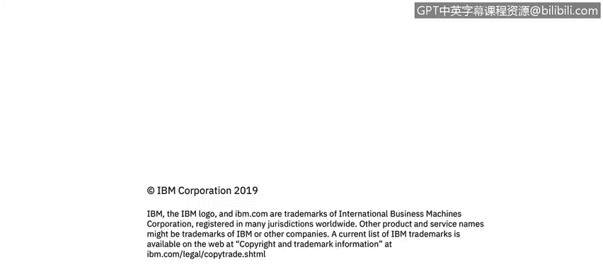

# 课程2：《网络安全角色、流程与操作系统安全》：48：9_01_CIA三要素简介

在本模块中，我们将学习信息安全的核心基础。Elilio和John将讲解被称为CIA三要素的概念，即**机密性**、**完整性**和**可用性**。随后，来自哥斯达黎加IBM安全运营中心的Priscilla Mariel Guzman Angello将分享她作为安全分析师的日常工作，并描述她如何运用相关技能。我们还将了解信息安全论坛，这是一个致力于调查、阐明和解决信息安全与风险管理关键问题的非营利组织。信息安全论坛为其成员开发满足业务需求的最佳实践方法、流程和解决方案。

让我们开始学习。

