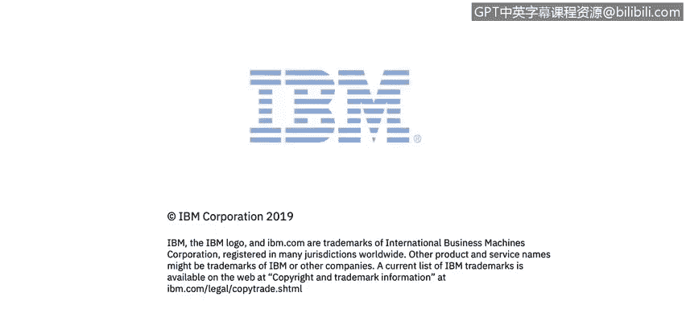

**课程2：《网络安全角色、流程与操作系统安全》：52：网络安全从业者的日常工作与挑战** 🛡️

在本节课程中，我们将通过IBM安全专家Priscilla Guzman的分享，了解网络安全领域一线从业者的日常工作内容、所需技能以及这份职业的挑战与价值。

大家好，我是Priscilla Guzman。我在IBM哥斯达黎加公司的网络安全部门工作。

我的职位是**MCn管理员**，需要持续处理IBM安全信息与事件管理软件可能出现的各种技术问题。

每天都有新的挑战，所以没有所谓“典型”的一天。

为了应对这些挑战，我们需要掌握和使用多种工具。以下是工作中常用的一些工具和持续学习的方法：

*   **工具应用**：有时我们必须使用诸如**Splunk**和**QRadar**这样的工具。
*   **知识提升**：或者考虑考取该领域的相关认证来提升我们的专业知识。

我们必须保持持续学习，我认为这有助于我紧跟新技术以及新出现的网络攻击和威胁。

对我来说，在网络安全领域工作最有价值的部分，是能够帮助客户保护他们的敏感数据和环境，抵御我们每天可能面临的攻击。

就我个人而言，我认为这是当前最好的技术类工作之一。

谢谢。

在本节课中，我们一起了解了网络安全管理员角色的日常工作状态。我们认识到，这份工作需要不断应对新挑战、熟练使用专业工具（如Splunk和QRadar），并且必须通过持续学习和考取认证来保持知识更新。其核心价值在于保护客户的数据与环境安全，使其成为一项充满挑战与成就感的职业。