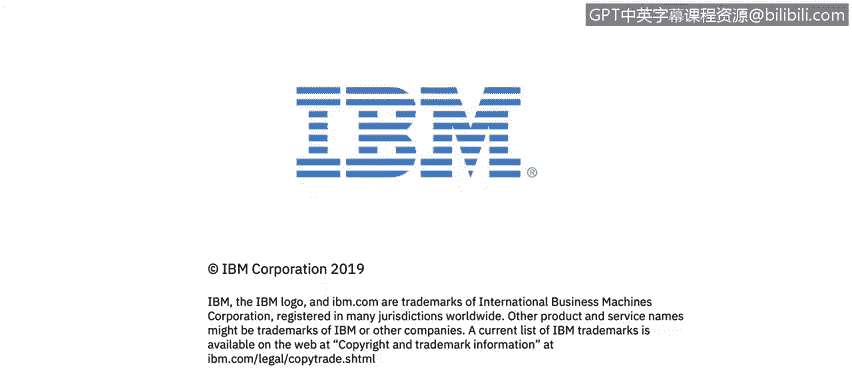

# 课程2：《网络安全角色、流程与操作系统安全》：53：14_01_认证与访问控制简介

## 概述
在本节课中，我们将学习认证与访问控制的基本概念。课程将介绍开放Web应用安全项目及其使命，并引导你通过研究练习来提升网络安全研究技能。

## 课程内容

在模块3中，Elio和John将继续围绕访问控制和授权展开网络安全讨论。

接下来，我们将探索开放Web应用安全项目，该项目也被称为OWASP。

OWASP的使命是让软件安全变得可见。

这种可见性使得组织内的所有成员都能识别出潜在的安全威胁。

《访问控制参考手册》是一个大型参考手册系列的一部分，该系列为访问控制和授权威胁提供了简明、可操作的数据与指导。

以下是本模块的一个实践环节：你需要利用OWASP基金会发布的十大安全风险项目进行一次研究练习，以磨练你的网络安全研究技能。

让我们开始吧。

## 总结
本节课我们一起学习了认证与访问控制的重要性，认识了OWASP项目及其在提升软件安全可见性方面的作用，并了解了如何通过研究OWASP十大安全风险项目来实践和提升网络安全研究能力。