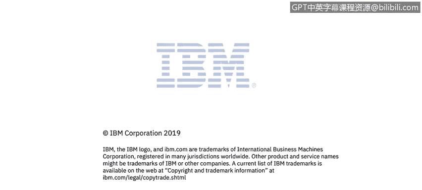

# 课程2：《网络安全角色、流程与操作系统安全》：54：身份识别与AAA

在本节课程中，我们将学习网络安全背景下的身份识别与AAA概念。我们还将探讨三种身份验证类型以及控制措施的使用。

## 身份识别与AAA概述

身份识别与AAA是网络安全访问控制的基础框架。AAA代表**认证（Authentication）、授权（Authorization）和审计（Accounting）**。接下来，我们将逐一解析这些核心概念。

## 什么是身份识别？🔑

身份识别是我们向资源声明自己身份的第一步。这可以通过用户名和密码实现，也可以通过令牌实现。

让我们以登录社交网络为例。当我们提交用户名和密码后，应用程序或资源将根据其存储的信息对我们进行认证。它会确认在该环境中确实存在我们对应的账户。

之后，系统将对我们进行授权，即赋予我们访问信息的相应权限。在社交网络的例子中，我们应被分配一个用户类型的角色，而不应获得任何管理员类型的权限。

最后，我们将对自己使用该身份所做的一切行为负责。我们在之前的章节讨论过这一点，即我们需要对使用该已验证身份执行的所有操作负责。

为了更好地理解其工作原理，我们总结一下流程：为了使用资源，我们首先需要进行身份识别以获得预设的权限和授权。当我们使用该资源时，我们的行为将被记录，从而实现可审计性。

## 身份验证方法 🔐

身份验证方法有很多种，可以概括为以下三类：

以下是三种主要的身份验证因素：

1.  **你知道的东西**：例如用户名和密码。
2.  **你拥有的东西**：通常用于提升银行交易等场景的安全性，例如令牌或智能卡。
3.  **你固有的特征**：这通常属于生物识别控制范畴，例如指纹。

上一节我们介绍了身份验证的三种因素，现在让我们更具体地看看每种因素的应用。

**你拥有的东西**，正如我们所见，在日常生活中经常使用。例如，带有芯片的信用卡。那个芯片就是我们拥有的东西，我们用它进行验证。在一些国家，比如美国，使用信用卡时，你需要输入PIN码（这是你知道的东西），然后通过芯片（你拥有的东西）来确认。

还有RSA令牌，当登录银行网站时，我知道用户名和密码，但RSA令牌会生成一个随机数或动态口令，以确认是我本人在登录该资源。因此，“你拥有的东西”通常是物理实体，可能是手机上的一个应用，也可能是另一件硬件设备，但它是你随身携带的。

**你固有的特征**。我们是什么？我们能向服务器或验证方法提供什么？这方面有很多技术，甚至包括脑电波频率。但最常用的是指纹、视网膜扫描和生物特征签名，后者几乎可以涵盖任何独特的生理特征。

其基本流程是：首先进行生物特征采集。然后将采集到的图像或样本转换成计算机可以理解的比特字节，创建算法并找出我们独特的模式。系统会将其与数据库中存储的模板进行比对，并给出匹配结果。通常，生物特征采集存在一定的误差范围。以指纹为例，其准确率约为90%，存在5%的误差。

## 安全控制措施 🛡️

接下来，我们将讨论日常使用或接触的安全控制措施。这些措施可以概括为三类：管理控制、技术控制和物理控制。

**管理控制**可以是企业内部的任何政策或程序。例如垃圾邮件政策。在许多企业中，如果你收到垃圾邮件，需要将其报告为垃圾邮件，这就是一种我们可以用来防止大量垃圾邮件进入系统的控制措施。

当管理控制或用户行为准则到位时，我们还可以通过技术控制增加一层安全防护。技术控制的一个例子是防火墙。我们不仅有政策控制（要求报告垃圾邮件），而且万一有人打开了垃圾邮件，我们还有防火墙作为防护。

此外，我们还有**物理控制**。物理控制可以是任何东西，例如一个需要不同生物识别控制才能进入的独立房间，或者是一扇门，任何能实际阻止我们接触该资源的物理屏障。

上一节我们介绍了控制措施的三大类别，现在让我们深入了解这些类别下的子类型。

以下是几种重要的控制子类型：

*   **纠正性控制**：在发现问题后纠正问题的控制措施。例如，政策培训或对违反企业程序行为的任何处罚。
*   **预防性控制**：旨在防止或发现内部控制违规行为的措施。例如，随机内部审计。
*   **威慑性控制**：旨在阻止违规者的措施。例如，服务器机房内的摄像头。因为行动被记录，一个人可能会停止或三思而后行，避免做出违反政策的行为。
*   **恢复性控制**：在灾难发生后帮助恢复的措施。例如，备份。
*   **检测性控制**：帮助识别潜在违规行为的措施。例如，防火墙。
*   **补偿性控制**：当我们发现一个漏洞，但仅靠政策（一种管理控制）不足以覆盖时，我们会采用补偿性控制。例如，在防火墙中添加模块，以防有人点击垃圾邮件，从而阻止恶意软件进入企业。

为了更深入地理解控制类型，这里分享一个图表，它更详细地展示了控制措施及其类型，包括预防型、纠正型、威慑型和恢复型等。

## 总结 📝

在本节课中，我们一起学习了网络安全中的身份识别与AAA框架。我们明确了身份识别是访问的第一步，并详细探讨了AAA（认证、授权、审计）的含义。我们分析了三种身份验证因素：你知道的、你拥有的以及你固有的特征。最后，我们系统性地介绍了管理、技术和物理三大类安全控制措施，并进一步了解了纠正性、预防性、威慑性、恢复性、检测性和补偿性等控制子类型。理解这些概念是构建有效网络安全防御体系的基础。