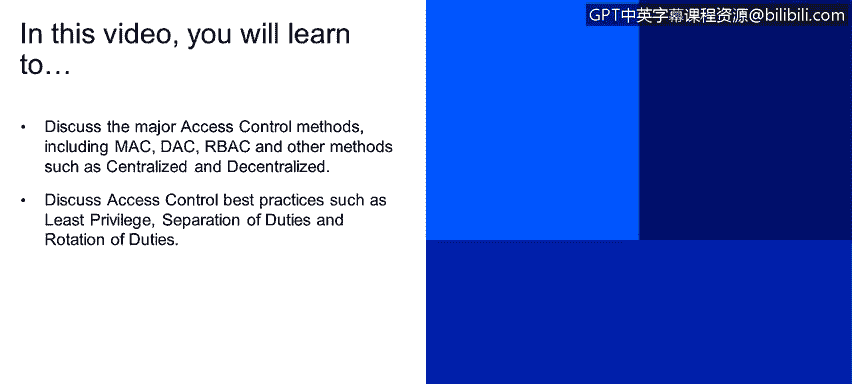
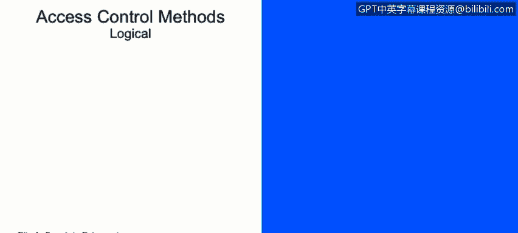
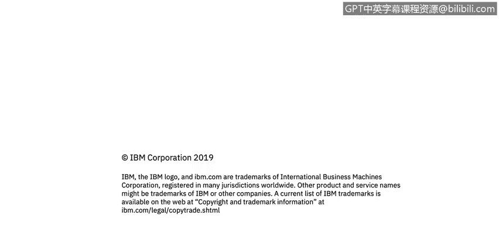

# 课程2：《网络安全角色、流程与操作系统安全》：55：访问控制方法

在本节课程中，我们将学习主要的访问控制方法，包括强制访问控制、自主访问控制、基于角色的访问控制，以及其他方法如集中式和分散式控制。我们还将探讨访问控制的最佳实践，例如最小权限原则、职责分离和职责轮换。

访问控制的核心是追踪谁有权访问特定资源，以及如何管理这些权限。有多种方法可以实现访问控制，我们将介绍三种主要方法。

## 主要访问控制方法

以下是三种主要的访问控制方法。

*   **强制访问控制**：这种方法通常用于军事领域，对数据进行分级。一个很好的例子是“交通信号灯协议”。该协议根据数据敏感度，将文档标记为TLP红、黄、绿等不同级别。MAC通常使用标签来管理访问权限，最常见于军事场景。
*   **自主访问控制**：在这种方法中，每个对象（文件、文档、资源）都有其所有者，并由所有者定义读写权限。由于需要跟踪大量对象和文件，这种方法通常用于小型企业。
*   **基于角色的访问控制**：这是目前应用最广泛的访问控制方法。它将权限与角色关联，用户通过被赋予的角色来获得相应权限。例如，收银员拥有“收银员”角色的权限，而商店经理则拥有“经理”角色的更多权限。这种方法有助于防止权限过度分配。

## 其他访问控制方法

除了上述三种主要方法，还存在其他访问控制方案。

*   **集中式解决方案**：例如单点登录，它提供了我们之前提到的“3A”（认证、授权、审计）功能。
*   **分散式解决方案**：例如独立访问控制。这类方案通常将控制权下放到本地，常用于军事领域，如在战场环境中管理访问。

## 访问控制最佳实践

在实施访问控制时，遵循最佳实践至关重要。以下是三个核心原则。

*   **最小权限原则**：确保人员或资源仅拥有完成其工作所必需的最低限度访问权限。
*   **职责分离**：避免让单个人员或资源掌握过多权限。试想，如果一名对公司不满的员工能够访问所有资源，可能造成多大损害。通过职责分离，可以最小化这种风险。
*   **职责轮换**：这不仅有助于员工了解其他部门的工作，也能帮助我们更好地跟踪和控制其职责履行情况。

总结本节内容，我们学习了三种主要的访问控制方法：强制访问控制、自主访问控制和基于角色的访问控制，并了解了集中式与分散式等其他方案。最后，我们回顾了访问控制的三个最佳实践原则：最小权限、职责分离和职责轮换。

