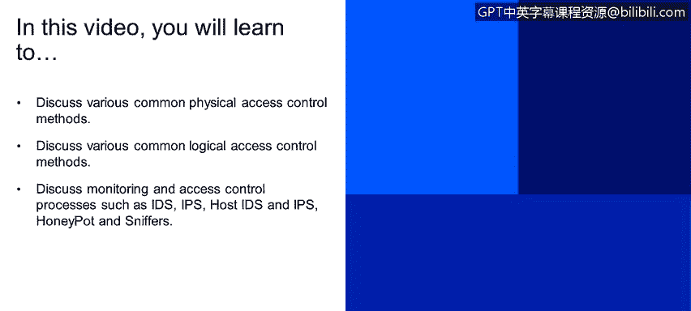
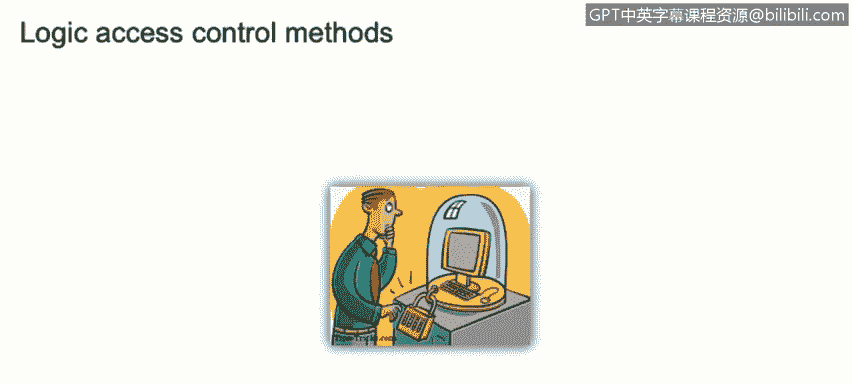
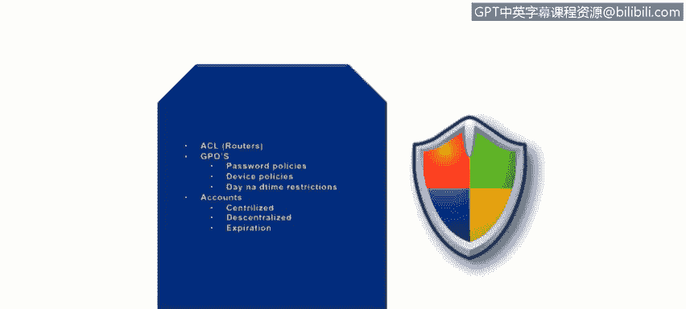
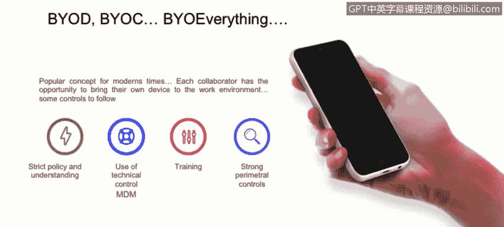
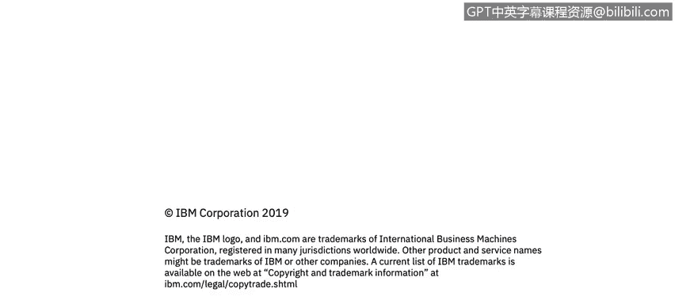

# 课程2：《网络安全角色、流程与操作系统安全》：56：访问控制：物理与逻辑方法 🔐

在本节课中，我们将学习各种常见的物理和逻辑访问控制方法，并探讨监控与访问控制流程，如入侵检测系统（IDS）、入侵防御系统（IPS）、主机IDS/IPS、蜜罐和嗅探器。

---

## 物理访问控制方法 🏢

上一节我们介绍了访问控制的基本概念，本节中我们来看看物理访问控制方法。物理访问控制旨在保护物理空间和资产。

物理访问控制可以应用于多个层面：
*   **周界**：例如围墙，用于隔离区域。
*   **建筑物**：控制谁能进入特定建筑。
*   **工作区域**：确保只有授权人员才能进入特定工作区。
*   **服务与网络**：在企业场景中，通常设有访客网络和企业网络。

以下是实现物理访问控制的一些技术手段：
*   **摄像头**：用于监控进出关键区域的人员。
*   **陷阱门或通道闸**：需要刷卡通行，通常一次只允许一人通过。
*   **令牌**：例如门禁卡。
*   **日志记录**：记录人员的进出情况，实现审计跟踪。

一个典型的例子是各国的大使馆，它们在物理访问控制方面通常做得非常出色。

---

## 逻辑访问控制方法 💻

了解了物理控制后，现在我们来探讨逻辑访问控制方法。逻辑控制关注对系统、数据和网络资源的访问。

以下是常见的逻辑访问控制方法：
*   **访问控制列表**：在路由器或防火墙上设置规则，控制网络流量。例如，一条ACL规则可以阻止特定IP地址访问内部资源。
    *   **代码示例**：`access-list 101 deny ip 192.168.1.100 any`
*   **组策略或合规性解决方案**：用于强制执行安全策略。
*   **密码策略**：规定密码复杂度、有效期等。
*   **设备策略**：管理哪些设备可以接入网络。
*   **时间限制**：限制在非工作时间访问特定资源。例如，可以阻止在东部时间凌晨2点通过VPN访问企业服务器。
*   **账户管理**：包括集中式/分散式账户管理以及账户过期策略。

所有这些方法都回归到我们之前讨论过的最佳安全实践。

---

## 自带设备与访问控制 📱

“自带设备”是一个流行的概念，但通过访问控制来有效管理它需要付出大量努力。

实施BYOD策略需要考虑以下几点：
*   **严格的策略**：需要制定明确且严格的安全策略。
*   **技术控制**：例如移动设备管理解决方案。
*   **员工培训**：确保员工正确使用其个人设备。
*   **外围控制**：需要强大的网络边界安全措施。

根据相关数据，约40%的数据泄露与BYOD相关。这表明许多企业在推行BYOD时，并未同步加强其安全策略，从而带来了风险。

---

## 监控与访问控制流程 👁️

在回顾了可能对组织造成损害的威胁和漏洞之后，现在让我们谈谈可以保护我们主机的设备和技术。

以下是关键的监控与访问控制工具和流程：

**入侵检测系统**
IDS是一种扫描、评估和监控计算机基础设施以发现攻击迹象的系统。它需要硬件传感器和软件进行部署。重要的是，每个IDS的实现都是独特的，取决于组织的安全需求。请记住，IDS**仅负责通知**攻击的发生。

**入侵防御系统**
IPS具备我们刚才提到的IDS的监控能力，但它可以**主动阻断**检测到的威胁，同时继续对其他事件使用被动响应。

**主机入侵检测/防御系统**
这些是基于主机的系统，可以监控主机是否存在意外行为或相对于基线的剧烈变化。例如，进行文件完整性检查，或查找可能可疑的出站请求（利用威胁情报来识别恶意连接）。如果我们想终止此类连接，就需要使用HIPS。

**蜜罐**
蜜罐是一种安全工具，用于引诱攻击者远离真实的网络，使其在一个可以被安全监控的环境中活动。当攻击者在蜜罐中时，其所有流量和技术都会被记录以供分析。蜜罐可以是软件模拟程序、硬件诱饵或整个域名网络（也称为“蜜网”）。

**嗅探器**
嗅探器也称为数据包分析器，是一种可以监控有线或无线网络通信的设备或程序，它能捕获流经网络的数据。它们通常用于网络故障排查。

在结束本节前，需要明确区分IPS和IDS。请始终记住，IPS可以**终止连接或采取行动**，而IDS**仅负责告警**。正如右侧图片所示，攻击者试图攻击目标时，IPS会拦截并终止该连接；而在IDS场景下，系统只会通知管理员攻击者正在尝试攻击目标。

---

## 总结 📝

本节课中，我们一起学习了网络安全中的访问控制方法。我们探讨了从围墙、门禁到摄像头等**物理访问控制**手段，也分析了包括ACL、策略管理和账户控制在内的**逻辑访问控制**技术。我们还讨论了管理“自带设备”趋势所带来的挑战。最后，我们深入了解了**监控与访问控制流程**，包括仅用于检测的IDS、能主动防御的IPS、基于主机的HIDS/HIPS、用于诱捕和分析攻击者的蜜罐，以及用于分析网络流量的嗅探器。理解这些控制方法的区别和适用场景，对于构建纵深防御体系至关重要。