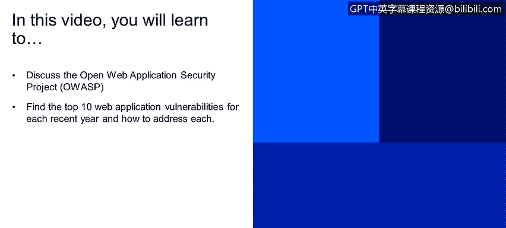
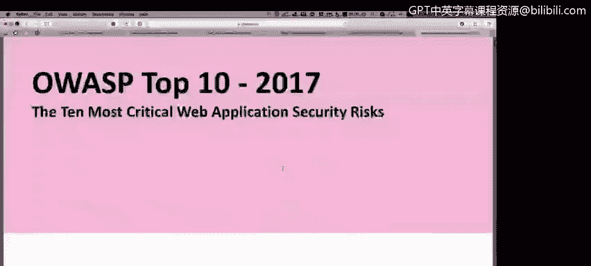
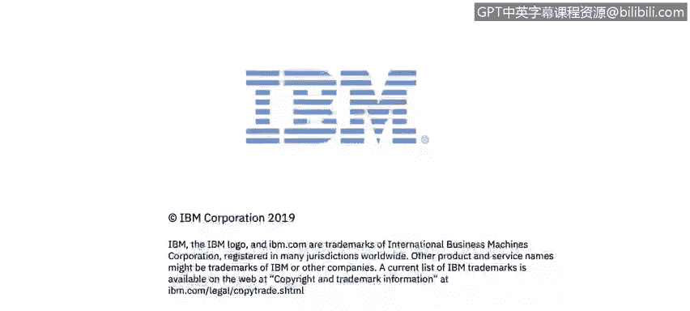

# 课程2：《网络安全角色、流程与操作系统安全》：57：OWASP开放Web应用安全项目

在本节课程中，我们将学习开放Web应用安全项目，了解其每年发布的十大Web应用安全风险，并探讨如何应对这些风险。

上一节我们介绍了其他安全方法论，本节中我们来看看另一个大多数Web应用都需要遵循的最佳实践——OWASP十大安全风险。

## 认识OWASP

OWASP是一个专注于Web应用安全的非营利组织。它为开发人员和安全专业人员提供了大量免费资源、工具和文档，旨在帮助构建和维护更安全的软件。

如果您需要处理网页或Web应用的安全问题，甚至任何类型的应用，都可以参考OWASP十大安全风险列表，并据此对组织的网站或应用进行逐项测试。

## 访问OWASP资源

以下是获取OWASP资源的方法：

*   **访问官方网站**：在搜索引擎中搜索“OWASP”，访问其官方网站 `owasp.org`。该网站提供了海量信息，当您需要对Web应用进行安全测试时，这些信息将非常有帮助。
*   **查找移动应用安全**：OWASP同样为移动应用安全提供了丰富的指南和资源。

## 核心资源：OWASP Top 10

OWASP最著名的成果是其定期发布的“十大Web应用安全风险”报告。以下是查找和使用该报告的方法：

*   **进入下载页面**：在官网找到“Downloads”或“Projects”区域。
*   **选择Top 10项目**：定位到“OWASP Top 10”项目。
*   **查看最新报告**：例如，您可以找到“OWASP Top 10 - 2017”报告。这份报告详细列出了近两三年内Web应用最常见、最危险的十大安全漏洞。

以2017年报告为例，排名第一的风险是**注入**。报告会详细解释：
*   什么是注入攻击（例如SQL注入）。
*   攻击者如何利用注入漏洞从系统获取信息。
*   测试系统是否存在注入漏洞时，需要执行哪些查询或检查。
*   相关的攻击场景和风险领域。

报告中还包含其他关键风险，例如**失效的身份认证**和**敏感数据泄露**。它为每项风险都提供了测试方法和验证步骤。

## 实用工具：安全清单

除了Top 10报告，OWASP还提供了一份非常重要的资源——**安全清单**。

这是一份文档，其中列出了在Web应用中需要实施的大量安全控制和检查项。遵循这份清单，可以帮助您确保Web应用达到较高的安全水平。

## 课程总结

本节课我们一起学习了开放Web应用安全项目。我们了解了如何访问OWASP官网以获取丰富的安全资源，重点探讨了其核心的“十大Web应用安全风险”报告的使用方法，并介绍了用于指导安全实践的安全清单。利用OWASP提供的这些免费、开放的资源，可以有效指导我们进行应用安全测试和加固。