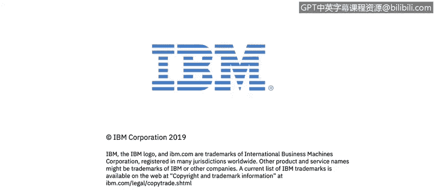

# 课程2：《网络安全角色、流程与操作系统安全》：58：操作系统基础入门 🖥️

在本节课中，我们将学习操作系统的基础知识。课程将概述Linux的架构、基本命令和文件系统，并介绍Mac OS和Windows操作系统，为你应对桌面系统威胁做好准备。我们还将利用PenTest Monkey参考网站，研究操作系统命令和特定的系统资源。

---

## 模块4、5和6概述

在接下来的模块4、5和6中，哥斯达黎加IBM托管安全服务组织的SIEM管理员Warren Perez，将为你概述Linux的架构、基本命令和文件系统。

## 学习目标与内容

你还将学习Mac OS和Windows操作系统，以便为应对桌面系统上的威胁做好准备。

以下是本部分课程的核心实践内容：

*   你将使用PenTest Monkey参考网站，研究操作系统命令和特定的系统资源。
*   PenTest Monkey是网络安全专业人员可以使用的众多工具之一。

## 课程总结与展望

本节课程我们一起学习了操作系统基础知识的课程安排和学习目标。接下来，我们将继续深入探索各个操作系统的具体细节。