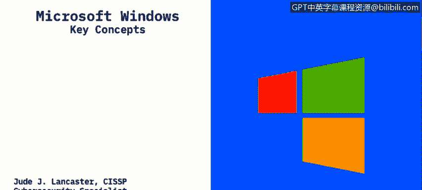
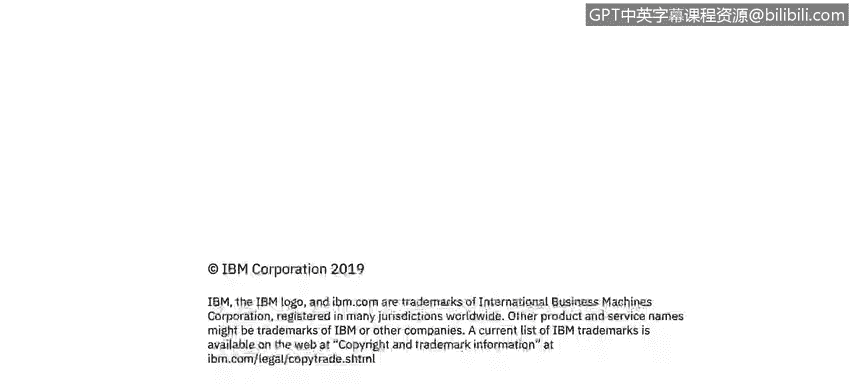

# 课程2：《网络安全角色、流程与操作系统安全》：59：用户模式与内核模式

在本节课程中，我们将学习描述Windows操作系统的两个核心组件：用户模式与内核模式，并理解它们之间的区别。

## 概述 📋

微软公司开发的Microsoft Windows操作系统已经存在很长时间。过去20年里，几乎所有使用过个人电脑的人都可能接触过Windows。Windows最大的优点之一是它创造了我们如今习惯使用的第一个图形用户界面。用户可以使用鼠标进行点击操作，而无需输入命令。该系统专为IBM兼容PC设计。众所周知，苹果设备运行其自身的操作系统，而Windows则运行在我们称之为IBM兼容PC的设备上。全球大约90%的个人电脑和服务器都运行着某个版本的Windows，因此我们对它非常熟悉。

## Windows的两种模式 🏗️

Windows操作系统主要包含两种运行模式：用户模式和内核模式。它们是系统架构的基础。

### 用户模式 👤

用户模式是您在使用应用程序时直接交互的部分。当您打开Microsoft Word、使用Chrome或Firefox浏览网页时，您就处于用户模式。该模式下的应用程序通过驱动程序来创建输入/输出功能。

当您启动一个用户模式应用程序时，Windows会为该应用创建一个**进程**。您可以在任务管理器中看到这些正在运行的进程，它们会显示内存使用量、CPU占用率等信息。

用户模式应用程序的一个关键特性是它们彼此**隔离**。每个应用启动时都会获得一个**私有的虚拟地址空间**。这意味着：
*   一个应用程序无法修改属于另一个应用程序的数据。
*   每个应用程序在隔离的环境中运行。
*   如果某个应用程序崩溃，它通常不会导致整个操作系统崩溃，只会影响自身，其他正在运行的程序不受影响。

### 内核模式 ⚙️

上一节我们介绍了用户模式，本节中我们来看看内核模式。内核模式是Windows的底层技术核心，包含了控制用户模式应用程序的各种**进程**和**线程**。

与用户模式不同，在内核模式下运行的所有组件**共享一个单一的虚拟地址空间**。这意味着：
*   内核模式驱动程序彼此之间以及与操作系统本身之间**不是隔离的**。
*   如果一个内核模式驱动程序意外地向错误的虚拟地址或操作系统内的其他部分写入数据，操作系统内的数据就可能被破坏。
*   如果一个内核模式驱动程序崩溃，**整个操作系统将会崩溃**。

您可能见过所谓的“蓝屏死机”，即操作系统停止运行并需要重启，这通常就是由内核模式故障或内核模式驱动程序写入虚拟地址引发的问题所导致的。

## 总结 📝

本节课中我们一起学习了Windows操作系统的两种核心运行模式。用户模式负责运行应用程序，提供隔离环境以增强稳定性；而内核模式作为系统核心，直接管理硬件和系统资源，其稳定性至关重要。理解这两种模式的区别，有助于我们更好地认识操作系统的运作原理和潜在的风险点。