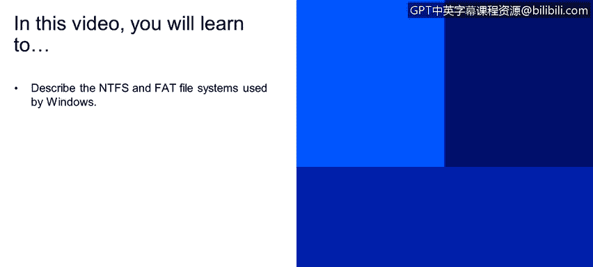
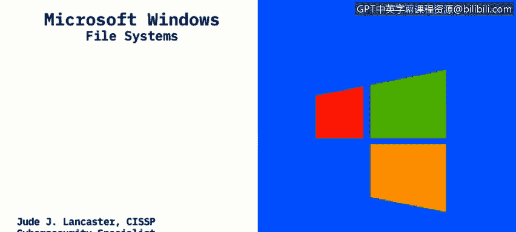
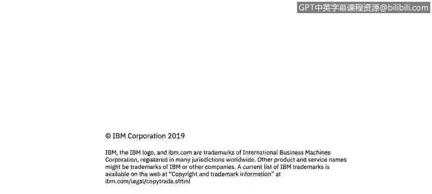

# 课程2：《网络安全角色、流程与操作系统安全》：60：Windows文件系统详解

## 概述
在本节课程中，我们将学习Windows操作系统中使用的两种主要文件系统：NTFS和FAT。我们将了解它们的基本概念、特点以及各自的适用场景。

---

## 文件系统基础
上一节我们介绍了操作系统安全的基本框架，本节中我们来看看文件系统这个核心组件。文件系统是应用程序在存储设备上存储和接收文件的机制。在Windows环境中，存储设备主要指计算机内置的硬盘驱动器。

硬盘驱动器可以是机械式的旋转盘片，也可以是非机械式的固态硬盘。文件被放置在一种称为**分层结构**的体系中，即文件夹中可以包含子文件夹和文件。文件系统规定了文件的命名规则，以及在该树状结构中定位文件路径的格式。

为了明确定义：
*   **文件**：是文件系统中用户可访问和管理的**数据单元**。例如，一张图片（JPG或PNG格式）就是一个文件。
*   **目录（文件夹）**：是文件和子目录的**分层集合**。每个文件在其所属的目录内必须具有唯一的名称。如果你在同一个目录内复制并粘贴一个文件，系统会自动在文件名后添加数字以示区分。

---

## Windows主流文件系统：NTFS
现在，让我们深入了解Windows中最主流的文件系统。NTFS，全称**新技术文件系统**，自1993年问世以来，已成为Windows系统的标准。

以下是NTFS的主要特点：
*   **广泛应用**：它是当今Windows客户端（如Windows 10）和服务器（如Windows Server 2012/2016）上最普遍的文件系统。
*   **支持大容量**：NTFS的设计是为了满足超过32GB的大容量存储设备的需求。
*   **功能丰富**：相比之前的文件系统，NTFS提供了更高级的功能，如文件权限、加密和日志记录，这些对于系统安全和数据完整性至关重要。

其核心优势可以概括为：`NTFS = 大容量支持 + 高级安全特性`。

---

## 传统文件系统：FAT
在NTFS成为主流之前，Windows主要使用FAT文件系统。FAT，即**文件分配表**，是一种更简单的文件系统，自20世纪80年代开始使用。

以下是关于FAT文件系统的关键信息：
*   **版本标识**：常见的版本有FAT16和FAT32。名称中的数字（16、32）代表用于枚举文件系统块的**位数**。
*   **主要用途**：如今，FAT文件系统（尤其是FAT32）主要用于**可移动存储设备**，如U盘、SD卡或可擦写光盘。
*   **容量限制**：FAT32适用于容量**小于32GB**的设备。对于更大的存储设备，则需要使用NTFS。

其适用场景可以总结为：`FAT32 -> 小容量可移动设备（如U盘）`。

---

## 总结
本节课中，我们一起学习了Windows操作系统的两种核心文件系统。我们了解到，**NTFS**是现代Windows系统和大型存储设备的首选，它功能强大且安全。而**FAT**（特别是FAT32）则因其简单性，至今仍广泛应用于小容量的可移动存储设备上。理解这两种文件系统的区别，是管理Windows存储和进行基础安全配置的重要一步。