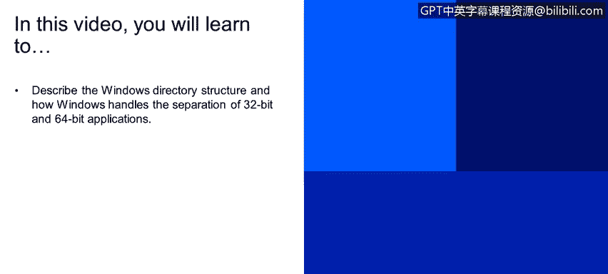
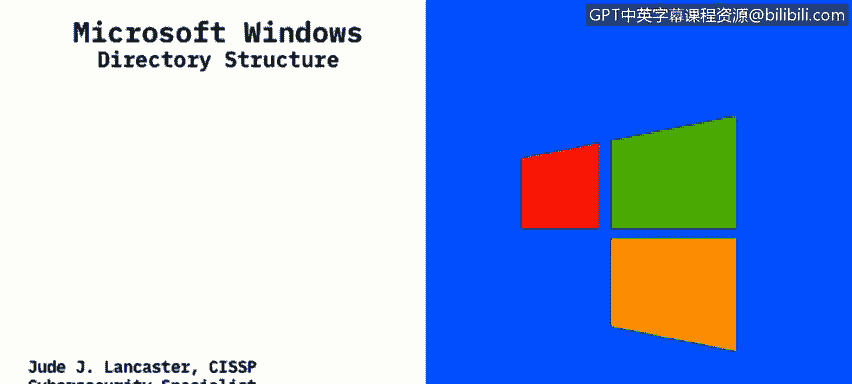
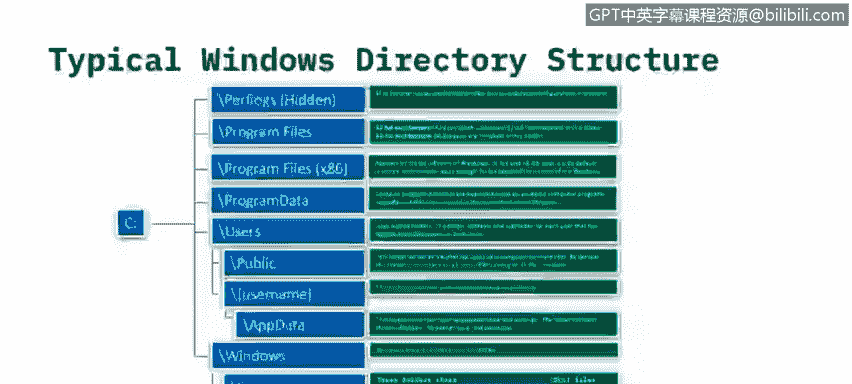
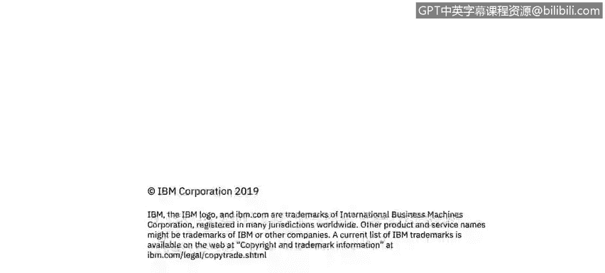

# 课程2：《网络安全角色、流程与操作系统安全》：61：Windows目录结构解析 🗂️

在本节课程中，我们将学习Windows操作系统的目录结构，并了解Windows如何处理32位与64位应用程序的分离。

## 概述

Windows操作系统将几乎所有文件都存储在通常被称为C盘的驱动器上。了解其标准目录结构，特别是区分不同位宽应用程序的存储位置，对于系统管理和安全分析至关重要。

## 目录结构详解

现在，让我们深入查看一个典型的Windows 10设备上的标准文件结构。

### 隐藏文件夹与根目录

C盘根目录下包含一些标准文件夹，其中部分文件夹可能被隐藏。隐藏文件夹意味着除非用户通过控制面板取消隐藏，否则最终用户无法直接访问。微软将这些文件夹隐藏，是因为普通用户通常不需要访问它们。

*   **PerfLogs**：此文件夹用于存放性能日志，但通常为空。

### 应用程序存储目录

接下来是C盘的核心部分，即存放应用程序的文件夹。在新版本的操作系统中，这主要涉及两个关键目录。

*   **Program Files**：在64位操作系统上，此目录用于存储**64位应用程序**。
*   **Program Files (x86)**：在64位操作系统上，此目录用于存储**32位应用程序**。

为了理解为何存在这种分离，我们需要简要回顾操作系统的发展历程。早期的Windows 3.1是16位系统，Windows 95升级为32位系统。32位系统最多只能寻址4GB内存，这对于现代应用已显不足。因此，从Windows 2000开始，64位操作系统逐渐成为主流。64位系统可以运行32位应用程序，但为了清晰管理，将它们安装在了独立的目录中。

### 程序数据与用户目录

除了应用程序本身，系统还需要存储程序运行所需的公共数据以及每个用户的个人数据。

*   **ProgramData**：此文件夹存放由计算机程序访问的文件，无论当前是哪个用户登录系统。这些是应用程序运行所必需的文件，与具体用户无关。
*   **Users**：此目录存放所有用户配置文件。每个子文件夹对应一个不同的用户名。

在Users目录下，常见的结构包括：

*   **Public**：所有Windows系统都会有一个公共文件夹。多用户登录系统时，可以在此处共享文件。
*   **`<用户名>`**：每个授权用户的个人文件夹。其下通常包含“文档”、“图片”、“音乐”等子文件夹。
*   **AppData**：类似于ProgramData，但存储的是**特定于最终用户的应用程序数据**。例如，用户在Microsoft Word中创建的自定义模板就存储在此处，以实现与其他登录用户的隔离。

### Windows系统核心目录

最后，我们来看Windows系统本身安装的核心目录，它包含了操作系统运行和提供图形用户界面的关键文件。

*   **Windows**：这是Windows系统的实际安装目录。其下主要有三个关键子文件夹：
    *   **System**：存放16位动态链接库文件。在64位Windows系统上，此文件夹通常为空，但目录结构仍然保留。
    *   **System32**：根据操作系统位宽，存放**32位或64位的DLL文件**。当程序请求加载动态链接库而未指定路径时，系统会优先在此目录中搜索。
    *   **SysWOW64**：此文件夹**仅出现在64位版本的Windows上**，用于存放**32位的DLL文件**。

## 总结

本节课中，我们一起学习了Windows的标准目录结构。我们了解到，在C盘根目录下，系统通过`Program Files`和`Program Files (x86)`目录来分别管理64位和32位应用程序。`Users`目录存储用户个人配置和数据，而`Windows`目录则包含了系统运行所需的核心文件，并通过`System32`和`SysWOW64`来区分不同位宽的系统库文件。理解这些结构是进行有效的系统管理和安全分析的基础。