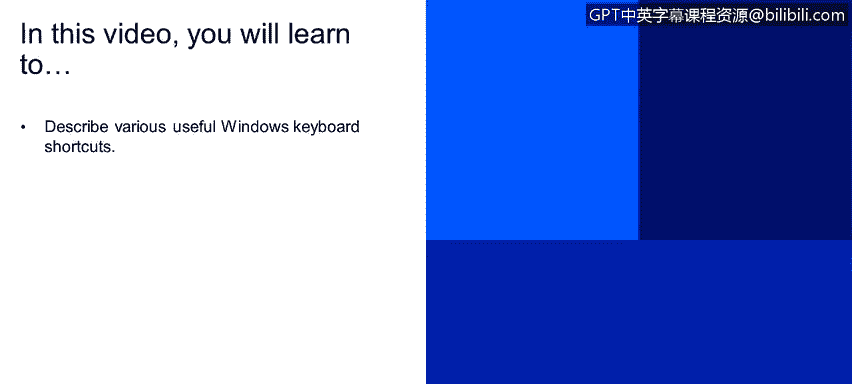
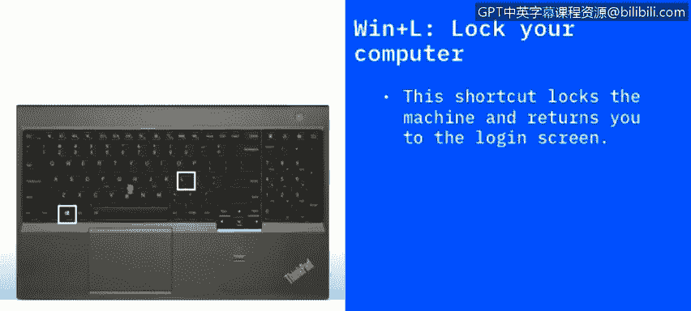

# 课程2：《网络安全角色、流程与操作系统安全》：63：Windows键盘快捷键进阶指南 🖥️⌨️

在本节课程中，我们将学习一系列实用的Windows键盘快捷键。掌握这些快捷键能显著提升你的工作效率，并帮助你更好地管理和保护你的计算机系统。

## 概述

本节将详细介绍多个Windows操作系统中常用的键盘快捷键。这些快捷键涵盖了文件管理、系统设置、屏幕截图、任务管理等多个方面，是每位计算机用户都应掌握的基础技能。

## 快捷键详解

以下是各个快捷键的具体功能和使用方法。

### 文件与基础操作

**F2键**：重命名文件。选中一个文件后，按下`F2`键可以直接进入重命名模式，无需右键点击选择“重命名”。此功能在文件资源管理器、Excel、Word等支持重命名的应用程序中均适用。

**F5键**：刷新当前视图。当你在编辑网页或查看文件夹内容，并希望获取最新信息时，按下`F5`可以快速刷新页面或窗口。这能确保你看到应用程序或网页的最新版本。

### 系统安全与锁定

**Windows键 + L键**：快速锁定计算机。这是一个重要的安全实践。无论你是在办公室还是在家中，当你需要暂时离开电脑时，按下`Win + L`可以立即锁定屏幕。返回后，你需要使用密码、指纹或面部识别等方式重新登录，从而保护你的隐私和数据安全。

### 系统设置与搜索

**Windows键 + I键**：打开Windows设置。无论你处于桌面还是任何应用程序中，按下`Win + I`都能快速调出Windows系统设置对话框。

**Windows键 + A键**：打开操作中心。操作中心会显示系统通知，并提供对网络、音量等常用设置的快速访问。按下`Win + A`即可打开它，方便你查看通知或调整设置。

**Windows键 + S键**：打开Windows搜索。按下`Win + S`会弹出搜索对话框，你可以快速搜索文件、文件夹或应用程序，比通过开始菜单导航进行搜索更高效。

### 屏幕截图

**Windows键 + Print Screen键**：截取全屏并自动保存。按下`Win + PrtSc`会将当前整个屏幕的图像保存为文件，并同时复制到剪贴板。

**Alt键 + Windows键 + Print Screen键**：仅截取活动窗口。如果你只想截取当前正在使用的窗口，而不是整个桌面（避免背景中的其他程序入镜），可以使用`Alt + Win + PrtSc`组合键。

### 系统管理与高级功能

**Ctrl + Shift + Esc键**：直接打开任务管理器。任务管理器可以显示正在运行的应用程序、后台服务，以及它们占用的内存和CPU资源。当某个程序无响应时，这是结束该进程的快捷方式。

**Windows键 + C键**：唤醒Cortana（微软小娜）。在较新版本的Windows系统中，按下`Win + C`可以启动Cortana数字助理，你可以通过语音或打字向她提问，例如查询天气。

**Windows键 + Ctrl + D键**：创建新的虚拟桌面。这个功能可以帮助你整理工作空间。按下`Win + Ctrl + D`会创建一个全新的虚拟桌面，你可以在不同的桌面间切换，将不同的工作任务分开，避免所有窗口都堆叠在一个桌面上。

**Windows键 + X键**：打开“快速链接”菜单。这是一个隐藏的高级菜单，独立于开始菜单。按下`Win + X`可以快速访问控制面板、命令提示符、电源选项等系统级工具和设置。

## 总结

本节课我们一起学习了多种提升Windows使用效率和安全性的键盘快捷键。从基本的文件重命名(`F2`)、刷新(`F5`)，到重要的安全锁定(`Win+L`)、快速设置访问(`Win+I`, `Win+A`)，再到实用的截图(`Win+PrtSc`, `Alt+Win+PrtSc`)和系统管理工具(`Ctrl+Shift+Esc`, `Win+X`)，这些组合键是高效操作计算机的得力助手。熟练掌握它们，将使你的日常工作流程更加顺畅和安全。