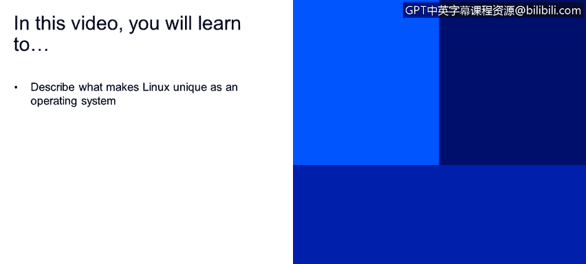

# 课程2：《网络安全角色、流程与操作系统安全》：64：Linux操作系统的核心组件 🔧

在本节课程中，我们将学习Linux操作系统区别于其他系统的独特之处。我们将讨论Linux及其操作系统的几个关键概念。

---

## 什么是Linux？

Linux是一个操作系统。它是开源的，并采用通用公共许可证（也称为GPL）进行授权。该许可证保证了最终用户（即我们自身）拥有运行、研究、分享和修改该软件的自由。但有一个条件：你可以研究、修改和分享它，但前提是你的修改也必须遵循通用公共许可证（GPL）进行授权。

---

## Linux的核心组件

Linux包含许多组件，但我们现在将重点讨论两个主要组件：**内核**和**Shell**。

### 内核

内核是操作系统的核心。它被设计为直接与硬件本身进行交互。它管理系统和用户的输入/输出、进程、文件、内存和设备。

**公式/代码表示**：`内核 = 操作系统核心 = 硬件交互层`

### Shell

在内核之上，我们有Shell。Shell就像一个接口，设计用于让用户直接与内核进行交互。在幻灯片中间的截图中，你会看到所谓的CLI或命令行界面。这就是系统的Shell，用户在此界面中输入命令，然后内核将执行这些命令。

**公式/代码表示**：`Shell = 用户界面 = 命令解释器`

---

## 总结

本节课中，我们一起学习了Linux操作系统的定义及其两个核心组件：内核和Shell。内核是直接管理硬件的核心，而Shell则是用户与内核交互的接口。理解这些组件是掌握Linux系统的基础。