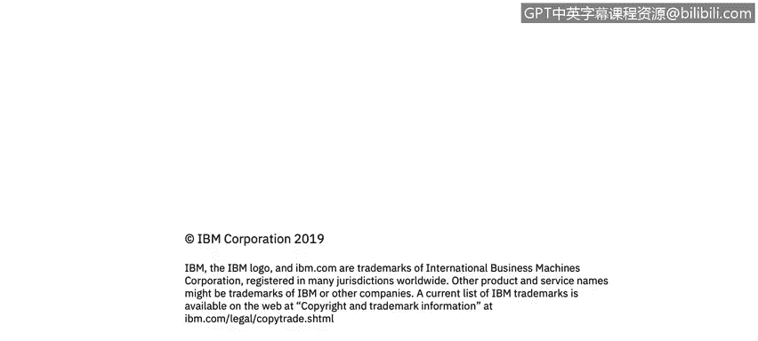

# 课程2：《网络安全角色、流程与操作系统安全》：65：Linux文件系统

## 概述
在本节课程中，我们将学习Linux文件系统的基本概念。我们将了解文件和目录的定义、Linux独特的目录结构，以及系统启动时的不同运行级别。

---

## 文件与目录

上一节我们介绍了课程背景，本节中我们来看看Linux中文件和目录的基本概念。

文件是存储数据的基本单元。它本质上是物理介质（如硬盘、U盘）上的一个存储单元。在命令行中，文件通常用一个短横线 `-` 表示。

目录是一种特殊类型的文件。它包含其他文件的信息，相当于Windows系统中的文件夹。在命令行中，目录用字母 `d` 表示。

在下面的截图中，你可以看到高亮显示的项目。左侧第一列以 `d` 开头的项目表示目录，而上方以 `-` 开头的项目则表示文件。

---

## Linux目录结构

了解了基本概念后，我们来看看Linux的目录结构，它与Windows有很大不同。

Linux中的所有内容都始于一个斜杠 `/`，也称为根目录。其他所有文件和目录都“附加”在这个根分区之下。根分区是每个文件和目录的起点，通常只有root用户组在此目录下拥有写权限，这是出于安全考虑。

以下是Linux中一些重要的目录及其作用：

*   **`/root`**：这是root用户的家目录，与根目录 `/` 不同。
*   **`/bin`**：包含二进制可执行文件。常用的Linux命令（如 `ps`， `ls`， `grep`， `cp`， `mv`）都存放在这里。
*   **`/sbin`**：同样包含可执行二进制文件，但主要用于系统维护（如 `iptables`， `reboot`， `ifconfig`）。
*   **`/etc`**：大多数情况下，系统上安装的所有程序的配置文件都存放在这里。例如，如果在Linux服务器上安装了Apache，其配置文件通常位于 `/etc/apache` 目录下。
*   **`/var`**：这是一个专门用于存放经常变化或增长的文件的分区，例如日志文件。应用程序的日志通常位于 `/var/log` 目录下。
*   **`/tmp`**：包含临时文件。存放在 `/tmp` 下的任何文件在系统重启时都会被删除。
*   **`/home`**：所有用户的个人家目录。每个用户创建时都会在此目录下生成一个以用户名命名的子目录（例如用户Warren的家目录是 `/home/warren`），用于存放个人文件，通常只有该用户自己有权读写。
*   **`/boot`**：包含系统启动加载器文件，专门用于系统启动过程。

---

## 系统运行级别

在讨论了启动过程后，我们还需要了解Linux系统的运行级别。运行级别定义了系统启动后进入的不同操作状态。

Linux系统使用不同的运行级别来应对特定的情况或需求：

*   **运行级别 0**：系统关机。停止所有服务，系统关闭后不会重启。
*   **运行级别 1**：单用户模式。仅允许一个用户使用系统，无网络功能，通常用于直接在操作系统上进行维护。
*   **运行级别 2**：多用户模式，但无网络支持。也用于维护和系统测试。
*   **运行级别 3**：完整的多用户模式，带网络支持。这是没有图形界面、只有命令行界面的服务器的典型运行级别。
*   **运行级别 4**：自定义模式。系统管理员可对其进行定制以满足特定需求。
*   **运行级别 5**：带图形界面（X11）的模式。与运行级别3类似，但提供了图形登录和用户界面。
*   **运行级别 6**：系统重启。指示系统重新启动并重新加载所有正在运行的服务。

---

## 总结
本节课中，我们一起学习了Linux文件系统的核心知识。我们明确了文件与目录的区别，了解了以根目录 `/` 为起点的独特目录结构及其各主要目录的功能，最后还介绍了系统从启动到关机的不同运行级别。理解这些基础概念是有效管理和维护Linux系统安全的重要前提。