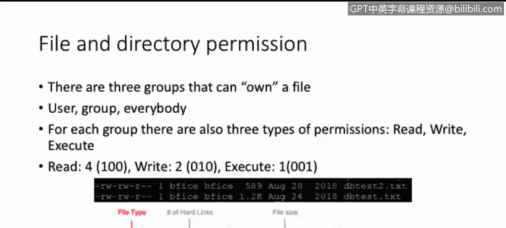
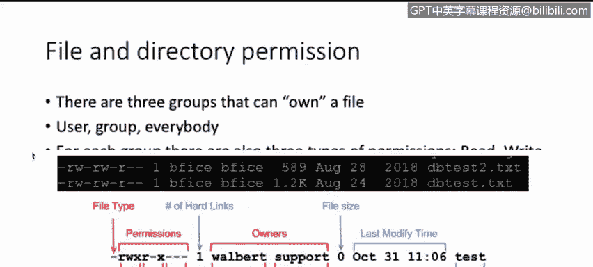
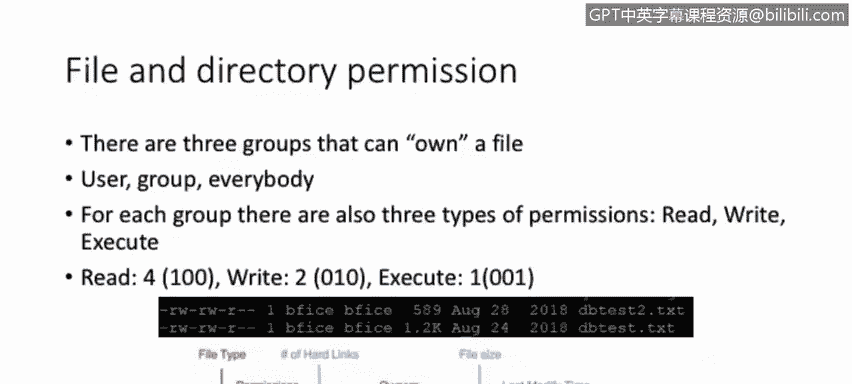
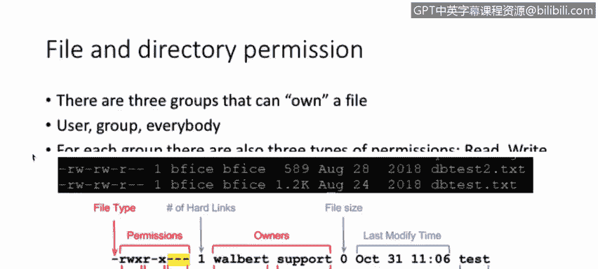
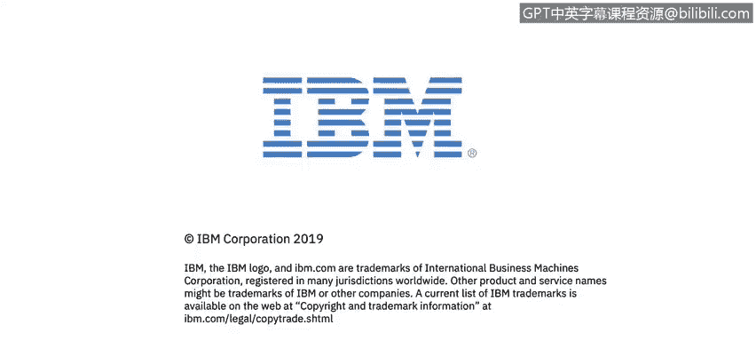

# 课程2：《网络安全角色、流程与操作系统安全》：67：Linux文件与目录权限基础


在本节课中，我们将要学习Linux操作系统中的文件与目录权限基本结构。理解权限是管理Linux系统安全的基础，它决定了谁可以读取、修改或执行系统中的文件。

## 权限与所有者概述

上一节我们介绍了Linux系统的基本概念，本节中我们来看看文件与目录的权限和所有者。在Linux中，每个文件和目录都有与之关联的权限，这些权限定义了不同用户对文件的操作能力。



具体来说，有三个主要的“组”可以拥有一个文件：
*   **用户**：文件的所有者。
*   **组**：拥有该文件的用户组。
*   **其他用户**：指既不是文件所有者，也不在所属组内的其他所有用户。



请注意本幻灯片中的最后一张图片，您会看到：


其中，“walter”是该文件的**用户**。“support”是拥有该文件的**组**。用户和组共同构成了该文件的**所有者**。



## 基本权限类型

对于上述每个组，都可以分配三种基本类型的权限。在本课程中，我们将讨论这三种基本权限：**读取**、**写入**和**执行**。

这些权限有对应的数值，分别是4、2和1。我们也可以用二进制数字来表示这些权限：
*   **读取** 的值为4，二进制表示为 `100`。
*   **写入** 的值为2，二进制表示为 `010`。
*   **执行** 的值为1，二进制表示为 `001`。

再次请您注意本幻灯片的最后一张图片，您会在左侧看到：




首先是**文件类型**，由一个短横线 `-` 表示这是一个普通文件。接着是**权限**，它由三组字符组成，每组包含三个特定的权限字符。

第一组三个字母代表**用户**的权限。从图中可以看出，用户拥有读取、写入和执行的权限（`rwx`）。
第二组三个字母代表**组**的权限。图中显示，组只有读取和执行的权限（`r-x`）。它没有写入权限，这可以通过中间的短横线 `-` 看出，表示该组不允许此权限。
第三组代表**其他用户**的权限。图中显示，其他用户没有任何权限（`---`）。

## 权限的数字表示法

以下是刚才讨论内容的另一种表示方法。

权限的八进制数值含义如下：
*   `0` 表示无权限。
*   `1` 表示可执行。
*   `2` 表示可写入。
*   `3` 是 `2`（写）和 `1`（执行）的和，表示可写和执行。
*   `4` 表示可读取。
*   `5` 是 `4`（读）和 `1`（执行）的和，表示可读和执行。
*   `6` 是 `4`（读）和 `2`（写）的和，表示可读和可写。
*   `7` 是 `4`（读）、`2`（写）和 `1`（执行）的和，表示可对该文件进行所有操作（读、写、执行）。

在屏幕右侧，您可以看到这些数值是如何相加的另一种表示。
对于**所有者权限**，数字是 `7`，即 `4`（读）+ `2`（写）+ `1`（执行）。二进制 `111` 转换为八进制就是 `7`。
对于**组权限**，数字是 `5`，即 `4`（读）+ `1`（执行）。虽然上方组权限显示为 `r-x`（读、空、执行），但“写”位置是短横线，表示没有该权限。所以 `4`（读）加 `1`（执行）得到 `5`。
对于**其他用户权限**，数字是 `4`，因为我们只有读取权限，写入和执行位置都是短横线。

## 修改权限：`chmod` 命令

文件的权限并非一成不变，它们可以被更改和修改。这时我们就需要使用 `chmod`（change mode，更改模式）命令。

该命令的基本用法如下：
```bash
chmod [权限] [文件名或目录名]
```
权限可以设置为数字形式，例如 `755`，表示用户权限为 `7`，组权限为 `5`，其他用户权限为 `5`。

我们也可以更具体地设置权限。以下是使用符号表示法的例子：
```bash
chmod u=rw,g=r,o=r filename
```
*   `u=` 代表用户，此处赋予该用户读和写权限。
*   `g=` 代表组，此处仅赋予该组读权限。
*   `o=` 代表其他用户，在此示例中，也仅赋予其他用户读权限。
命令最后跟上要编辑的文件名或目录名。

## 修改所有者：`chown` 命令

在Linux中，我们也可以更改文件或目录的所有者（用户）或所属组。

为此，我们将使用 `chown` 命令。该命令的格式如下：
```bash
chown [用户]:[组] [文件名或目录名]
```
在这个具体案例中，如果您注意下方的图片：



您会看到文件 `test` 目前由用户 `walter` 和组 `support` 拥有。如果我们想修改文件 `test` 的所有者，可以使用命令：
```bash
chown root:root test
```
执行此命令后，文件 `test` 的所有者和所属组都将更改为 `root`。

## 总结


本节课中我们一起学习了Linux文件与目录权限的基础知识。我们了解了三个权限组（用户、组、其他用户）和三种基本权限（读、写、执行），以及如何使用数字和符号表示法来查看和设置权限。最后，我们还介绍了如何使用 `chmod` 命令修改权限，以及如何使用 `chown` 命令更改文件的所有者和所属组。掌握这些是进行Linux系统安全管理的重要第一步。