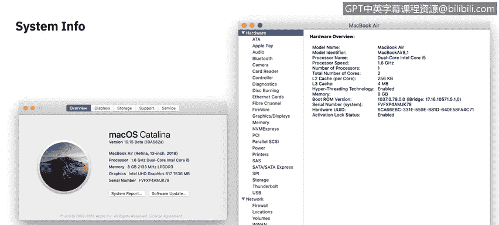
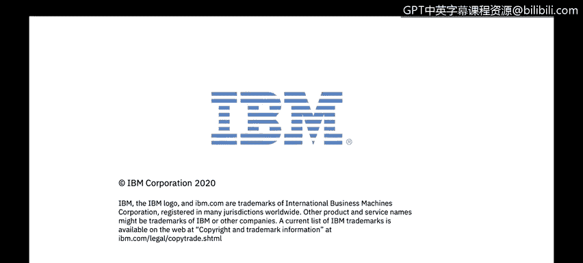

# 课程2：《网络安全角色、流程与操作系统安全》：68：macOS系统审计 🖥️

在本节课中，我们将学习如何在macOS操作系统中查找硬件和软件的规格信息，如何查看系统的实时活动状态，以及如何定位各种日志文件。掌握这些技能对于进行系统审计和故障排查至关重要。

## 系统概览：关于本机

获取Mac操作系统信息最基础的起点是查看“关于本机”菜单设置。该选项位于苹果菜单的第一个位置。在“概览”屏幕上，你可以看到一个关于硬件规格的总体概览，包括设备的品牌型号、处理器、内存、显卡和序列号。

“关于本机”窗口内还有另外四个标签页：显示器、储存空间、支持和维修。“显示器”页面的含义不言自明，它会告诉你当前连接了何种类型的显示器。“储存空间”页面会显示内部存储容量，以及不同类型媒体文件（如视频、文档、照片）的分布情况，例如，它会显示有30GB的视频、15GB的文档和100GB的照片。

“支持”标签页会链接到Apple官网上的自助帮助链接。“维修”标签页则允许你检查设备的保修状态，并在需要时联系AppleCare。

回到“概览”标签页，这里有一个“系统报告”按钮，点击它会启动“系统信息”应用程序。这个应用会以更高的详细程度，展示macOS识别到的以及安装在这台特定Mac上的每一件硬件、网络接口和软件的信息。

以下是“系统信息”中一些有用的信息类别：
*   你可以找到关于Mac上已连接或已安装的设备信息。
*   你还可以查看已安装的软件及其版本，以及计算机上存在的任何驱动程序。
*   还有一个专门用于诊断日志的部分，特定应用程序会向这里报告信息。

“系统信息”是获取高级别信息概览的绝佳工具。

## 实时监控：活动监视器

上一节我们介绍了如何获取静态的系统信息，本节中我们来看看如何监控系统的实时动态。“活动监视器”是获取一切正在发生的活动实时信息的最佳方式。

默认情况下，“活动监视器”会打开CPU窗口或标签页。它的作用是显示每一个正在运行的活跃进程和打开的应用程序，这与Windows系统中的任务管理器非常相似。

除了CPU标签页，“活动监视器”还有另外四个标签页：内存、能耗、磁盘和网络。与CPU标签页类似，这些标签页也分别显示每个活跃进程的相关信息。对于内存，它显示每个消耗内存的进程及其占用的内存百分比；能耗、磁盘空间和网络活动标签页也是如此。

“活动监视器”在需要捕获易失性数据时尤其有用，这些数据在系统重启后可能不复存在。因此，如果你需要精确捕获计算机在当前时刻的状态，“活动监视器”绝对是必去之处之一。

## 日志管理：控制台

最后要介绍的实用工具是“控制台”，它位于“实用工具”文件夹中，是macOS用于记录所有信息的应用程序。正如你在左侧所见，它方便地将报告分类到不同的区域，例如应用程序崩溃或挂起报告、任何日志报告、诊断报告、Mac分析数据和系统日志。

这里的优点是，你可以搜索几乎任何特定的内容。如果你想要精确定位或监控某些信息，你可以清除所有日志，或者直接点击“现在”按钮，这将带你到当前最新的时间点，你可以开始监控任何需要的特定日志。

## 总结

本节课中我们一起学习了macOS系统审计的三个核心工具。通过“系统报告”、“活动监视器”和“控制台”日志，你应该能够审计计算机上当前存在的一切以及正在进行的活动。这些工具的组合使用，为系统状态分析、性能监控和安全事件调查提供了坚实的基础。