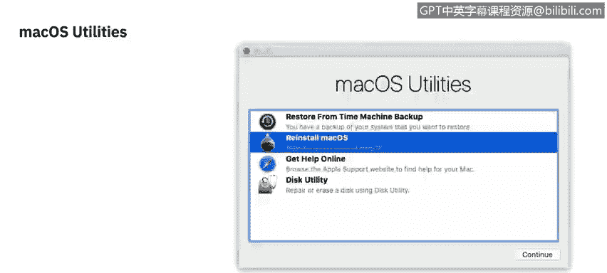
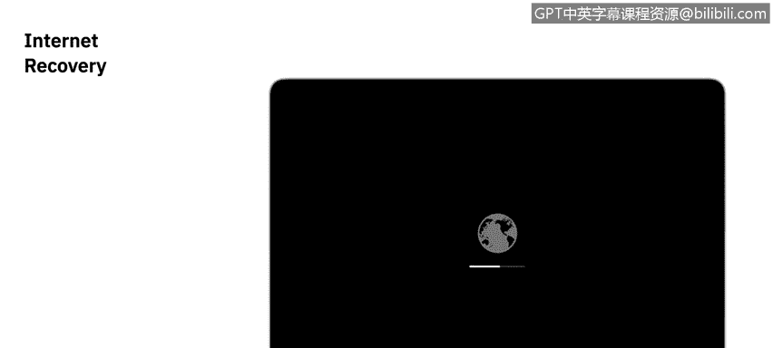
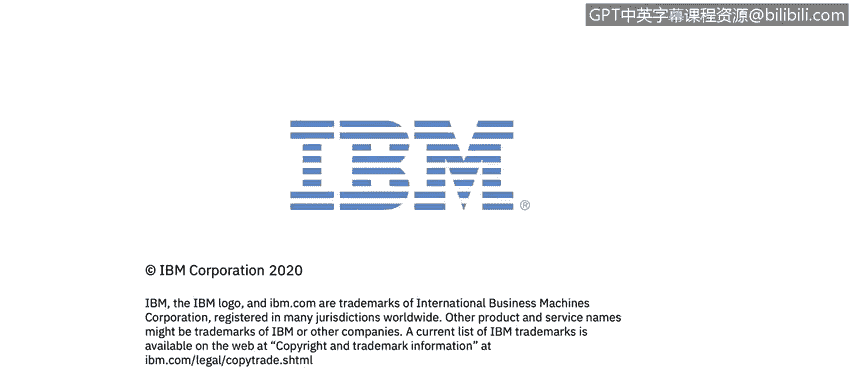

# 课程2：《网络安全角色、流程与操作系统安全》：70：macOS恢复模式教程 💻

在本节课程中，我们将学习macOS的恢复分区及其提供的各项服务。恢复分区是一个内置于Mac中的隐藏分区，它取代了传统随新电脑附带的安装光盘，提供了操作系统安装和一些额外的实用工具。

## 访问恢复模式 🔑

要访问恢复模式，您需要在重启Mac时按住 **`Command (⌘) + R`** 键。系统可能会要求您输入管理员密码。启动后，您将看到一个名为“macOS实用工具”的小窗口。

## macOS实用工具选项 🛠️

以下是“macOS实用工具”窗口提供的四个主要选项：

1.  **从“时间机器”备份恢复**：如果您使用“时间机器”备份过Mac，可以通过此选项进行恢复。
2.  **重新安装macOS**：此选项将重新安装操作系统。需要强调的是，这**不是**抹掉并安装，它只会替换系统文件，而不会触及用户目录。因此，如果操作系统出现问题，您可以相对放心地重新安装，个人数据通常不会被影响。当然，始终建议提前备份。请注意，此选项安装的是电脑出厂时预装的系统版本，而非最新版本。
3.  **获取在线帮助**：这是一个功能有限的Safari浏览器窗口，允许您访问苹果官方的支持文档。
4.  **磁盘工具**：此工具帮助我们管理设备上的磁盘。

## 深入理解磁盘工具 💾

磁盘工具提供了丰富的功能来管理Mac的存储。其功能主要可分为以下三个领域：

*   **急救**：尝试运行“急救”功能来诊断和修复磁盘问题。
*   **分区**：在存储设备上创建新的分区或宗卷。
*   **抹掉**：完全擦除驱动器。

**重要提示**：若要修改存储空间上的任何宗卷，您需要管理员权限。此外，如果磁盘使用**FileVault**加密，您还需要提供FileVault密钥来解锁驱动器才能进行修改。

### 安全抹掉选项 🔒

如果您选择抹掉硬盘，在抹掉后有三种安全选项可供选择：

*   **最快**：这类似于将存储设备的所有内容丢进垃圾桶并清空。此时，数据恢复仍然非常可行。
*   **安全性较好**：此选项会覆盖数据三次，符合美国能源部对安全擦除磁性介质的标准。
*   **最安全**：此选项会覆盖数据七次，符合美国国防部 **5220.22-M** 标准。

您还可以点击右上角的“信息”按钮，获取关于驱动器的尽可能详细的信息列表。

虽然磁盘工具有很多功能，但最常用的场景之一是重新分区驱动器，特别是外置硬盘。许多新购买的外置硬盘由于驱动程序原因，可能无法直接在macOS上使用。此时，您可以：
1.  在磁盘工具中打开它。
2.  选择该驱动器。
3.  将其重新格式化。
4.  这将清除磁盘上任何专有的备份软件，之后您就可以正常使用了。

## 互联网恢复模式 🌐

上述所有实用工具都非常有用，但前提是恢复分区本身存在。如果硬盘或固态硬盘被重新格式化，这个隐藏分区也会消失。

在这种情况下，您可以使用“互联网恢复”功能。通过启动时按住 **`Option (⌥) + Command (⌘) + R`** 键来访问。您会看到一个带有进度条的地球图标，表示正在下载macOS实用工具。

有两点需要注意：
1.  此过程需要互联网连接，系统会提示您连接网络。
2.  与常规恢复模式（安装Mac出厂系统）不同，互联网恢复将安装与您的Mac兼容的**最新版本**操作系统。

## 课程总结 📝

本节课我们一起学习了macOS恢复模式的核心功能。我们了解了如何通过 **`Command + R`** 启动恢复分区，探索了其四大工具：从时间机器恢复、重新安装macOS、获取在线帮助和使用磁盘工具。我们重点剖析了磁盘工具的功能，包括急救、分区和安全抹除选项，并理解了不同安全擦除标准（如美国国防部 **5220.22-M**）的含义。最后，我们介绍了在恢复分区丢失时如何使用 **`Option + Command + R`** 启动互联网恢复来下载并安装最新的兼容系统。掌握这些知识对于系统维护、故障排除和安全数据擦除至关重要。