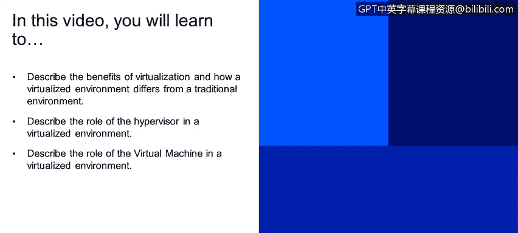

# 课程2：《网络安全角色、流程与操作系统安全》：72：虚拟化概述

在本节课程中，我们将学习虚拟化的核心概念。我们将描述虚拟化的优势，并比较虚拟化环境与传统环境的区别。同时，我们会了解虚拟机管理程序（Hypervisor）和虚拟机（Virtual Machine）在虚拟化环境中的角色。

## 虚拟化与传统架构对比

虚拟化技术允许你从单一的物理硬件系统中，创建多个拥有专用资源的模拟环境。

在屏幕右侧的图片中，你可以看到两种基础设施架构。

左侧是传统的基础设施架构。其结构自下而上依次是：底层的物理硬件、中间层的操作系统，以及顶层的应用程序。

右侧是虚拟化架构。其结构自下而上依次是：底层的物理硬件、中间层的虚拟化层（通常是一个软件），以及顶层的多个虚拟机。每个虚拟机都包含自己的操作系统和应用程序。

在右侧的图片中，每一个带有“OS & App”的方块都代表一个独立的虚拟机。

## 虚拟机管理程序（Hypervisor）的角色

虚拟化层中的核心软件称为虚拟机管理程序，也称为宿主机（Host）。宿主机是安装了管理程序软件的物理机器。

虚拟机管理程序是运行在实际硬件上的软件或应用程序，它使你能够虚拟化操作系统。

以下是虚拟机管理程序的两种主要安装模式：

*   **托管模式**：管理程序作为一个应用程序安装在现有的操作系统之上。例如，VirtualBox 或 VMware Workstation。
*   **裸机模式（企业模式）**：管理程序直接安装在硬件上，无需底层操作系统。例如，VMware ESXi。

在屏幕右侧的图片中，你可以看到这种架构：底层是硬件，中间是虚拟机管理程序，顶层是多个虚拟机。

虚拟机管理程序将物理资源与虚拟环境隔离开来。这意味着虚拟机无法直接访问硬件本身。

## 虚拟机（Virtual Machine）的角色

虚拟机本质上是一个单一的数据文件，就像任何数字文件一样。它可以被从一台计算机移动到另一台计算机。

你可以在一个计算机上创建虚拟机，复制其文件，并将其放到另一台相同类型的管理程序上，它应该能够完全一样地运行。

虚拟机管理程序负责转发来自虚拟机的所有请求到物理硬件本身。因此，虚拟机不直接与硬件交互，它们之间隔着一个管理层（即管理程序）。

物理硬件资源（如内存和磁盘）被直接分配给虚拟机，但这个过程是通过虚拟机管理程序来完成的。

例如，如果你有总计 8 GB 的物理内存，你可以将其中 1 GB 分配给每一个你计划运行的虚拟机。

在屏幕右侧的图片中，我们关注的是顶层，即位于虚拟机管理程序之上的虚拟机层。

## 课程总结

在本节课中，我们一起学习了虚拟化的基础知识。我们了解了虚拟化如何通过单一物理硬件创建多个独立环境，并比较了虚拟化架构与传统架构的区别。我们明确了虚拟机管理程序作为资源调度和隔离核心的角色，以及虚拟机作为可移植、独立计算单元的特性。理解这些概念是掌握现代云计算和高效资源管理的基础。