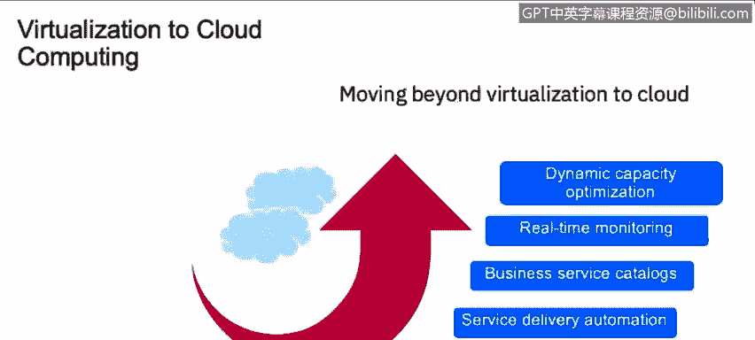

# 课程2：《网络安全角色、流程与操作系统安全》：73：从虚拟化到云 ☁️

在本节课中，我们将学习如何描述从虚拟化环境向云环境的演进，并了解在云环境中进行部署的关键步骤。

## 概述：从虚拟化到云 ☁️

欢迎来到本节课程，我将为您概述关键的安全工具，特别是关于虚拟化和云的部分。

上一节我们介绍了基础的安全概念，本节中我们来看看虚拟化技术如何演变为现代的云环境。

## 什么是虚拟化？ 💻

首先，我们需要理解什么是虚拟化。虚拟化允许您使用更少的物理资源来运行软件资源。例如，您可以在一个物理服务器上运行多个不同的虚拟机。这使得您能够在仅使用少量物理资源的情况下，运行多个独立的环境。

虚拟化的核心公式可以理解为：
**物理资源 / 虚拟化层 = 多个虚拟环境**

## 从虚拟化到云的演进 🚀

那么，我们是如何从拥有虚拟化环境，跳跃到整个云系统的呢？几年前，当云计算兴起时，人们提出了一个问题：如果我们把多个虚拟化资源整合在一起会怎样？

以下是演进的关键步骤：

1.  **从虚拟化管理开始**：首先需要对虚拟化环境本身进行管理。
2.  **实现服务交付自动化**：自动化需要与业务服务目录对齐。您不能在不清楚用途的情况下构建虚拟化环境。
3.  **实现业务目标**：一旦您明确了想要实现的业务目标，就可以将此模型应用到您的业务需求中。
4.  **端到端实时监控与优化**：这包括基于消费的计量和动态容量优化。

这张图表展示了我们如何从单一的虚拟资源，跳跃到拥有满足服务需求的、多层次交互设备的完整云环境。

## 云部署的步骤 📋

在上一部分，我们讨论了如何从虚拟化环境演进到提供服务的云。现在，为了理解云部署的具体样貌，您可以参考本幻灯片中的图表。

云部署主要分为三个步骤，每个步骤内包含若干子步骤：

**第一步：整合与虚拟化**
首先，您需要整合现有的操作。所谓“整合”，是指确定您希望迁移到云的内容、您想要提供的服务以及所需的服务。然后，您需要将第一步中列出的项目进行虚拟化，并准备实现整个虚拟化所需的资源。

**第二步：自动化**
接下来，您需要实现自动化。自动化指的是对您将在云中使用的服务和项目进行管理。一旦您明确了所有结构和如何管理这些在第一步中整合的项目，就可以开始向云迁移。

**第三步：集成与优化**
在云中，您需要进行集成和优化。您需要衡量其运行行为和性能，确保业务需求与云集成，并且您提供的服务确实能满足业务目标。优化意味着确保您已部署的资源确实在为您的目标工作。例如，如果您只需要一个云邮件解决方案，就不需要在不同地点部署100项服务。此时，您需要进行容量规划（Sizing）练习，以优化资源。您需要评估当前构建的系统是否足够，或者未来是否需要更多资源来支持增长。这只有通过了解您的业务和您希望通过云计算实现的目标才能知晓。

## 总结 📝

本节课中，我们一起学习了从虚拟化到云的演进过程。我们了解到，虚拟化是云计算的基础，它通过抽象物理资源来创建多个虚拟环境。而云计算则进一步将大量虚拟化资源整合、自动化，并通过按需服务模式提供。部署到云环境需要遵循清晰的步骤：整合现有操作、实现虚拟化、进行服务自动化管理，最后在云中完成集成与持续优化，以确保其高效、安全地满足业务需求。理解这一演进路径和部署步骤，对于规划和实施云安全策略至关重要。