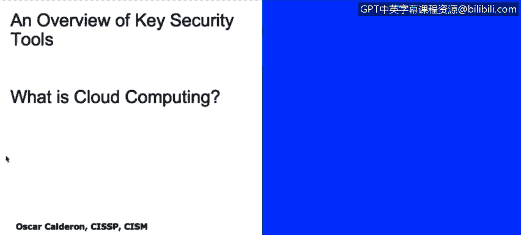
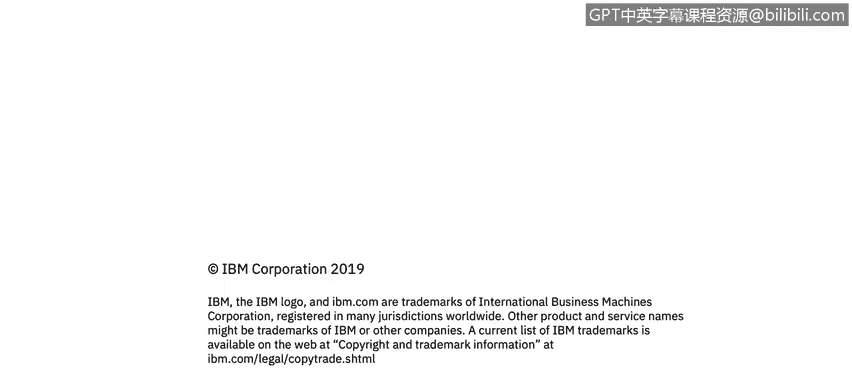

# 课程2：《网络安全角色、流程与操作系统安全》：74：什么是云计算 ☁️

在本节课程中，我们将学习云计算的定义及其不同的服务模型。我们将探讨云计算的优势与挑战，并了解其核心的参考架构。

---

## 云计算的定义

上一节我们讨论了虚拟化技术，本节中我们来看看如何从虚拟化发展到完整的云环境。那么，什么是云计算？

云计算是指按需提供的系统资源的可用性。这意味着你将拥有一个由虚拟化设备构成的环境，这些设备服务于商业目的，范围涵盖从存储到计算能力的各种资源。

---

## 云计算的优缺点

以下是云计算的一些主要优点和缺点。

**优点：**
*   **业务选择与敏捷性**：由于拥有多个虚拟化资源，业务具有灵活性，可以在全球任何地方扩展。
*   **集成、规模与成本**：拥有虚拟化资源通常比为每台服务器购置实体设备更便宜。这允许我们根据需求扩展业务，无需添加硬件，只需向提供商支付更多资源费用即可。
*   **集中化的变更管理**：无论系统规模大小，都可以在一个统一的位置管理所有资源，无需亲临不同地点的数据中心。
*   **下一代架构**：随着技术进步，云服务也会更新。提供商通常会将新技术应用到服务中，使其日益高效。

**缺点（部分为观念而非事实）：**
*   **安全性**：存在一种观念，认为由于与他人共享资源，安全性会受损。这并不完全正确，但大型云服务提供商确实有相应的安全措施。
*   **供应商锁定**：如果将所有服务基于某个云提供商构建，当该提供商突然提价时，迁移到其他提供商可能非常困难且耗时。
*   **控制力缺失**：有人认为，由于设备不在本地，就无法真正控制它们。实际上，你仍然拥有控制权，但根据服务类型，你可能不需要负责打补丁或维护等具体工作。
*   **可靠性**：同样源于“控制力缺失”的观念，人们可能质疑无法直接控制的事物的可靠性。但这正是云服务协议和云计算环境本身需要保障的部分。

---

## 云计算部署类型

现在，我们来谈谈不同类型的云计算部署模型。

**1. 公有云**
公有云是最常见的云计算类型。它由第三方拥有和运营。你与其他组织共享硬件和处理资源，这通常被称为“租户”模式。你无需购买任何硬件，所有资源由提供商提供，这降低了成本，也无需自行维护。你可以按需扩展环境，并且通常非常可靠。

**2. 私有云**
当你特别关注安全，不希望与其他公司共享资源时，私有云是你的选择。在私有云中，你将拥有专供自己使用的资源，不再是多租户环境的一部分。这提供了更大的灵活性以满足特定的业务需求，并对关键业务部分提供更高层次的控制和安全性。

**3. 混合云**
混合云结合了公有云和私有云的优势。你可以将敏感资产放在可控的私有基础设施中，同时将非敏感或需要弹性扩展的部分放在成本更低的公有云上。这样既能保障安全，又能实现成本效益。

---

## 云计算参考模型

为了理解云计算如何运作，我们可以参考一个抽象的云计算参考模型。该模型描述了云计算环境中的各个功能角色。

*   **云消费者**：雇佣或使用云服务的个人或组织。
*   **云审计员**：负责确保安全性、隐私性合规，并进行控制审计，以验证信息的可靠性和安全性。
*   **云提供商**：提供各种服务（如SaaS、PaaS、IaaS）的核心实体。
*   **云经纪人**：以某种方式向云消费者转售云服务的中介。
*   **云运营商**：实际管理云基础设施、为系统打补丁并维护一切以确保服务有效的组织。

---

## 云计算服务模型

最后，我们来详细了解一下云计算的三种主要服务模型。

**1. 软件即服务**
SaaS是指由第三方托管应用程序并通过互联网提供使用。例如 Salesforce、Google Apps、Facebook 以及 Hotmail、Gmail 等邮件服务。这是最常见的云计算服务形式。其核心是，你无需在本地计算机安装任何软件，即可直接在线使用应用程序。

**2. 平台即服务**
PaaS为你提供了一个完整的平台，用于开发、运行或管理应用程序，而无需维护底层基础设施的复杂性。你可以从供应商那里购买一个环境（如中间件、数据库环境、Java沙箱）来运行你的任务或供开发人员工作。

**3. 基础设施即服务**
IaaS提供完整的计算基础设施作为服务，包括存储、服务器、网络设备等。你可以拥有一个“数据中心即服务”。如果你不想购买实体网络设备（如路由器、交换机），或者没有空间放置它们，你可以通过IaaS模型购买这些设备的使用权，并远程使用它们来满足所有需求。

---

## 总结

本节课中，我们一起学习了云计算的核心概念。我们定义了云计算，分析了其优缺点，并了解了三种主要的部署类型：公有云、私有云和混合云。我们还通过参考模型理解了云生态中的不同角色，并详细探讨了三种关键的服务模型：软件即服务、平台即服务和基础设施即服务。掌握这些基础知识对于理解现代IT架构和网络安全至关重要。