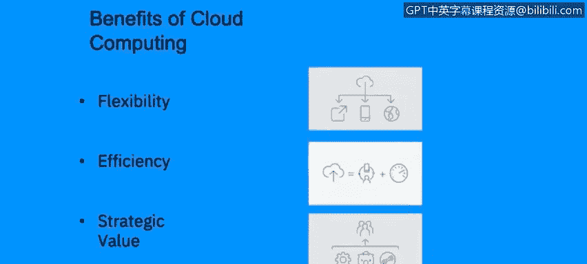
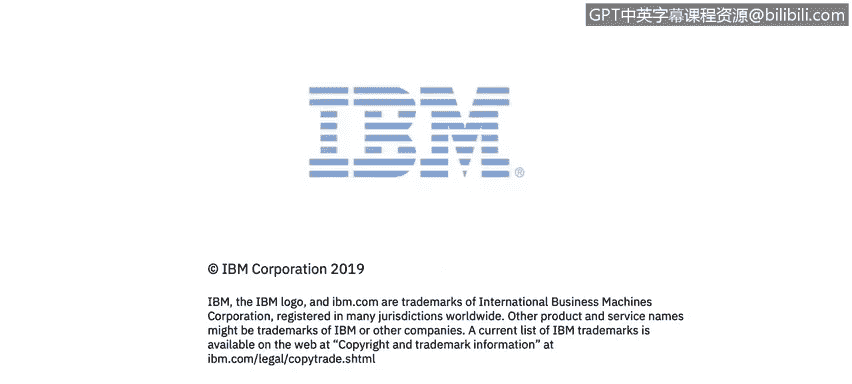

# 课程2：《网络安全角色、流程与操作系统安全》：75：云的优势、安全与治理 ☁️

在本节课中，我们将学习云计算的优势，描述云安全的组成部分，并定义云治理流程的重要性。

## 云计算的优势 🚀

上一节我们介绍了云计算的基本概念，本节中我们来看看云计算带来的具体优势。基于我们目前所涵盖的内容，云计算主要有以下三大好处：

以下是云计算的核心优势：

1.  **灵活性**：您可以根据业务需求灵活地扩展环境。您不受单一地点的限制，可以从世界任何地方访问资源，并且这种扩展能力本身也有限制。因此，云计算非常方便和灵活。
2.  **效率**：您可以随时加入会议、使用WebEx等工具。您可以在世界任何时间添加更多资源以提高效率，这就是云计算的效率体现。
3.  **战略价值**：我们几秒钟前谈到的灵活性，使我们能够将云计算的战略项目与组织的战略目标对齐。您可以将这些目标引导至同一方向，这对企业的战略价值贡献巨大。

## 云安全 🔒

了解了云的优势后，我们需要关注如何保障其安全。在第一张幻灯片中我们提到，人们对云计算的一个普遍看法是缺乏安全性，但这并非完全正确。您确实可以拥有云安全。以下是建立云环境安全控制时需要考虑的一些事项：

以下是构建云安全策略的关键组成部分：

1.  **灾难恢复与业务连续性计划**：您需要考虑如果供应商遭受攻击或停电无法提供服务时该怎么办。您需要考虑其他灾难情况。例如，是否需要另一个提供商？是否需要备份以防万一？是否需要备份副本和实施手册，以便在需要寻找新供应商时使用？所有这些都必须在灾难恢复和业务连续性计划中妥善建立和规划。
2.  **治理**：我们将在最后一张幻灯片（即下一节）更详细地讨论治理，但您绝对需要围绕云计算建立一些治理。例如，由谁负责？需要哪些部门参与？沟通计划是什么？流程将如何？我对云环境的期望是什么？所有这些都需要妥善建立。
3.  **合规性**：合规性意味着，例如，我需要了解云计算的数据保留期限。该云计算是否符合我组织可能面临的任何法规？它是否符合我所在国家/地区的政策？例如，在欧洲的GDPR，我的云计算环境是否符合GDPR？它是否会侵犯我全球供应商或客户的任何信息？这是我们在云计算中真正需要考虑的问题。
4.  **可用性**：这也与灾难恢复计划相关。如果我的供应商服务中断怎么办？我是否有另一个供应商？云中的信息如果不再可用怎么办？我是否有一个网站，或者一个本地服务器可以托管我在云中托管的网站？所有这些都是在构建云安全框架时需要牢记的信息。
5.  **数据安全**：信息是否加密？它将如何从我的公司传输到云供应商？我的云供应商采取了哪些保障措施？这一点非常重要。我们希望确保定期对我们的云或云提供商进行审计，以确保我们的数据在那里是安全的，特别是如果我们拥有基于公共云的基础设施。
6.  **身份与访问管理**：我们非常需要确保并记录谁在何时、何地、以何种方式以及为何访问了什么。确保访问管理是必须的。我们有第三方管理云环境这一事实，并不意味着我们仍然不需要跟踪和访问这些日志以及对这些日志的可见性。

所有这些项目共同构成了一个良好的云安全策略。

## 云治理 ⚖️

最后，我们来谈谈云治理，这将结束幻灯片中关于云安全的部分。为了拥有有效的云战略，您需要非常好的云治理。而拥有良好云治理的唯一途径是确保治理与服务和组织保持一致，正如您在右侧看到的小圆圈所示。

正如您所见，治理、服务和组织三者需要在不同领域重叠。如果治理与您在云中提供的服务不一致，您就无法拥有治理。当然，您在云中提供的服务需要与组织目标保持一致。而组织目标当然需要涉及或与治理相结合。因此，正如您所见，这是一个小三角关系，您不能真正牺牲三角形上的任何一点。所有三点都必须存在，并且正如我所说，需要与服务、组织和治理保持一致，才能拥有有效的云安全策略。

## 总结 📝

本节课中我们一起学习了云计算的核心优势，包括灵活性、效率和战略价值。我们深入探讨了云安全的六大关键组成部分：灾难恢复与业务连续性、治理、合规性、可用性、数据安全以及身份与访问管理。最后，我们明确了有效的云治理必须与组织目标及云服务本身紧密结合，形成一个稳固的三角关系，这是构建成功云战略的基础。