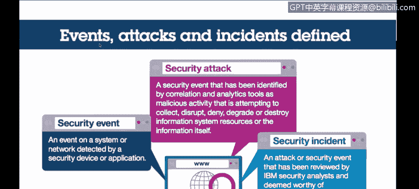
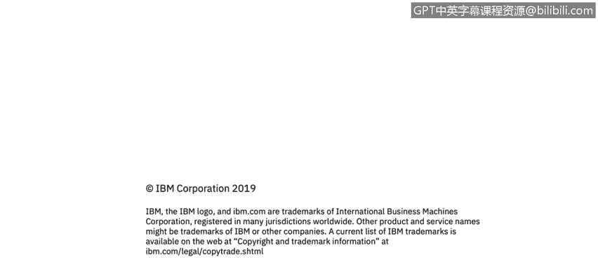

# 课程3：《网络安全合规框架与系统管理》：3：2_组织面临的网络安全挑战 🔐

在本节课程中，我们将探讨组织在网络安全领域所面临的主要挑战，这些挑战正是推动合规与监管需求的核心原因。我们将了解安全事件、攻击与事故的区别，分析攻击的来源与类型，并讨论如何针对不同的威胁来源设计相应的安全控制措施。

---

首先，我们来明确一些关键定义。安全领域存在不同类型的事件，包括**安全事件**、**攻击**和**事故**。它们相互关联，但含义不同。

一个**安全事件**是指被安全设备或应用程序检测到的系统或网络活动。这可以是任何正常活动，例如输入密码或防火墙规则检查。它本身并不等同于攻击。

**攻击**是安全事件的一个子集，指某个实体、工具或个人试图对您的系统进行恶意或不当行为。这可能包括试图窃取数据、破坏系统、发起拒绝服务攻击等。任何此类尝试都构成一次攻击。

而**事故**则是指IBM乃至整个行业认为值得深入调查的事件。这意味着我们怀疑可能确实发生了不良后果。攻击是尝试，而事故意味着我们认为可能已造成实际影响，需要查明情况并决定应对措施。

---

上一节我们定义了不同类型的安全事件，本节我们来看看这些事件发生的规模。安全领域的一大挑战在于，此类事件的数量极其庞大。

根据IBM 2015年的威胁情报指数报告，仅在云空间，2014年就发生了大约8200万起安全事件。其中，约1.7万起构成了实际攻击，而最终被认定为事故的仅有约100起。这还只是针对单个系统的数据。

人们常有一个误解，认为自己的系统很安全，因为没有看到问题。但很可能是因为防火墙规则和其他安全措施已经为您拦截了大量威胁，您所看到的只是经过层层过滤后真正需要关注的部分。因此，主要目标是如何为所有这些事件部署必要的安全控制，以便发现、预防和防范攻击与事故。

---

既然攻击不可避免，那么了解攻击的来源和类型就至关重要。保护系统没有单一的方法，因为恶意攻击者会尝试成百上千种不同的方式。

同样根据2014年的研究，已识别的安全攻击类型主要包括：
*   未经授权的访问
*   恶意代码
*   持续探测与扫描
*   凭据窃取
*   拒绝服务攻击

由此可见，攻击可以细分为多种不同的类别。

攻击者的身份也主要分为两大类：
*   **外部人员**：约占45%。他们不属于您的企业或环境，但试图入侵。这包括世界各地的黑客，可能是个人、有组织犯罪或各种其他来源。
*   **内部人员**：约占55%。这些人可能在您的组织内工作。您可能认为认识并信任所有人，但事实是，有些内部人员可能随着时间的推移变得不满，从而成为恶意内部人员。此外，还包括无意的内部行为者，他们因日常工作职能而有权访问系统，但作为人类，难免会犯错。

因此，我们需要建立安全协议、控制措施、工具和流程，以应对可能发生的不同类型安全事件以及不同的攻击来源。

---

针对上述不同的威胁来源，我们需要采取差异化的安全策略。每种安全控制都有其目的，关键在于部署一套组合措施来应对不同场景。

以下是针对不同威胁来源的应对思路：

**应对外部威胁**
外部人员试图入侵，意图窃取数据、计算资源或干扰您对产品和服务的合法使用。您需要专门针对他们的技术，例如：
*   实施**加密**
*   配置**防火墙**
*   通过审查、测试、威胁建模、渗透测试等多种方式验证这些措施的有效性

**应对无意的内部行为者**
他们身在内部，但会犯人为错误。您需要确保有系统和程序来减少与控制相关的错误，例如：
*   设置操作确认提示
*   寻求自动化以减少人工数据输入错误
*   利用自动化工具和报告等手段来预防此类事件发生

**应对恶意的内部人员**
他们身在内部且故意行为不当。在此情况下，您应重点关注：
*   **职责分离**
*   限制**特权ID**的数量
*   将关键系统和数据的访问权限限制在尽可能少的人员范围内，以降低这些人怀有恶意的风险
*   确保**个人问责制**，避免共享用户ID，并对这些有限ID执行的操作进行日志记录、监控和定期审查

---

在本节课中，我们一起学习了网络安全的基本概念区分（安全事件、攻击、事故），认识了网络攻击的巨大规模和多样化的类型与来源（外部人员、无意内部人员、恶意内部人员）。最重要的是，我们探讨了如何根据不同的威胁来源，有针对性地部署加密、防火墙、自动化、职责分离、权限最小化及审计监控等组合安全措施，以构建有效的防御体系。理解这些挑战是制定合规框架和进行有效系统管理的第一步。