# 课程3：《网络安全合规框架与系统管理》：4：合规基础 📚

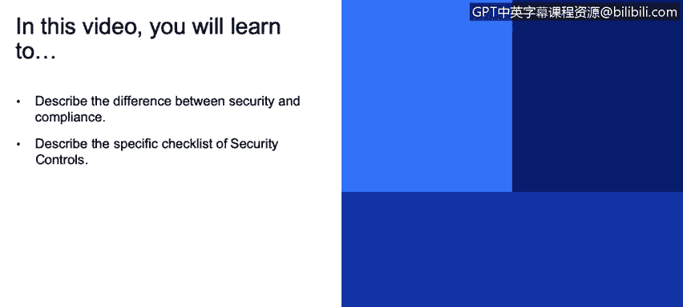

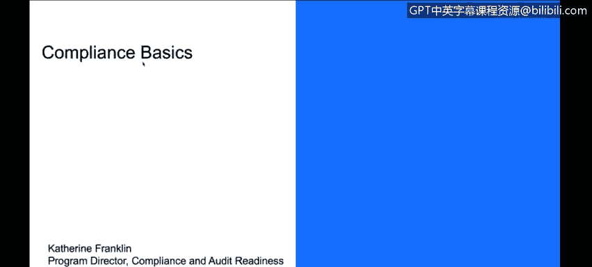

在本节课中，我们将要学习安全、隐私与合规之间的核心区别，并了解合规的基本流程和主要类别。理解这些概念是掌握后续具体合规框架的基础。

## 安全、隐私与合规的区别 🔍

上一节我们介绍了课程的整体背景，本节中我们来看看安全、隐私与合规这三个紧密相关但又不同的概念。

*   **安全**：旨在保护您的环境、系统免受盗窃、破坏或中断。它主要通过三类控制措施实现：
    *   **物理控制**：确保承载应用和数据的硬件（如服务器、数据中心）的物理安全。
    *   **技术控制**：通过工具、软件或功能来限制或控制数据与流程的安全。例如：`加密`、`日志记录`、`密码管理软件`。
    *   **操作控制**：涉及流程和程序。例如：服务器配置规则、系统补丁更新频率、日志监控职责、员工培训等。
    系统的安全通常需要综合运用以上多种防御措施。

*   **隐私**：重点关注**数据**本身。它涉及信息如何被使用、谁有权访问、如何存储和传输，以及信息是否被用于追踪个人或实体。

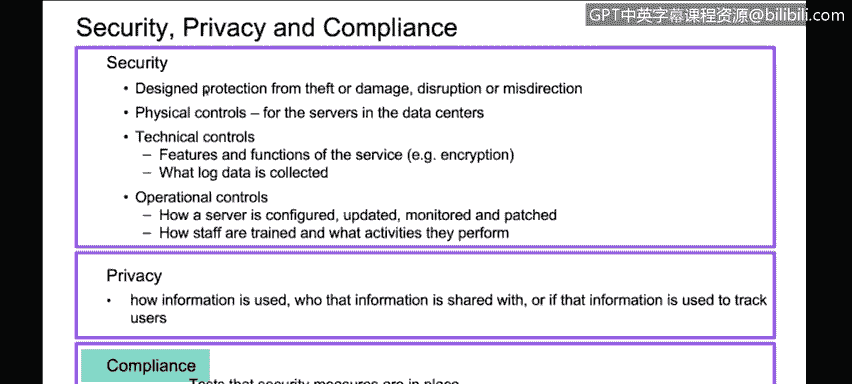

*   **合规**：侧重于**验证**既定的安全或隐私措施是否到位。合规通常会根据特定目标，从所有控制措施中选取一个特定的子集，然后对照标准验证这些控制措施的有效性。合规还可能涵盖一些非传统意义上的安全领域，如商业实践、供应商协议等。

## 合规的核心概念与流程 ⚙️

理解了基本区别后，我们来深入了解合规的具体运作方式。

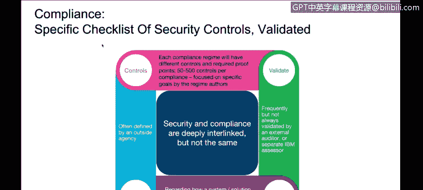

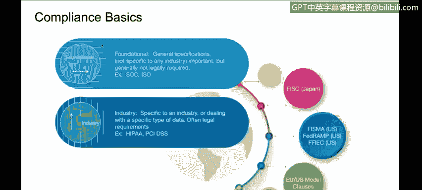

合规涉及大量控制措施，范围可能在50到500项之间，具体取决于安全要求的表述。追求特定合规标准，意味着需要选择并验证这其中的一个特定子集。验证工作通常按计划进行，由内部评估员或外部审计员执行。

以下是典型的合规认证流程：

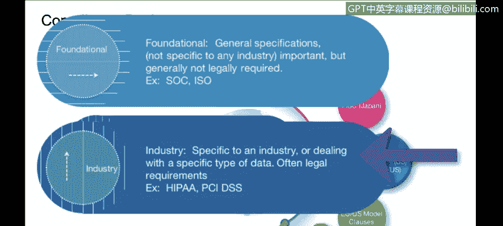

1.  **确立范围**：明确界定需要合规的系统、应用或环境边界。
2.  **准备评估**：对照标准的所有要求，评估每项控制措施在已界定范围内的应用情况。
3.  **识别差距**：评估现有控制措施的执行情况，找出不足之处。
4.  **弥补差距**：针对评估发现的差距进行整改和修正。
5.  **测试阶段**：进行内部或外部审计测试。
6.  **完成认证**：测试完成后，经过报告整理等环节，获得认证、声明或报告。
7.  **重新认证**：根据标准要求（如每季度、每年或每两年）进行周期性重新认证。

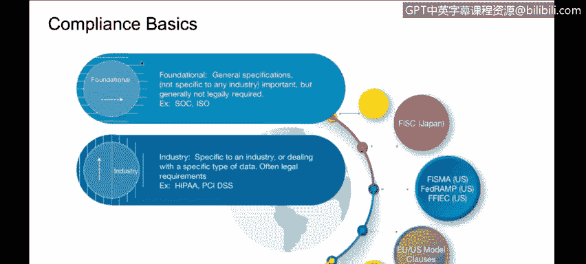

如果在测试中发现差距未完全弥补，可能需要回到前面的步骤重新开始。只要您打算维持该合规状态，这个循环就会持续下去。

## 合规的主要类别 🗂️

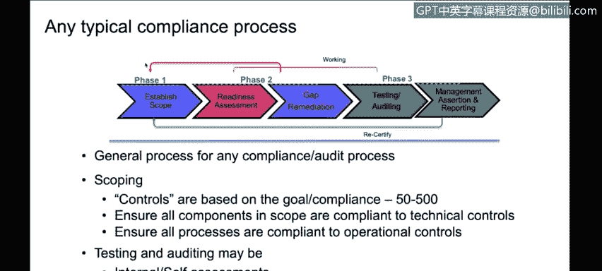

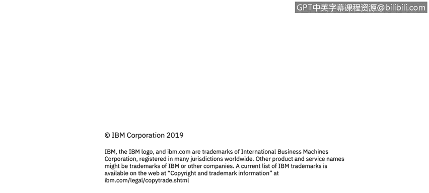

接下来，我们看看合规标准有哪些主要类别。

合规标准主要分为两大类：

*   **基础性/通用性标准**：不针对特定行业，涵盖范围广泛。例如：**ISO 27001**、**SOC**（系统和组织控制）报告。
*   **行业/政府特定标准**：针对特定领域或管辖区域。例如：
    *   **HIPAA**：专注于美国医疗保健行业。
    *   **PCI DSS**：专注于支付卡（信用卡）数据安全。
    *   此外，还有欧洲标准、美国联邦政府的多项标准等。

作为网络安全专家，需要理解各种标准的适用场景，并根据自身行业和业务需求，选择能带来最大商业价值的合规目标，因为其中一些认证过程可能非常昂贵。

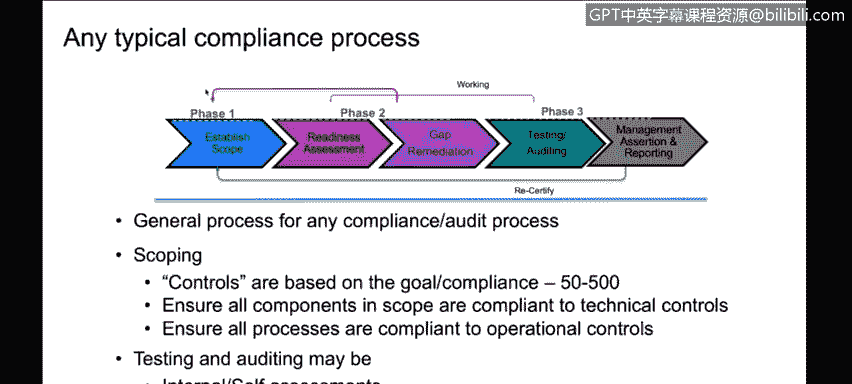

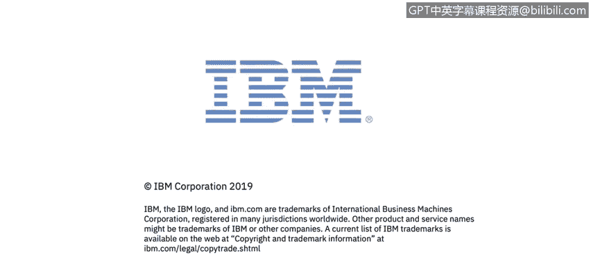

本节课中我们一起学习了安全、隐私与合规的核心区别，探讨了合规认证的基本流程，并了解了合规标准的两大主要类别。这些基础知识将帮助我们更好地理解和应用后续课程中介绍的具体合规框架。