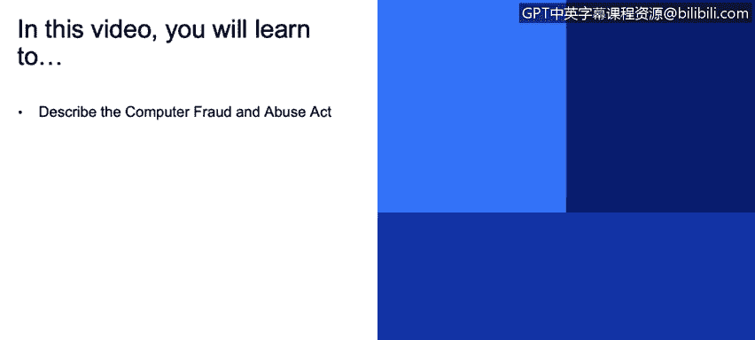
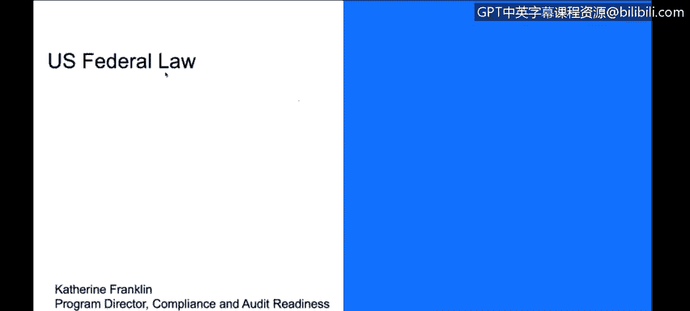
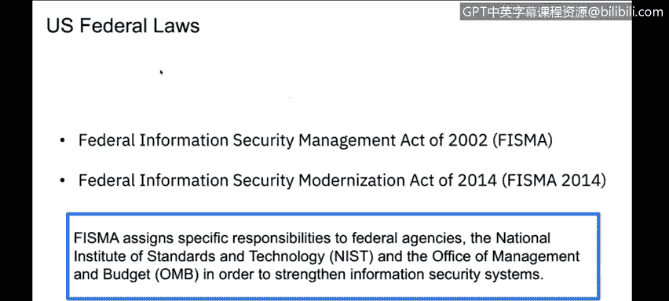
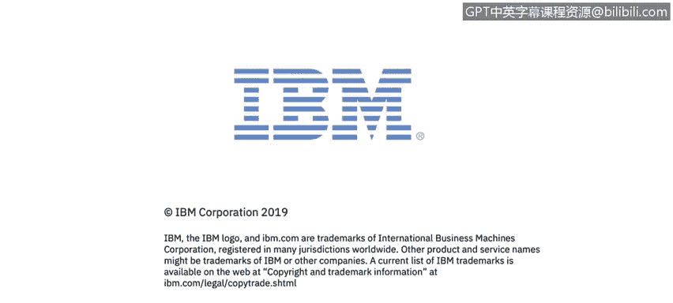

# 课程3：《网络安全合规框架与系统管理》：5：美国网络安全联邦法概述 🇺🇸

在本节课程中，我们将学习美国联邦层面与网络安全相关的几部重要法律。我们将了解这些法律的基本内容和适用范围，为理解更复杂的合规要求打下基础。

上一节我们讨论了合规框架的宏观概念，本节中我们来看看美国联邦法律的具体实例。

## 《计算机欺诈与滥用法案》💻

首先，我们将介绍《计算机欺诈与滥用法案》。这部法律是美国联邦层面打击网络犯罪的基础。

该法案自1984年起生效，其核心是将网络犯罪行为定义为刑事犯罪。该法律规定，未经授权或超越授权范围访问计算机系统、干扰系统运行、获取或破坏系统数据均属违法行为，并将受到法律制裁。

在1984年之前，计算机相关的犯罪通常依据传统的邮件和电信欺诈法规处理。自该法案出台后，网络犯罪有了专门的法律依据。

## 其他美国联邦法律与标准

接下来，我们看看其他重要的美国联邦法律与合规项目，例如《外国情报监视法》和“联邦风险与授权管理计划”。这些法律和框架主要为联邦机构设定了特定的安全责任。

如果你与美国联邦政府有业务往来，你的系统必须满足非常严格的物理和技术安全要求。美国联邦政府内的各个机构可能需要遵循不同的标准子集，这使得合规要求变得相当复杂。

以下是关于处理美国联邦法律合规的几点建议：
*   如果你需要深入研究美国联邦法律合规领域，这本身就是一个需要投入大量精力的专题。
*   建议将其作为一个完整的研究项目或教育课题来对待。
*   值得注意的是，这些美国联邦法律的要求通常都基于一个共同的标准框架——美国国家标准与技术研究院制定的标准。

## 总结

本节课中我们一起学习了美国网络安全领域的两部基础联邦法律。《计算机欺诈与滥用法案》是打击网络犯罪的基石，而其他联邦法律和FedRAMP等项目则为与政府相关的业务设定了复杂的安全要求。理解这些法律是掌握美国网络安全合规框架的重要第一步。