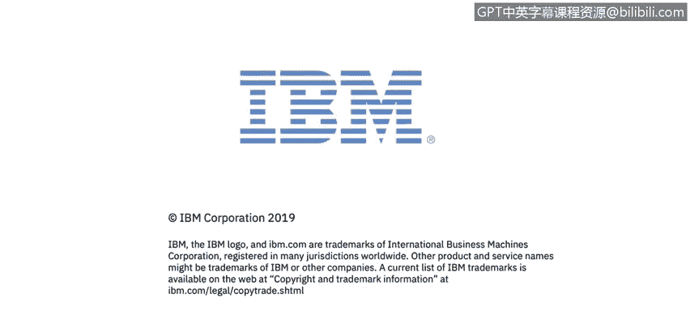

# 课程3：《网络安全合规框架与系统管理》：6：国家标准与技术研究所(NIST)概述 🇺🇸

在本节课中，我们将要学习国家标准与技术研究所（NIST）在网络安全领域的重要性及其核心作用。

上一节我们介绍了网络安全合规的基本概念，本节中我们来看看一个在全球范围内具有重要影响力的标准制定机构——NIST。

国家标准与技术研究所主要专注于网络安全与隐私领域。

该机构会识别出数百项与网络安全相关的独立标准。

以下是NIST标准文档的特点：

这些文档包含大量关于密码、加密、网络通信以及如何确保安全与隐私的详细内容。

通常并不期望企业完全实施这数百项标准中的所有内容。

但企业需要建立一种内部实践，根据自身业务情况，实施其中尽可能多且合理的标准。

正如之前提到的，根据您所打交道的具体机构，它们会关注NIST标准中特定的子集。

本节课中我们一起学习了国家标准与技术研究所（NIST）的核心职能。我们了解到NIST制定了大量详细的网络安全与隐私标准，企业需要根据自身业务需求，选择性地实施这些标准中的合理部分，以满足不同监管机构的具体要求。