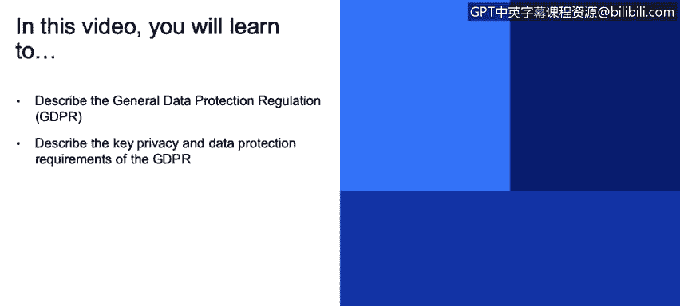
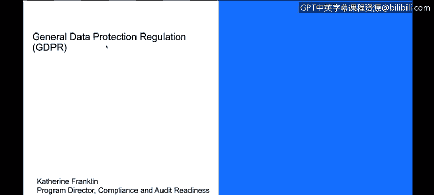
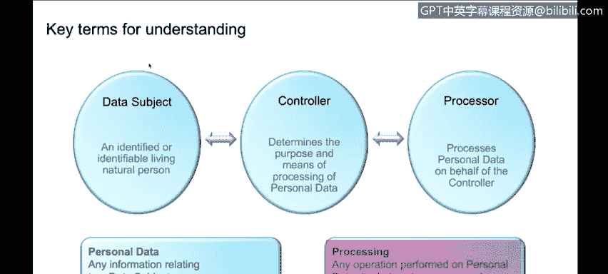
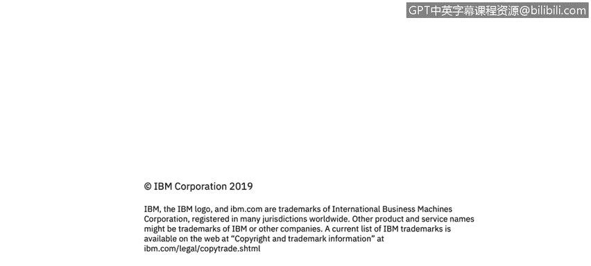

# 课程3：《网络安全合规框架与系统管理》：7：通用数据保护条例(GDPR)概述 📜

在本节课程中，我们将学习《通用数据保护条例》（GDPR）的基本概念、核心要求及其重要性。GDPR是欧盟制定的一项关于数据隐私和保护的法规，对全球处理欧盟居民数据的企业具有深远影响。

## GDPR简介

GDPR，即《通用数据保护条例》，是一项近期出台的欧洲标准法律。该法律旨在管理欧洲数据的隐私，重点关注合规性、数据保护以及欧盟居民的个人数据。

## GDPR的适用范围与重要性

具体而言，如果你的企业计划托管欧盟居民的数据或与欧盟开展业务，那么理解这项法规至关重要。从合规角度来看，GDPR旨在规范你如何管理与个人相关的数据，确保你制定了相应的政策和流程。

以下是GDPR特别关注的几个方面：

*   **数据加密**：确保数据在传输和存储时得到保护。
*   **数据安全**：实施措施防止数据泄露或未经授权的访问。
*   **数据访问与监控**：控制谁可以访问数据，并监控数据的使用情况。
*   **个人数据与隐私**：确保数据处理具有合法依据。
*   **被遗忘权**：赋予数据主体要求删除其个人数据的权利。

GDPR自2018年起生效，其适用范围是全球性的。无论你的公司位于世界何处，只要你处理的数据属于欧盟居民，就必须遵守该法律。

## 处罚与核心原则

GDPR伴随着极其严厉的处罚。罚款金额可能高达公司全球年营业额的**4%** 或**2000万欧元**（以较高者为准）。通过搜索“GDPR罚款案例”，你会发现已有多起数额巨大的罚单，有些甚至超过1亿欧元。

GDPR建立在五大核心原则之上：

1.  **数据主体的权利**：保障欧盟居民对其个人数据的控制权。
2.  **个人数据安全**：要求采取适当的技术和组织措施保护数据。
3.  **获取数据主体同意**：在多数情况下，处理个人数据前需获得数据主体的明确同意。
4.  **问责制**：要求组织能够证明其遵守了GDPR的所有规定。
5.  **数据保护**：将数据保护融入业务流程的设计中。

## 关键术语解析

为了深入理解GDPR，我们需要明确几个关键术语的定义：

*   **数据主体**：指一个已被识别或可被识别的、活着的自然人，即**欧盟居民**。
*   **控制者**：指单独或与他人共同决定个人数据处理目的和方式的个人或实体。
*   **处理者**：指代表控制者处理个人数据的个人或实体。例如，一家银行是控制者，而为该银行提供应用程序服务的公司则是处理者。
*   **个人数据**：指任何与已识别或可识别的数据主体相关的信息。这里有一个常见的误解：即使数据与直接标识符分离，只要能够关联到个人，它仍然属于**个人数据**。
*   **处理**：指对个人数据执行的任何操作或一组操作，例如**存储、访问、传输**等。

正如之前提到的，GDPR具有全球效力。该法律管辖的是数据本身，而非数据物理存储的地理位置。

## 课程总结

在本节课中，我们一起学习了《通用数据保护条例》（GDPR）的概述。我们了解到GDPR是一项保护欧盟居民数据隐私的严格法规，具有全球适用性和高额罚款。其核心在于保障数据主体的权利、确保数据安全、要求获取同意，并强调组织的问责制。理解数据主体、控制者、处理者、个人数据和处理等关键术语，是掌握GDPR合规要求的基础。对于任何涉及欧盟居民数据业务的组织而言，遵守GDPR都是一项至关重要的法律义务。