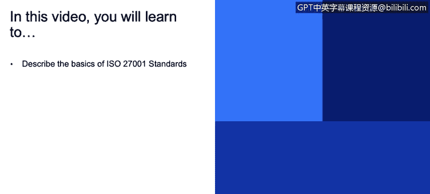
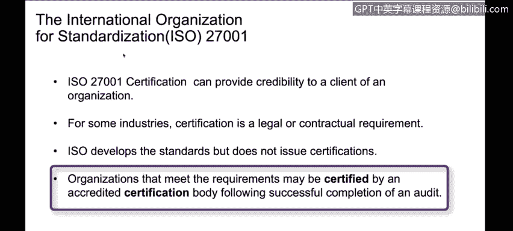

# 课程3：《网络安全合规框架与系统管理》：8：国际标准化组织ISO 2700x 📜

在本节课中，我们将要学习国际标准化组织（ISO）的ISO 27000系列标准。这个系列是信息安全领域的重要框架，我们将重点了解其核心标准ISO 27001，以及相关的ISO 27017和ISO 27018。

## 概述：ISO 27000系列标准

ISO制定了许多不同的标准，而我们在此特别关注的是适用于网络安全和信息安全的ISO 27000系列。这个系列的核心是**ISO 27001**，它是一个关于信息安全管理体系的国际标准。

## ISO 27001：信息安全管理体系

上一节我们概述了ISO 27000系列，本节中我们来看看其核心标准ISO 27001。

ISO 27001是一个基于风险的信息安全管理标准。它关注的重点是**建立、实施、维护并持续改进**一个组织的信息安全管理体系。该标准要求组织评估自身风险和安全成熟度水平。例如，仅仅“有密码保护”是不够的，标准会进一步考察密码策略的复杂度等细节。随着实施的安全措施复杂度提升，组织的安全成熟度等级也随之提高。

其核心思想可以概括为：**安全水平 = 风险评估 + 持续改进**。

## ISO 27000系列的其他相关标准

除了核心的ISO 27001，该系列中还有其他针对特定领域的重要标准。以下是其中两个与我们讨论高度相关的标准：

*   **ISO 27017**：专注于**云安全**。它为云服务提供商和云服务客户提供了具体的安全控制指南。
*   **ISO 27018**：专注于**隐私保护**。它特别建立了针对公有云个人可识别信息处理的保护控制措施。

在实际应用中，例如在云服务领域，我们通常会结合使用ISO 27001、27017和27018这三个标准，以确保能够满足像GDPR（通用数据保护条例）这类法规的要求。

## 认证流程与价值

了解了标准内容后，我们来看看如何获得官方认可，即认证流程。

组织可以聘请外部授权的审计师来进行评估，并获得认证。这个过程为组织带来了多重价值：

1.  **建立信誉**：认证向客户证明了组织达到了预期的安全标准。
2.  **提高效率**：一份权威的认证报告可以替代众多客户各自进行的单独评估，节省大量时间和资源。组织可以用这一份报告服务许多客户。
3.  **满足要求**：在某些行业、司法管辖区或合同场景下，获得ISO 27001认证可能是一项法律或合同强制要求，是开展业务的准入条件。

需要明确的是：**ISO组织本身只制定标准，并不直接颁发认证**。认证必须由经ISO认可的、具备资质的认证机构或审计师来执行。成功通过评估后，组织会获得证书，这通常是值得在官网展示的成就，它能有效吸引重视安全的客户。

## 总结

本节课中我们一起学习了ISO 27000系列信息安全标准。我们了解到ISO 27001是该系列的核心，是一个基于风险的信息安全管理体系框架。此外，ISO 27017和ISO 27018分别针对云安全和隐私保护提供了补充指导。通过外部审计获得ISO认证，不仅能有效证明组织的信息安全水平、满足合规要求，还能提升商业信誉和运营效率。