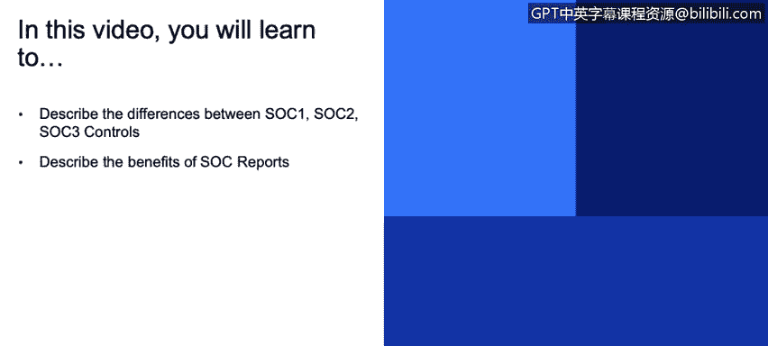
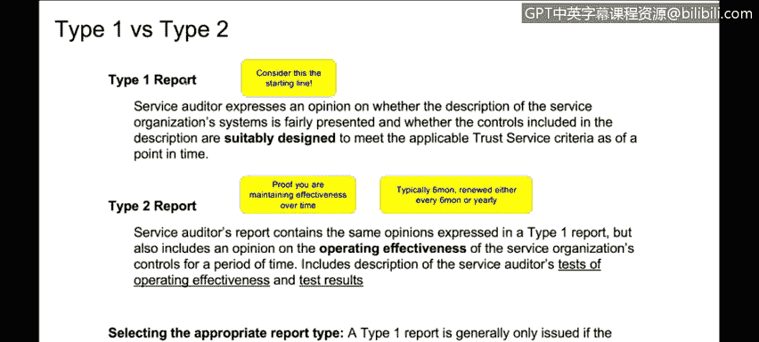
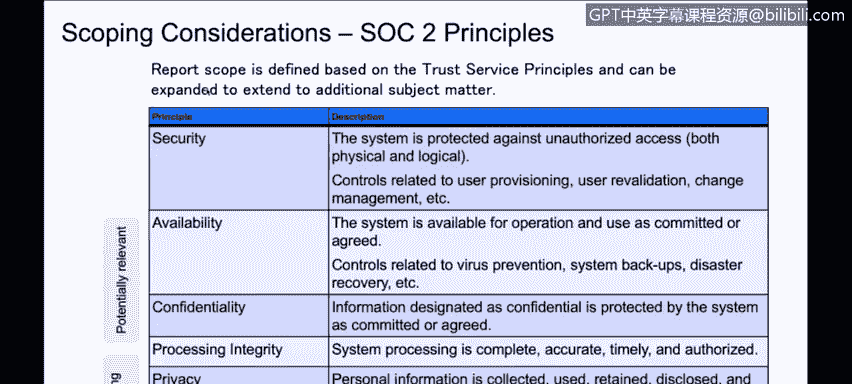
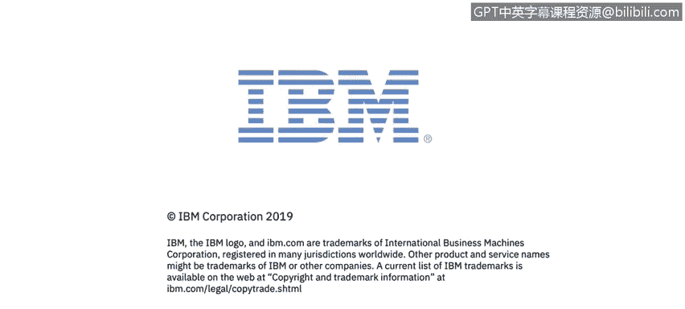

# 课程3：《网络安全合规框架与系统管理》：9：服务组织控制报告 🔍

## 概述
在本节课程中，我们将学习服务组织控制报告。我们将了解SOC 1、SOC 2和SOC 3报告之间的区别，并探讨SOC报告为组织带来的益处。

---

## SOC报告简介
上一节我们讨论了ISO等合规框架，本节中我们来看看SOC报告。SOC报告在某些行业是必需的，就像之前提到的ISO标准一样。如果组织没有SOC报告，可能需要接受本地合规审计。

许多熟悉合规的组织实际上更倾向于SOC 2报告，而非ISO认证。这是因为ISO认证是“时点测试”，而SOC 2报告是对一段时间内控制措施有效性的“持续监控测试”。此外，一些行业或客户会接受SOC 2报告，以替代其自身的审计权利。

## SOC 2与ISO 27001对比
为了更清晰地理解，我们可以将SOC 2与ISO 27001进行对比。

以下是两者的一些关键区别：
*   **关注点**：SOC 2侧重于**逻辑安全**，核心是验证组织是否“说到做到”。而ISO 27001更侧重于**风险管理**。
*   **认可度**：ISO是国际公认的标准。SOC 2传统上在北美更流行，但正逐渐获得国际认可。
*   **测试目的**：SOC 2旨在验证组织是否达到控制标准，并有效执行了自身制定的政策。ISO则更侧重于验证是否遵循了行业**最佳实践**。
*   **管理机构**：ISO由获得ISO认可的机构进行咨询和认证。SOC 2几乎总是由**注册会计师**执行，因为它受美国注册会计师协会管辖。
*   **范围与性质**：如前所述，ISO关注**设计有效性**（时点测试）。SOC 2（特别是Type 2）还会评估一段时间内的**运行有效性**（例如6-12个月）。
*   **报告形式**：ISO认证通常提供一页纸的证书，详细报告被视为机密。SOC 2报告则非常详细，长达多页，描述了控制措施、测试方法及结果，能为客户提供深入的洞察和信心。

个人观点认为，由于包含运行有效性评估，SOC 2的认证难度通常高于ISO。

## SOC报告的类型
SOC报告主要分为三种：SOC 1、SOC 2和SOC 3。它们基于相同的核心控制集，但侧重点和报告形式不同。

以下是三种SOC报告的主要区别：
*   **SOC 1报告**：使用控制集的子集，专门关注系统用于**财务报告**的场景。例如，系统存储销售分类账数据并用于生成财务报表或SEC文件。其报告会侧重于与财务报告相关的特定控制。
*   **SOC 2报告**：范围更广，涵盖的控制措施是SOC 1的超集，适用于**通用目的**。由于其报告包含了系统、安全、流程和方法的详细信息，属于**限制性使用报告**。组织需与客户或潜在客户签订保密协议后方可提供，以防敏感信息泄露被用于恶意攻击。
*   **SOC 3报告**：可视为SOC 2报告的**执行摘要**。它提供审计意见和系统描述，但不涉及具体的安全实践、测试方法和结果的细节。这份报告简洁明了，可以像ISO证书一样公开放在网页上。

通常，组织至少会进行SOC 2审计。如果有财务报告相关的需求，也会进行SOC 1审计。SOC 3报告通常会随SOC 2报告一同生成。通过一次精心策划的审计，可以同时获得三种认证。

## Type 1 与 Type 2 报告
SOC 1和SOC 2报告又分为Type 1和Type 2两种类型。

以下是两种类型的核心区别：
*   **Type 1报告**：可视为**起点**，最接近ISO认证。它测试控制措施的**设计有效性**，并验证组织至少执行过一次这些控制。这适用于新产品或首次寻求SOC认证时，通常只做一次，不会重复。
*   **Type 2报告**：在Type 1的基础上，进一步评估一段时间内（通常是6或12个月）控制措施的**运行有效性**。审计师会在此期间进行多次测试（例如，在3个月和6个月时），以验证控制措施持续有效运行。组织需要提供证据证明其长期维持了控制的有效性。Type 2报告通常每6个月或每年更新一次。例如，在业务中采用滚动12个月报告，即每6个月报告过去12个月的情况，这为持续使用其产品的客户提供了连续性保障。

## SOC 2的信任服务原则
除了Type 1和Type 2的复杂性，SOC 2还包含不同的**信任服务原则**，每个原则都对应一系列控制要求。

以下是SOC 2的主要信任服务原则：
*   **安全性**：这是最典型、最基础的原则，每个人都会涉及。它关注组织如何保护其物理和逻辑访问及系统，涉及用户配置、变更管理、库存管理等控制。
*   **可用性**：系统可供操作和使用的程度。
*   **机密性**：信息被保密，未被未经授权披露的程度。
*   **处理完整性**：系统处理是否完整、准确、及时且经过授权。
*   **隐私**：个人信息的收集、使用、保留、披露和处置是否符合承诺。

目前，安全性的基线要求是入门级。行业趋势正从基础的安全性向增加更复杂的控制发展，可用性和机密性原则越来越常见，处理完整性和隐私原则也受到更多关注。机密性和隐私原则对于向欧洲客户证明符合**GDPR**要求特别有用。

---

## 总结
本节课我们一起学习了服务组织控制报告。我们明确了SOC 1、SOC 2和SOC 3报告在目标、内容和用途上的区别，了解了Type 1与Type 2报告在设计有效性与运行有效性评估上的不同。我们还探讨了SOC 2报告的五大信任服务原则，并理解了SOC报告如何为组织建立信任、满足客户及法规要求带来益处。