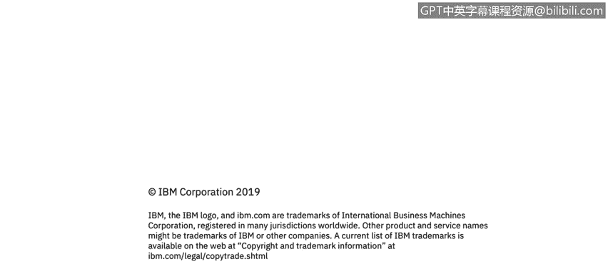

# 课程3：《网络安全合规框架与系统管理》：10：SOC报告审计过程概述 🔍

在本节课中，我们将学习SOC（系统和组织控制）报告的审计过程。我们将了解审计师在测试过程中关注的五个核心要素，以及如何通过持续监控来确保合规框架的有效运行。

---

上一节我们介绍了SOC报告的基本概念，本节中我们来看看审计师在执行SOC 2审计时具体关注哪些方面。审计过程非常严格，旨在确保控制措施得到有效实施。

审计师在测试时，主要关注五个核心要素。这些要素要求非常具体，SOC 2合规性是一项极具挑战性的任务。

以下是审计师重点测试的五个要素：

1.  **准确性**：审计师检查所有控制措施是否都得到处理，并清晰区分控制措施是通过还是失败。
2.  **完整性**：审计师评估控制措施是否覆盖了整个服务范围。例如，针对系统的控制是否覆盖了所有系统和资产清单；针对访问管理的控制是否覆盖了所有人员。
3.  **及时性**：确保控制措施按时或提前执行，且覆盖范围没有间隙。例如，如果规定每周打补丁，延迟一天就会造成覆盖间隙，可能带来恶意攻击或意外错误的风险。如果因故无法按时执行（如客户业务高峰期），则必须在控制措施被视为逾期之前，完成适当的风险评估并提前记录。
4.  **弹性**：审计师寻找制衡机制。如果一项主要控制措施失败，是否有备用方案来确保任务按时完成。
5.  **一致性**：审计师希望确保没有因过多变数而引入间隙。他们通常会测试主要控制措施，并确保其功能。如果主要控制失效，他们会寻找支持或备份措施来确保其有效性。例如，在访问管理审批记录到位的情况下，是否定期将这些审批记录与系统中的实时状态进行核对，以确保无人绕过访问管理系统私自创建账户。

---

这是一个用于审计的不同控制措施的总结列表。可以看到，它们被分解为不同的章节。这些章节是我们出于自身目的使用的。你可以从美国注册会计师协会（AICPA）的原始要求集开始。

无论你选择哪种合规框架（ISO或SOC），在两次审计之间进行**持续监控**都至关重要。我们讨论了很多可能导致SOC 2审计失败的情况，但即使是ISO审计，你也需要确保控制措施按设计运行、发挥其功能，并且所有沟通都送达给需要知悉的人员。你需要测试你的环境、流程和人员，以确保控制措施的持续执行，这就是我们所说的持续监控。你需要寻找任何偏离的风险，以及任何出现临时故障或延迟的情况，并希望有效地识别它们。因为，如果你不确保自己真正在执行标准，那么拥有标准就毫无意义。因此，持续监控是一个重要的方面。

---

本节课中，我们一起学习了SOC报告的审计过程。我们了解了审计师关注的五个核心要素：**准确性**、**完整性**、**及时性**、**弹性**和**一致性**。同时，我们认识到在审计间隔期进行**持续监控**对于维持合规状态和确保控制措施持续有效至关重要。