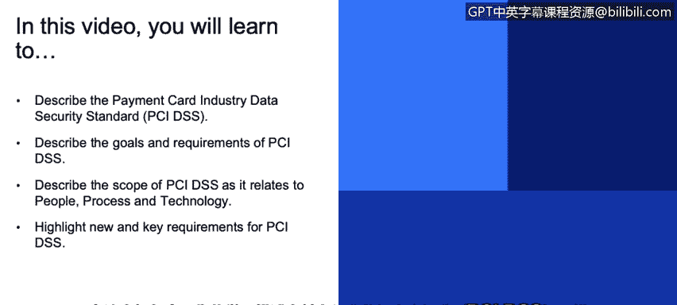
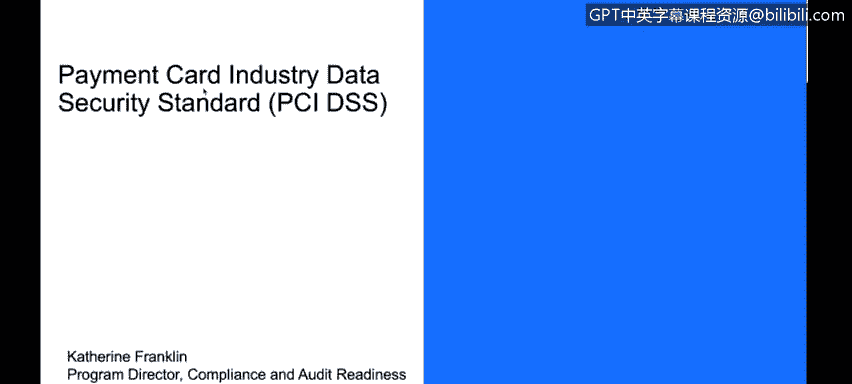
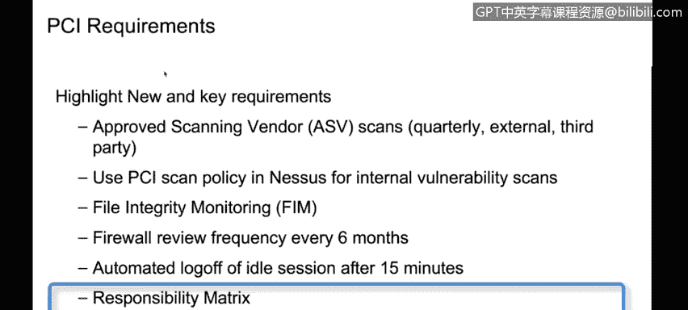
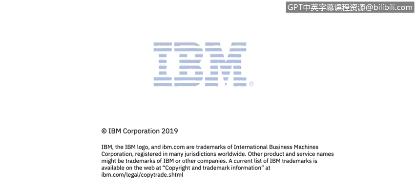

# 课程3：《网络安全合规框架与系统管理》：12：支付卡行业数据安全标准(PCI DSS) 🛡️💳

在本节课程中，我们将学习支付卡行业数据安全标准。我们将描述PCI DSS标准本身，阐述其目标和具体要求，并分析该标准在人员、流程和技术方面的适用范围。

支付卡行业数据安全标准在公共领域非常常见。回顾近年来的数据泄露事件，攻击者经常以获取他人信用卡信息为目标，因为这些数据具有极高的价值。早在2004年，几家主要的信用卡公司——美国运通、发现卡、万事达卡和维萨卡——联合制定了一套数据安全标准。随着新技术和新标准的出现，该安全标准会定期进行修订。

这些信用卡公司要求，任何涉及信用卡数据存储或传输的业务，都必须按照此标准来保护数据安全。这包括存储、处理或传输持卡人数据，例如信用卡号等。该标准涵盖了技术和运营实践，即管理控制和技术控制两方面。

该标准总共包含12个不同组别下的264项具体要求。因此，在进行PCI审计时，首要任务之一就是确定范围。你需要界定你的环境范围，并确定这264项要求中有多少适用于你。

接下来，我们将逐一审视这12个类别的要求，从构建和维护安全网络，到保护持卡人数据、实施漏洞管理计划、访问控制、监控和测试网络，再到维护信息安全策略。你需要完成一个评估，即我们之前在讨论范围时提到的准备度评估，以识别这些不同的要求并确定哪些适用于你的环境。

所有这些工作都基于一个核心认识：处于风险之中、需要被保护的数据是持卡人数据。

持卡人数据环境是指存储这些数据的人员、流程和技术，尤其关注主账号等数据，也可能包括持卡人姓名、有效期和服务代码。标准还关注敏感认证数据，例如用于验证信用卡交易的PIN码和PIN块等。

标准旨在确保任何处理、传输或存储此类数据的环节都被纳入考量范围。因此，它特别关注人员、流程和技术，审查范围从人力资源方面到网络设备管理、网络分段、审计日志记录等多个不同主题。正如我们回顾过去几项要求时所看到的，它们都有相似和重叠之处，只是各有其独特的侧重点。

PCI DSS的一个独特之处在于其“经批准的扫描供应商”概念。这些供应商通常每个季度进行一次外部扫描，这类似于但不同于漏洞扫描或渗透测试，它是一种非常具体且经批准的操作，是要求必须执行的。

相对于其他要求，另一个我们认为比较独特的地方是关于Nessus漏洞扫描和文件完整性监控的详细配置要求。文件完整性监控是确保系统上运行的所有文件都是你预期的文件，防止有人用同名但不同的可执行文件进行替换，例如检查是否存在盗刷器。

防火墙规则审查频率提高到了每六个月一次，而其他一些认证可能只要求每年一次。我们通常的做法是，如果想确保每六个月至少正确执行一次，那就每三个月执行一次，这样就能保证在间隔期内至少完成几次。因此，你可能需要执行得比规范要求更频繁，以确保在间隔期内至少完成一次。

空闲会话的自动注销时间设置为15分钟。例如，HIPAA标准是30分钟，你可以看到其中的一些差异。PCI DSS会产生一份责任矩阵文档，这是一份非常好的供你审阅的文件，因为它明确了提供PCI支持的实体与消费者各自的责任。

在这种情况下，我们可能讨论的是一家银行或一家使用信用卡进行网上购物的企业，你为这种购买安排存储了信用卡信息。那么，你和你的消费者各自做什么，就构成了你们的责任矩阵。

---

**本节总结**

在本节课中，我们一起学习了支付卡行业数据安全标准。我们描述了PCI DSS标准本身，阐述了其保护持卡人数据的目标和总计12类264项的具体要求，并分析了该标准如何从人员、流程和技术三个维度界定其适用范围。我们还了解了PCI DSS的一些独特要求，如经批准的扫描供应商和具体的责任矩阵。理解这些内容对于处理信用卡相关业务的系统安全管理至关重要。