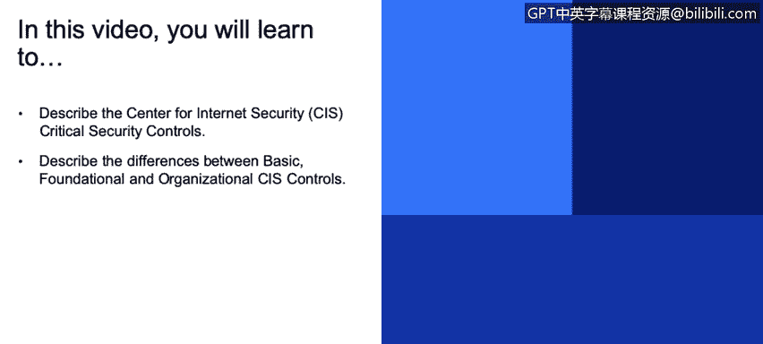
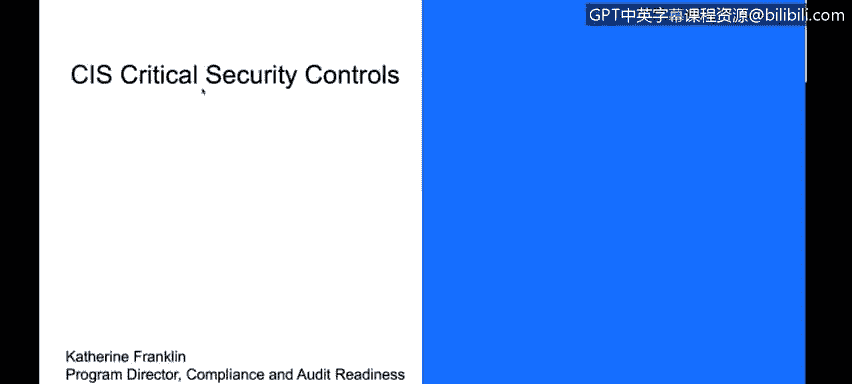
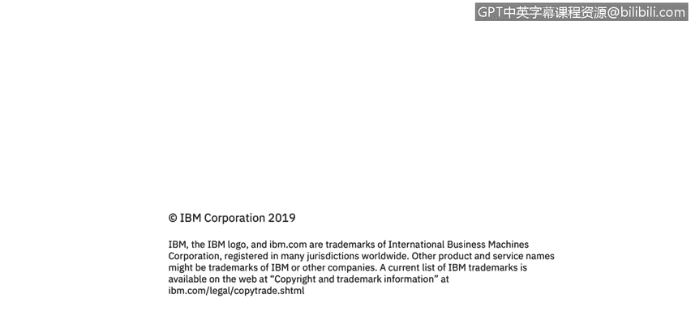

# 课程3：《网络安全合规框架与系统管理》：13：互联网安全中心关键安全控制(CIS)

## 概述
在本节课中，我们将学习互联网安全中心及其关键安全控制。我们将了解CIS控制措施是什么，以及它们如何分为不同的实施组别，以帮助各种规模的组织提升其安全配置和防御能力。

---

## CIS关键安全控制介绍
互联网安全中心制定了一套安全控制措施。与许多组织一样，CIS也发布了一套他们认为重要的标准清单。这套关键安全控制措施是CIS认为能够有效缓解系统和网络常见攻击的深度最佳实践集合。

具体而言，我们通常从配置的角度来审视这些控制措施，即如何最佳地配置位于公共互联网上的系统，使其得到合理保护。许多行业的专家，包括零售、制造和医疗保健等，都在广泛使用这些控制措施。

## CIS控制措施示例：密码配置
CIS管理的一个控制措施示例是密码策略。初次设置计算机时，你可以选择是否启用密码，有常识的人都会选择启用。但不同网站对密码复杂性的要求可能不同：是需要8个字符还是15个字符？是否需要大写字母、小写字母、数字和标点符号？

这就是一个安全配置的例子。每个企业都会决定采用何种适当的配置。CIS有一套配置基准，其中就包括对密码复杂性的管理。这只是众多控制措施中的一个例子。

## CIS控制措施涵盖的领域
CIS控制措施涵盖了许多不同主题。除了密码管理，还包括漏洞管理、边界防御、应用程序安全以及事件响应与管理。

之前我们未深入讨论事件响应与管理，现在让我们花点时间了解一下。仅仅部署了所有控制措施和实践是不够的。我们之前讨论过安全事件，总会有事情出错，或者有人察觉到问题。这时，应该联系谁？该如何处理？是否为客户和员工提供了报告可疑事件的渠道？组织内部关于事件管理的规程是大多数安全态势的重要组成部分。

## CIS控制的三个实施组别
CIS将其控制措施分为三个实施组别。这种划分基于控制措施的成熟度或重要性，以及使用组织的规模。

*   **实施组1**：适用于小型、单一业务的组织。
*   **实施组3**：适用于成熟的大型企业组织。

每个控制措施都详细说明了实施原因、不同组成部分、所需的工具和程序，并提供了组织实施的示例。

## 总结
本节课我们一起学习了不同类型的控制措施，重点介绍了互联网安全中心的关键安全控制。我们了解了CIS控制是一套旨在缓解常见攻击的最佳实践配置指南，探讨了其具体示例（如密码复杂性），并认识到其涵盖漏洞管理、事件响应等多个领域。最后，我们了解到CIS根据组织规模和成熟度，将控制措施分为三个实施组别，以提供灵活的采用路径。

希望这些知识对您的安全和合规工作有所帮助。谢谢。