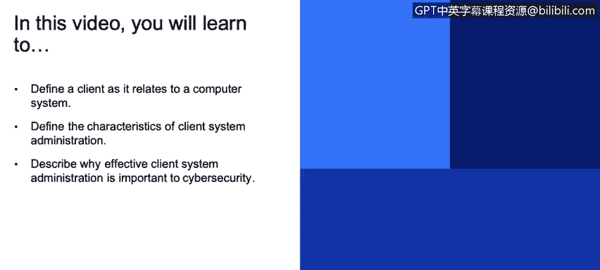

# 课程3：《网络安全合规框架与系统管理》：15：客户端系统管理 🖥️

在本节课中，我们将学习客户端系统管理的基础知识。我们将定义什么是客户端，探讨客户端系统管理的特点，并解释为什么有效的客户端管理对网络安全至关重要。

---

## 什么是客户端？

上一节我们介绍了课程概述，本节中我们来看看客户端的具体定义。

在计算机系统的语境中，客户端是指访问服务器资源的任何设备或系统。这里的“访问”特指与服务器应用程序的交互。

**核心概念**：`客户端` 是任何向服务器请求服务或资源的终端设备或软件。

例如，当您使用笔记本电脑上的浏览器访问一个网站时，您的笔记本电脑就是客户端，而托管网站的那台计算机就是服务器。常见的客户端设备包括：
*   台式电脑
*   笔记本电脑
*   平板电脑
*   智能手机

一个服务器可以同时为多个客户端提供服务，而一个客户端也可以访问多个不同用途的服务器。因此，客户端与服务器之间的关系通常是**多对一**或**一对多**的。

---

## 客户端系统管理的特点

理解了客户端的定义后，本节我们将探讨客户端系统管理的主要特点。

在网络安全领域，客户端系统管理主要关注以下几个方面：
1.  **云与移动计算**：如今，我们通过智能手机上的应用程序访问服务，这些应用大多采用客户端-服务器模式，从云端（如AWS、Azure、IBM云）的服务器获取资源。
2.  **动态环境**：新的设备、应用和服务不断进入组织。员工会安装新软件，新的业务线应用程序也会上线，这创造了一个按需使用的世界。
3.  **安全前线**：端点设备（即客户端）是网络攻击的前线。大多数恶意行为者或黑客试图通过入侵一个端点或客户端来进入组织，并以此为跳板进行横向移动。

恶意软件可能通过员工访问的网站、网络钓鱼攻击或勒索软件等方式安装在客户端上，从而给组织带来巨大风险。

---

## 常见的端点攻击类型

认识到客户端是攻击前线后，本节我们来看看攻击者具体会使用哪些手段。以下是几种常见的端点攻击类型：

*   **钓鱼攻击与鱼叉式钓鱼**：
    *   **钓鱼攻击**：指发送给组织内所有人的大规模欺诈邮件，任何点击链接的人都可能成为攻击目标。
    *   **鱼叉式钓鱼**：一种模仿可信来源、针对特定个人或部门的精准电子邮件攻击。“鱼叉”比喻其攻击目标明确。针对公司高管的此类攻击有时也被称为“捕鲸”。

*   **水坑攻击**：指在员工或特定员工群体经常访问的网站上植入恶意软件。任何访问该网站并点击恶意链接的用户，其端点设备都会被安装恶意软件。

*   **广告网络攻击**：攻击者利用在线广告网络，通过广告软件将恶意软件植入用户设备。用户点击网站上的恶意广告链接后，恶意软件便会下载到端点。

*   **勒索软件**：这种攻击已变得日益普遍，对组织构成重大威胁。它通过加密文件来勒索赎金，例如去年亚特兰大市和今年佛罗里达州莱克城遭遇的攻击。

*   **岛屿跳跃攻击**：这是一种供应链渗透攻击。攻击者试图侵入组织的供应链，以破坏其业务运营或窃取信息，最终可能造成问题或将信息出售牟利。

**核心动机**：无论是破坏竞争对手运营，还是直接勒索公司以换取解密密钥，现代端点攻击和恶意软件的**根本目的通常是牟利**。这与早期黑客以技术挑战为主的动机已大不相同。

---

## 有效客户端管理的重要性

了解了各种攻击手段，本节我们总结一下为什么有效的客户端系统管理如此关键。

有效的客户端系统管理是网络安全防御的基石，原因如下：
*   **减少攻击面**：通过严格管理客户端设备上安装的软件、应用和访问权限，可以显著减少恶意软件入侵的机会。
*   **及时响应威胁**：良好的管理策略包括定期更新、打补丁和监控，能够快速发现并遏制已发生的安全事件。
*   **保护核心资产**：客户端往往是访问组织核心服务器和数据的入口。守住客户端，就等于保护了后方更重要的服务器和数据资产。
*   **应对现代威胁**：面对以经济利益驱动、高度组织化的现代网络攻击，强有力的客户端管理是组织不可或缺的防御环节。

---

本节课中，我们一起学习了客户端系统管理的基础知识。我们明确了客户端的定义，了解了其多对一的服务器访问特性。我们探讨了在云和移动计算时代客户端管理的特点，并认识到端点设备是网络安全的前线。通过分析钓鱼攻击、勒索软件等多种常见攻击类型，我们理解了攻击者的核心动机是牟利。最后，我们总结了实施有效的客户端系统管理对于减少攻击面、及时响应威胁和保护组织核心资产至关重要。