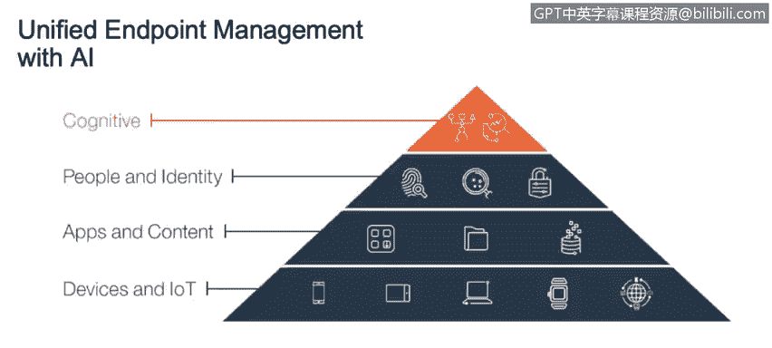
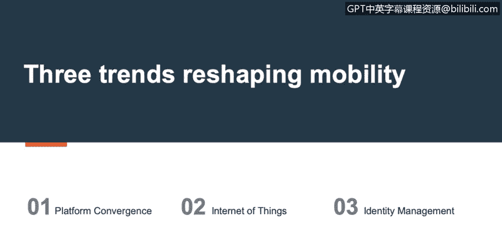
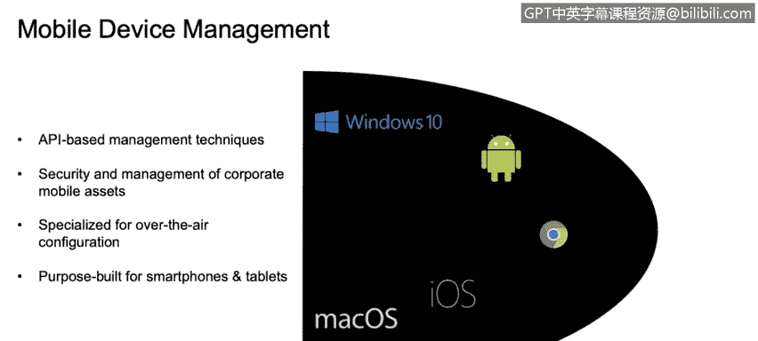
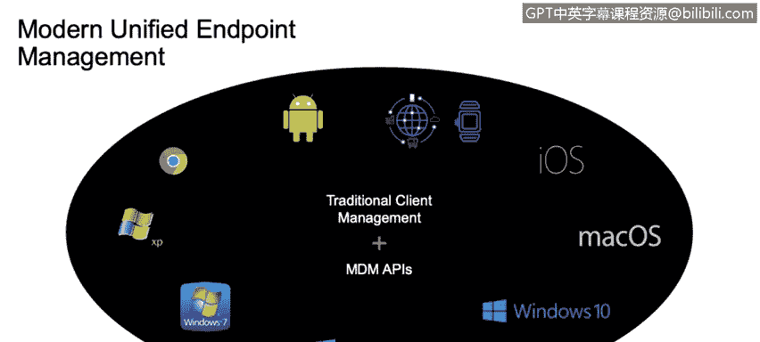
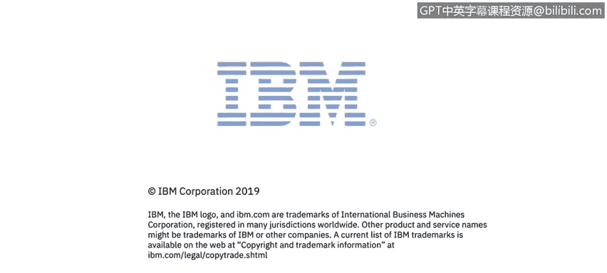

# 课程3：《网络安全合规框架与系统管理》：18：统一端点管理

在本节课中，我们将要学习统一端点管理的概念、发展历程及其在现代企业生态系统中的重要性。我们将了解它如何整合不同的设备管理技术，为组织提供一个全面的安全管理平台。

## 概述：什么是统一端点管理？

我是马修·谢弗，IBM的知识与内容经理。今天我将介绍统一端点管理，即UEM。我将解释它的定义以及它在现代企业生态系统中的定位。

## 设备管理的演变 🕰️

上一节我们介绍了课程概述，本节中我们来看看设备管理是如何演变的。

设备管理并非一个新概念。在过去十年左右的时间里，它已经发展到我们目前所处的阶段，即统一端点管理。

传统的移动设备管理解决方案是为一个更简单的时代构建的。当智能手机进入市场时，情况相对简单。当时存在一套非常松散的API，它们对设备的影响可能很关键，但数量相对较少。例如，擦除设备是一个相当标准的操作。如果组织认为存在安全漏洞，他们可以通过MDM解决方案，甚至通过邮件服务器的ActiveSync命令来执行此操作。

黑莓在翻盖手机时代出现，并带来了对企业移动设备（特别是手机）进行管理的理念。这包括一个部署在环境中的本地解决方案，可以直接与黑莓设备通信。

然而，当我们开始拥有越来越多的设备类型，即iOS和Android时，就需要一种能够处理所有设备的集中管理解决方案。这时，MDM解决方案开始出现，例如MaaS360。它们可以通过嵌入在实际操作系统中的API来处理这些设备。

随着时间的推移，人们越来越需要在单一平台下管理所有设备，无论它们是台式机、笔记本电脑、智能手机还是平板电脑。

## UEM的基础：设备、内容与身份 🔐

上一节我们回顾了设备管理的历史，本节中我们来看看构成统一端点管理基础的核心要素。

统一端点管理的基础是设备本身，以及现在的物联网设备。这包括智能手机和平板电脑、PC台式机和笔记本电脑及服务器、智能连接设备。

然而，需要保护的不仅仅是设备。还有很多内容在设备上或周围流动。保护现有的企业内容很重要，同时我们也需要能够将其与个人数据分离，并在必要时将其移除，而不影响用户的任何个人信息。

下一层是人员和身份。这指的是操作设备的人员，以及他们用来在这些移动设备支持的各种系统中进行身份验证的凭据。

所有这些层面共同构成了统一端点管理。

## UEM的实际应用流程 📱💻

了解了UEM的基础要素后，本节我们通过一个场景来看看它的实际应用流程。

这个流程是怎样的？我们有设备、应用和内容、人员和身份。假设我加入一个新组织，并带着我的个人智能手机。当我开始工作时，公司会发给我一台公司拥有的笔记本电脑。

通过这些系统，我的设备被注册。一台被特别标记为“自带设备”，另一台被标记为公司资产。因此，不同的合规规则适用于这些设备，不同的监控设置也会生效。如果我违反了企业准则，将采取不同的处理措施。

不仅如此，现在我可以在我的个人移动设备上接收公司应用和内容，并且公司保留仅删除那些应用和内容的能力，而不会影响我的任何个人功能。

为了注册所有这些，公司提供了一套在这些平台间同步的凭据。因此，我只需在我的移动设备上输入一次凭据，这不仅会在MaaS360解决方案中注册它，还会自动推送我所有的电子邮件配置、公司文档访问权限和内部网资源，而无需我后续再次进行身份验证。

当然，管理对这一切至关重要，但洞察力也同样重要。能够洞察我的环境，了解存在什么，了解威胁可能潜伏在哪里，了解发生了什么、可能发生什么以及当事情发生时应该做什么。因此，策略引擎、合规引擎和设备监控（如恶意软件和防病毒软件）都在这个环境的背景下，被统一端点管理所封装。

## 从被动响应到主动智能 🧠

上一节我们看到了UEM如何管理设备，本节中我们来看看它如何帮助企业从被动响应转向主动智能。

采取一种新方法，从随机搜索旧新闻文章、博客和Twitter以找出最新威胁，转变为主动接收这些信息的警报，提出问题并获得答案，正变得越来越重要。因此，统一端点管理不仅仅是提供一个管理设备的平台，还教育您了解市场上存在什么，将知识直接传递给每天管理这些设备的管理员以及最终用户。

需要理解的是，最佳实践可能因行业垂直领域、甚至您部署的具体设备以及公司规模而异。因此，没有一套适用于所有人的通用最佳实践。我们可以提出建议，但如果这些建议适合您的环境，效果会好得多。

制定行动计划也可以被替换为在上下文中立即采取行动。如果市场上出现了一个影响您环境中设备的威胁，您不希望必须经过数周的会议来决定如何解决它。您希望立即采取行动。统一端点管理可以为您采取行动。

## 认知能力与自动化洞察 ⚙️

上一节提到了主动智能，本节中我们来看看实现这一目标的关键技术：认知计算与自动化洞察。

很多功能是通过管理员设置实现的。在我们金字塔的顶端是认知能力。MaaS360 with Watson是我们的认知组件，它提供了一个可信赖的顾问、增强的智能和认知计算。这意味着我们可以为您提供自动化的、可操作的洞察和上下文分析。

我们可以向您展示应用评级，以帮助您理解：一个应用出现在市场上，仅仅因为它通过了Play商店或iTunes商店的安全检查，并不意味着它100%适合存在于您的环境中。因此，应用评级和上下文分析可以在那里提供额外的洞察。

我们还可以在新威胁出现时自动将设备分组。如果某个特定版本的操作系统中存在安全漏洞，洞察功能可以收集这些设备到一个组中，为您设置并显示它们，以便管理员知晓，并为您提供一种方法来自动对这些设备采取行动，无论是简单地将它们从环境中移除，还是更严格的操作，如完全擦除设备。

除此之外，我们还可以提供应用、内容和数据，以及连接这些设备所需的人员和身份安全，当然还有设备本身。

## 推动UEM发展的三大趋势 🚀

了解了UEM的功能后，本节我们来看看推动其发展的三大宏观趋势。

三大趋势正在重塑移动性：平台融合、物联网和身份管理。这些趋势共同促成了统一端点管理理念的形成。

## 传统客户端管理与移动设备管理 🔄

上一节我们看到了宏观趋势，本节中我们回顾一下UEM所整合的两种传统管理方式。

传统的客户端管理采用基于代理的方法。安装一个代理程序来接管设备管理，安装补丁，负责维护。这是一个重复的过程：新设备、新员工，IT部门接收设备，为其安装镜像，然后提供给员工。

移动设备管理是一种基于API的方法。解决方案已经嵌入在设备中。您只需要安装一个证书或代理来解锁这些功能并进行管理。

公司移动资产的安全和管理也变得重要。容器化技术可以隔离公司数据、电子邮件，确保对信息的访问是安全的，并且可以在不影响用户个人资产的情况下移除这些信息。

它专为无线配置而设计，您无需亲自接触这些设备。有部署程序，因此您可以直接将设备运送给用户，并且设备会强制用户在开始使用前进行注册。

## 现代统一端点管理的整合 🌐

现代统一端点管理将所有理念整合在一个统一的平台下。它结合了传统客户端管理和MDM API，有时甚至在同一个设备上协同工作，但覆盖了当今所有主要平台。

## 总结

本节课中我们一起学习了统一端点管理的基础知识。我们看到设备管理、客户端管理如何融合在一起，形成一个团队、一个解决方案、管理所有设备的统一体系，即UEM或统一端点管理。

