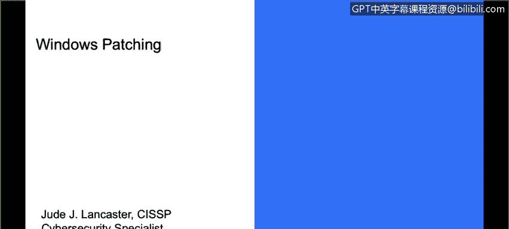
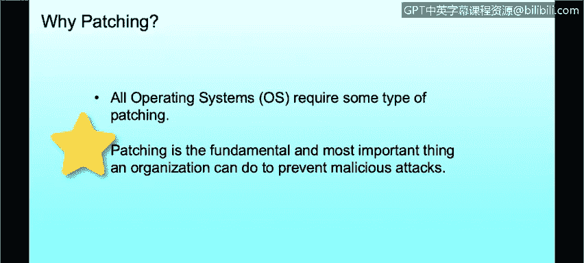
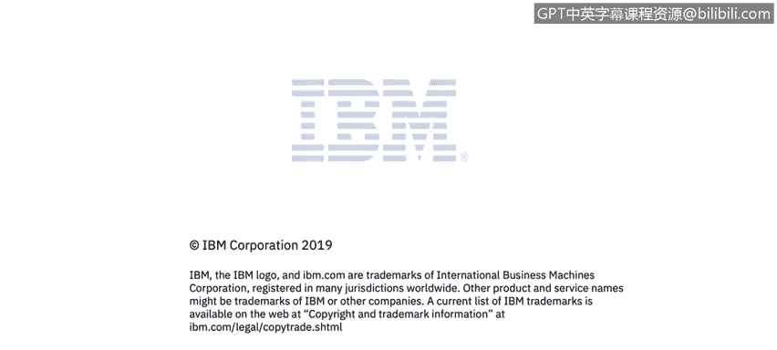

# 课程3：《网络安全合规框架与系统管理》：19：补丁概述 🛡️

在本节课中，我们将要学习补丁的基本概念，并了解为什么及时打补丁对于防范网络安全威胁至关重要。

## 什么是补丁？

上一节我们介绍了网络安全的基本挑战，本节中我们来看看一个具体的防御措施：补丁管理。无论您使用的是何种操作系统，补丁都是一个核心概念。

补丁是指对计算机程序或其支持数据所做的一系列更改，旨在**更新、修复或改进**它。这包括修复安全漏洞和其他程序错误（因此某些补丁可能被称为“错误修复”）。当我们讨论打补丁时，通常也指对操作系统本身进行更新。

## 为什么补丁至关重要？

了解补丁是什么之后，我们来看看它为何如此重要。及时应用补丁是组织保护自身免受恶意事件侵害的最基本、最重要的事情之一。

我们经常听到公司被黑客攻击或遭遇勒索软件的新闻。在美国，有许多公共机构（如城市）遭受攻击的实例，例如亚特兰大市、佛罗里达州莱克城等，它们近期都遭受了勒索软件攻击。

以下是勒索软件的典型攻击过程：
*   攻击者（通常是境外实体）侵入系统。
*   他们在系统上植入特定代码，对硬盘上的所有内容进行加密。
*   这种加密会传播到环境中的所有机器，导致所有文件和文件夹无法使用。
*   攻击者要求支付赎金（通常以比特币形式）来提供解密密钥。

支付赎金的机构通常能成功恢复文件，但许多组织和市政当局选择不支付，结果在恢复文件上花费的成本远高于赎金。这个现实世界的例子清楚地表明，保持系统补丁更新至关重要。

## 补丁的通用性

最后，我们来总结一下补丁的通用性原则。尽管不同操作系统的打补丁机制可能略有不同，但其核心目的和概念是相同的。

无论您谈论的是Mac、Windows系统，还是Linux或Unix系统，我们打补丁的**根本原因**都是一致的：为了修复漏洞、提升安全性和稳定性。保持所有系统的更新是网络安全防护的第一道防线。

本节课中我们一起学习了补丁的定义、其对于防范网络安全威胁（尤其是勒索软件）的重要性，以及补丁概念在不同操作系统间的通用性。记住，及时打补丁是维护系统安全最基础且关键的一步。