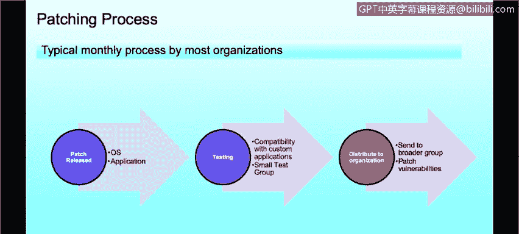
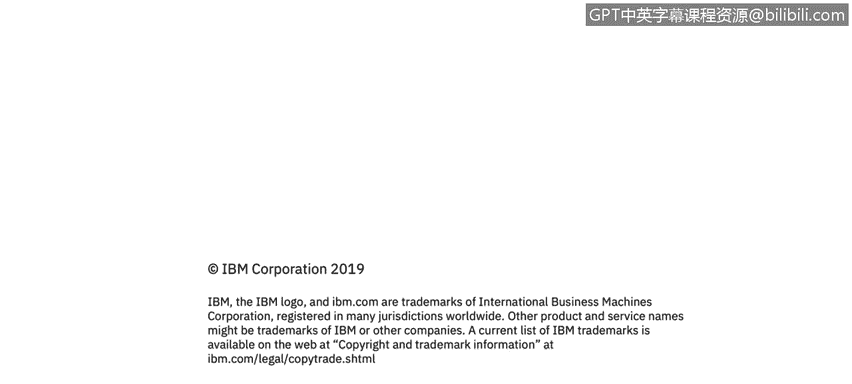

# 课程3：《网络安全合规框架与系统管理》：20：Windows补丁管理

## 概述
在本节课程中，我们将学习Windows操作系统的补丁管理。你将了解补丁的工作原理以及补丁管理的最佳实践。

---

## 补丁的工作原理

上一节我们介绍了系统管理的基础，本节中我们来看看Windows补丁的具体工作机制。

在Windows环境下，我们可能都熟悉的“Windows更新”功能，用于修复Microsoft产品及操作系统中的已知缺陷。这些更新不仅针对软件，有时也针对硬件，例如存在漏洞的硬件驱动程序。它们有助于提升系统的性能、可靠性，最重要的是安全性。

以Microsoft为例（因其最为人熟知），他们每月定期发布补丁。业界通常称之为“补丁星期二”，因为Microsoft在每个月的第二个星期二发布补丁。

Windows操作系统主要有四种更新类型，这些类型同样适用于Linux和Mac等其他操作系统：

以下是四种主要的更新类型：
1.  **安全更新**：这可能是最重要的更新。许多组织**只部署安全更新**，他们认为应用程序更新或为增加功能而升级到新版Microsoft Office意义不大。安全更新主要修补操作系统中的漏洞，其严重性等级分为：**关键、重要、中等、低**，有些甚至不予评级。许多组织只修补**关键**和**重要**级别的安全更新。
2.  **关键更新**：这些是高优先级更新，可能不属于安全更新范畴，但依然被视为关键。例如，某个应用程序中存在导致问题的错误，就需要应用关键更新。
3.  **软件更新**：由Microsoft发布，不被视为关键。这类更新通常涉及功能升级或特定软件的可靠性改进，与漏洞无关。
4.  **服务包**：服务包是之前所有更新的汇总或合集，旨在确保系统更新至最新状态。它们也可能包含操作系统的功能更新或增强。但随着Microsoft更新策略的改变，服务包可能逐渐成为历史。

组织对补丁的哲学各不相同。有时，一个补丁可能会影响组织业务所需的其他应用程序，这就是为什么他们选择不修补所有内容。因此，无论大型还是小型组织，在部署补丁前都需要进行大量测试，以确保发布的补丁与自身环境兼容。这也是为什么即使在今天，补丁管理仍然是一大挑战。

---

## 应用程序补丁管理

了解了操作系统补丁后，我们同样需要关注应用程序的补丁管理。

当谈论应用程序补丁时，无论系统是Windows、Linux、Unix还是Mac，原则是通用的。这里主要指每个终端用户系统甚至大多数服务器上安装的第三方应用程序。

以下是需要重点关注的第三方应用程序示例：
*   Java
*   Adobe Flash
*   各种网页浏览器

事实上，修补这些应用程序有时比修补操作系统本身更重要。数据显示，在排名前50的网络安全程序中发现的漏洞，有80%影响的是Flash Player、Reader、Java、Skype、媒体播放器等第三方应用程序，而非操作系统本身。

因此，最重视网络安全的组织，会像对待操作系统补丁一样严肃地对待应用程序补丁。

---

## 补丁管理最佳实践

那么，在实际操作中，应如何实施补丁管理呢？以下是常见的行业最佳实践流程。

大多数与我合作的组织都采用月度补丁周期，并围绕“补丁星期二”展开工作。他们的流程通常如下：

以下是典型的补丁管理流程步骤：
1.  **发布与收集**：在“补丁星期二”补丁发布后，组织会收集该月所有的Windows补丁及第三方应用程序补丁。
2.  **测试与验证**：将这些补丁分发给组织内的一个“测试组”，通常是IT部门的员工或被视为测试部分的虚拟系统。
3.  **兼容性测试**：测试组会运行日常所需的应用程序（无论是定制软件还是商业现成品），以确保新发布的补丁不存在兼容性问题。
4.  **全面部署**：一旦确认没有兼容性问题，这些补丁就会被部署到更广泛的组织网络中，确保所有机器都得到修补，不存在可被利用的漏洞。

这是一个非常耗时但至关重要的过程，是网络安全中需要定期执行的重要组成部分。

---

## 总结
本节课我们一起学习了Windows补丁管理。我们描述了补丁如何工作，区分了安全更新、关键更新、软件更新和服务包等不同类型。我们强调了修补第三方应用程序与修补操作系统同等重要。最后，我们介绍了一个围绕“补丁星期二”展开的、包含测试与验证环节的月度补丁管理最佳实践流程。有效的补丁管理是维护系统安全性的基础性关键工作。