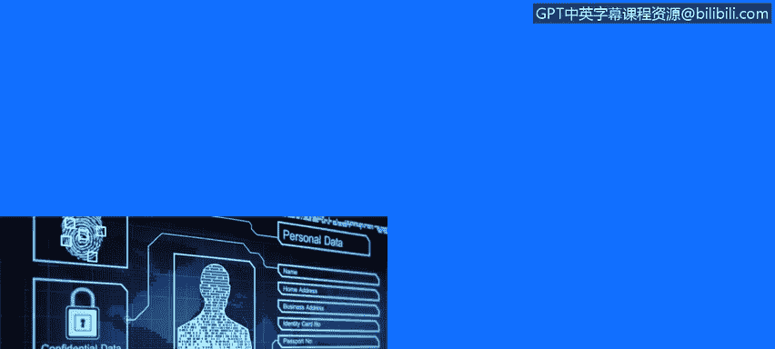
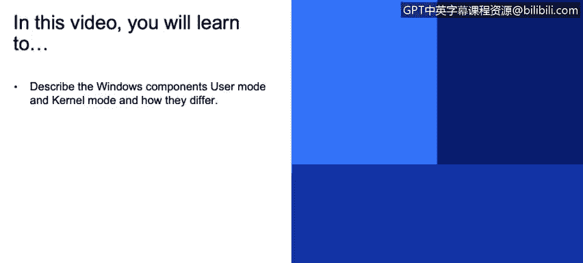
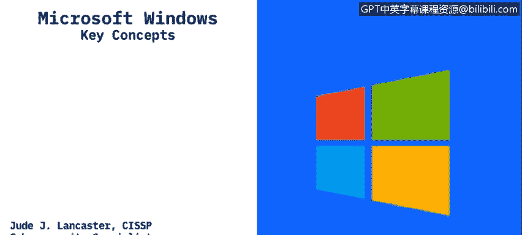
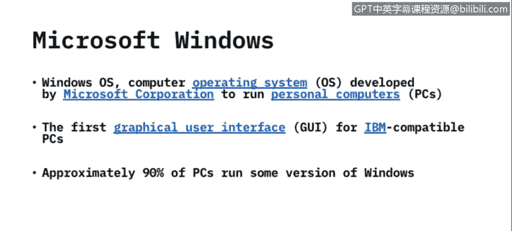
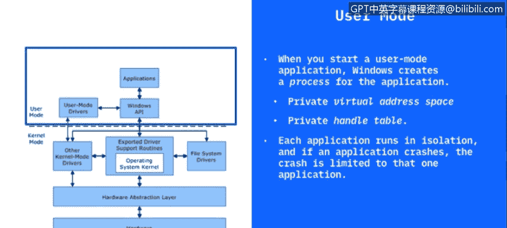
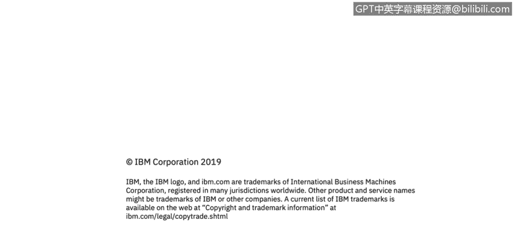

# 课程3：《网络安全合规框架与系统管理》：22：用户与内核模式 👨‍💻

在本节课中，我们将学习Microsoft Windows操作系统的两个核心组件：用户模式与内核模式，并了解它们之间的区别。

---

## Windows操作系统简介

Microsoft Windows由微软公司开发，已经存在很长时间。过去20年里，几乎所有使用过个人电脑的人都可能接触过Windows。Windows最大的优点在于，它创造了我们如今习惯使用的首个图形用户界面。用户可以使用鼠标进行点击操作，而无需输入命令。Windows专为IBM兼容的个人电脑设计。显然，Macintosh和Apple设备运行其自身的操作系统，而Windows则运行在我们称之为IBM兼容的PC上。

IBM，正如许多人所知，在80年代初制造了第一台个人电脑。全球约90%的个人电脑以及服务器都运行着某个版本的Windows。因此，这是一个我们很多人都非常熟悉的系统。

## Windows的核心组件：用户模式与内核模式

Windows操作系统主要包含两个核心组件：用户模式和内核模式。

上一节我们介绍了Windows的概况，本节中我们来看看这两个核心组件。

*   **用户模式**：这是您在使用应用程序时直接接触到的部分。当您打开Microsoft Word，或使用Chrome、Firefox等浏览器上网时，您实际上正在访问用户模式。应用程序通过驱动程序来创建您所使用的输入/输出功能。
*   **内核模式**：这是Windows内部的底层技术。它包含各种进程和线程，这些进程和线程实际控制着您在Windows用户模式下运行的应用程序。

## 深入理解用户模式

现在，让我们更详细地探讨用户模式。

当您启动一个用户模式应用程序时，Windows会为该应用程序创建一个所谓的“进程”。任何进入过任务管理器的人都可以看到，正在运行的应用程序会以进程的形式显示在任务管理器中。它会告诉您该应用程序使用了多少内存、占用了多少CPU（即您的处理器）资源。

以下是用户模式的关键特点：

*   **进程隔离**：每个应用程序启动时，都会获得一个私有的虚拟地址空间。这意味着它与环境中的其他应用程序是分隔开的。一个应用程序无法修改属于另一个应用程序的数据。
*   **独立运行**：每个应用程序都在所谓的“隔离”环境中运行。因此，如果某个应用程序崩溃，它不会导致整个操作系统宕机，而只会影响该应用程序本身。其他正在运行的程序不会受到这次崩溃的影响。

## 深入理解内核模式

理解了用户模式后，我们再来看看内核模式。

在内核模式下运行的所有内容共享一个单一的虚拟地址空间。这意味着内核模式驱动程序与其他驱动程序以及操作系统本身之间**并非**隔离的。

以下是内核模式的关键特点：

*   **共享地址空间**：由于共享地址空间，如果一个内核模式驱动程序意外地写入错误的虚拟地址或操作系统的其他部分，操作系统内的数据就可能遭到破坏。
*   **系统级影响**：如果内核模式驱动程序崩溃，将导致整个操作系统崩溃。您可能见过所谓的“蓝屏死机”，即操作系统停止运行，您必须重新启动。这通常就是由内核模式故障或内核模式中的驱动程序写入虚拟地址引发问题所导致的。

---

在本节课中，我们一起学习了Microsoft Windows操作系统的两个基本架构层级：用户模式和内核模式。我们了解到，用户模式为应用程序提供了隔离且安全的运行环境，而内核模式则作为操作系统的核心，管理所有关键资源，但其稳定性至关重要，一旦出现问题将影响整个系统。理解这两者的区别对于系统管理和故障排查至关重要。