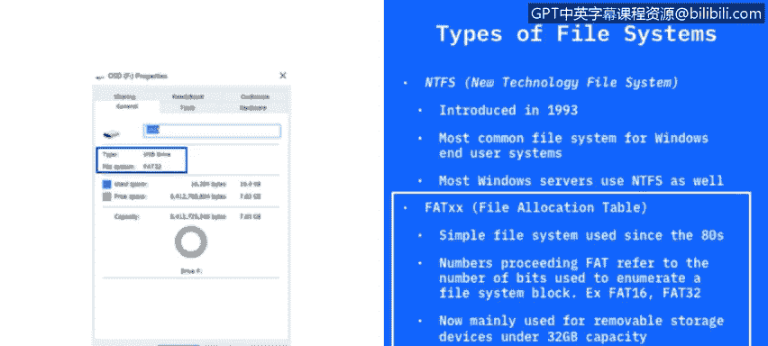
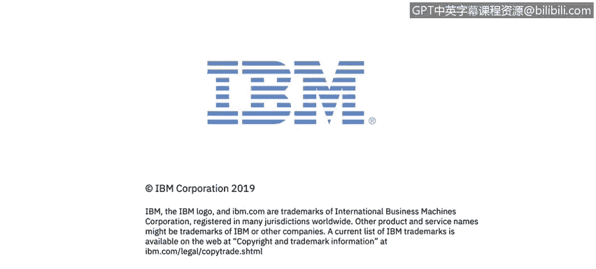

# 课程3：《网络安全合规框架与系统管理》：23：文件系统

在本节课程中，我们将学习Windows操作系统中使用的不同文件系统。文件系统是应用程序在存储设备上存储和接收文件的机制。我们将重点介绍两种主要的文件系统：NTFS和FAT，并解释它们的基本概念、结构以及应用场景。

## 文件系统基础

上一节我们介绍了文件系统的基本作用。本节中，我们来看看文件系统在Windows中的具体实现。文件系统使应用程序能够在存储设备（如硬盘）上存储和接收文件。Windows中的存储设备主要指硬盘，它可以是机械式的旋转盘片硬盘，也可以是非机械式的固态硬盘（SSD）。

文件以**分层结构**存放，即文件夹中可以包含子文件夹和文件。文件系统规定了文件的命名规则，以及在该分层或树状结构中指定文件路径的格式。

以下是关于文件和目录的核心定义：

*   **文件**：用户可访问或管理的数据单元。例如，一个图片文件（如JPEG或PNG格式）就是一个文件。每个文件在其所在目录中必须具有唯一的名称。如果你在同一个目录内复制并粘贴一个文件，系统通常会在文件名后添加数字以示区分。
*   **目录**：在Windows中通常被称为“文件夹”，是目录和文件的层次化集合。

## Windows中的主要文件系统类型

了解了基本概念后，我们来看看Windows中实际使用的几种文件系统类型。

### NTFS文件系统

**NTFS**（新技术文件系统）是当今Windows操作系统中最主流的文件系统。自1993年问世以来，它广泛应用于Windows 10、Server 2012、2016等系统。无论是终端用户的个人电脑，还是运行Windows的服务器，其硬盘大多格式化为NTFS。

### FAT文件系统

在NTFS之前，更早的文件系统是**FAT**（文件分配表）。这是一个更简单的文件系统，自20世纪80年代开始使用。FAT系统名称前的数字（如FAT16、FAT32）表示用于枚举文件系统块的**比特位数**。

如今，FAT文件系统主要用于**可移动驱动器**，例如U盘或可擦写光盘。FAT32通常用于容量小于32GB的设备。随着硬盘容量增大，NTFS应运而生，以满足更大的存储需求。因此，FAT现在主要用于较小的驱动器和可移动存储设备。

## 总结

本节课中，我们一起学习了Windows操作系统的文件系统。我们首先了解了文件系统的基础概念，包括文件和目录的定义。接着，我们重点介绍了两种主要的文件系统：**NTFS**和**FAT**。NTFS是现代Windows系统的主流选择，适用于大容量硬盘和服务器；而FAT则是一种更早、更简单的系统，如今主要用于小容量的可移动存储设备。理解这些文件系统的区别，是进行有效系统管理和安全配置的基础。