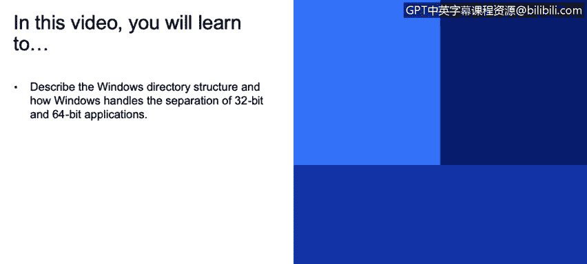
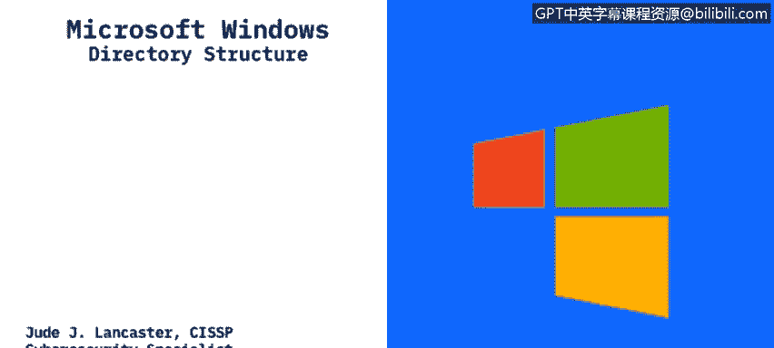
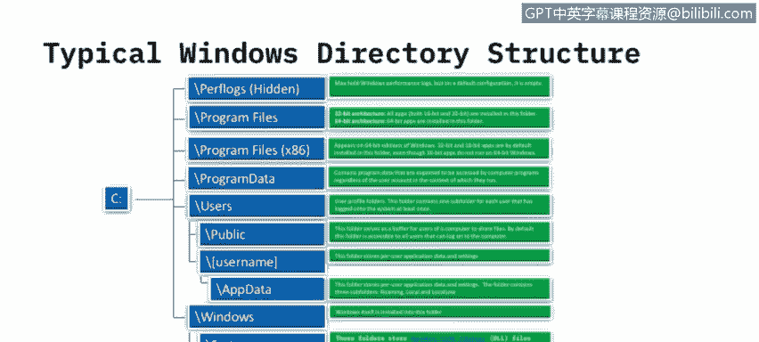

# 课程3：《网络安全合规框架与系统管理》：24：Windows目录结构 📂

在本节课中，我们将要学习Windows操作系统的目录结构，并了解Windows如何处理32位与64位应用程序的分离。

---

## 概述

理解Windows的目录结构对于系统管理和安全分析至关重要。本节将详细介绍Windows文件系统的标准布局，特别是`C:`驱动器下的核心文件夹及其功能，并解释32位与64位应用程序的存储差异。

---

## Windows目录结构详解

上一节我们介绍了操作系统的基本概念，本节中我们来看看Windows系统的具体文件组织方式。

一个典型的Windows目录结构通常以`C:`驱动器为中心。主硬盘驱动器通常被称为C盘，这是Windows系统的标准配置。在Windows 10设备上，你会看到一系列标准文件夹。

以下是`C:`驱动器根目录下常见的文件夹及其作用：

*   **隐藏文件夹**：某些文件夹默认对最终用户隐藏，例如`PerfLogs`。这个文件夹存放性能日志，但通常为空。微软隐藏这些文件夹是因为普通用户通常不需要访问它们。用户可以通过控制面板的设置来显示这些隐藏文件夹。
*   **Program Files**：这是64位应用程序的默认安装目录。
*   **Program Files (x86)**：在64位操作系统上，这是32位应用程序的默认安装目录。
*   **ProgramData**：此文件夹存放由计算机程序访问的文件，与当前登录的用户无关。这些是应用程序运行所需的核心文件，独立于任何用户。
*   **Users**：这是用户配置文件的主目录。每个在此系统上有账户的用户都会有一个以其用户名命名的子文件夹。

---

## 32位与64位系统的区别

理解了基本结构后，我们来看看一个关键概念：32位与64位系统的区别。这直接关系到`Program Files`和`Program Files (x86)`两个文件夹的存在。

操作系统从16位、32位发展到64位，主要区别在于**可寻址的内存容量**。公式可以简单表示为：
*   **32位系统**：最大寻址空间约为 **4 GB**。
*   **64位系统**：寻址空间极大，远超4GB。

随着需要更多内存的应用程序出现，操作系统升级到64位以支持更大的内存。从Windows 2000开始出现64位版本，到Windows 10时，微软已停止发布32位系统，仅提供64位版本。服务器架构也普遍采用64位。

因此，文件夹的分配规则如下：
*   在**32位操作系统**上，所有应用程序都安装在`Program Files`目录下，不存在`Program Files (x86)`文件夹。
*   在**64位操作系统**上，64位应用程序安装在`Program Files`中，而32位应用程序则安装在`Program Files (x86)`中，以实现兼容性分离。

---

## 用户目录与系统目录

接下来，我们深入查看`Users`和`Windows`这两个核心目录。

在`Users`目录下，除了每个用户的个人文件夹，还有一个`Public`文件夹，用于在多用户系统中共享文件。每个用户的文件夹内通常包含`Documents`、`Pictures`、`Music`等子文件夹。

此外，每个用户目录下还有一个`AppData`文件夹。它与`ProgramData`类似，但用于存储**特定于该用户的应用程序数据**。例如，用户在Microsoft Word中创建的自定义模板就存储在这里，从而与其他用户的配置分开。

`Windows`目录是操作系统本身的安装位置。以下是其核心子文件夹：

*   **System**：存放16位动态链接库文件。在64位Windows系统上，此文件夹通常为空，但结构仍被保留。
*   **System32**：这是关键的系统文件夹。它存放着32位或64位的DLL文件，具体取决于你的操作系统位数。当程序请求加载DLL而未指定路径时，Windows会优先在此文件夹中搜索。
*   **SysWOW64**：此文件夹**仅出现在64位版本的Windows**上，专门用于存放32位的DLL文件。它的存在使得32位应用程序能在64位系统上正常运行。

---

## 总结

本节课中我们一起学习了Windows操作系统的目录结构。我们了解了`C:`盘下的标准文件夹布局，包括`Program Files`、`Users`和`Windows`等核心目录的作用。更重要的是，我们明确了32位与64位操作系统的根本区别在于内存寻址能力，并掌握了由此产生的应用程序安装路径分离规则：在64位系统上，64位应用进入`Program Files`，32位应用则进入`Program Files (x86)`。最后，我们认识了存放系统核心文件的`System32`和`SysWOW64`目录。理解这些结构是进行有效系统管理和安全分析的基础。