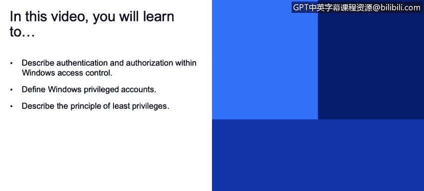
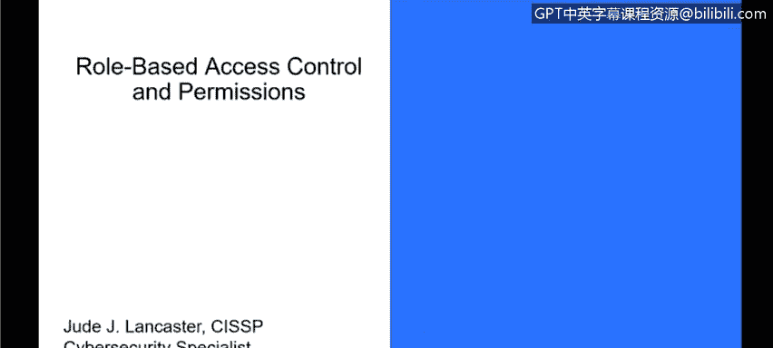
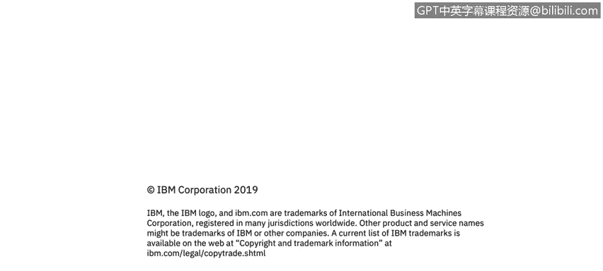

# 课程3：《网络安全合规框架与系统管理》：25：基于角色的访问控制和权限

在本节课程中，我们将学习Windows操作系统中的访问控制机制。具体内容包括：描述Windows访问控制中的身份验证与授权，定义Windows特权账户，并阐述最小权限原则。我们将重点探讨基于角色的访问控制与权限管理。

Windows主要通过身份验证和授权两种方式来实现访问控制。用户通过身份验证后，操作系统会决定该用户对系统资源拥有何种访问权限。这里的“资源”可以是系统上的文件、文件夹等任何对象。稍后我们会讨论活动目录，它将身份验证和访问控制移至服务器端，以实现对网络资源的统一管理。但目前，我们仅讨论本地访问控制。

## 用户、组与安全主体

在本地访问控制模型中，核心概念是**用户**和**组**，它们被称为**安全主体**。这里的“主体”指的是人，而非指导性原则。

这些安全主体拥有**权利**和**权限**，它们告知操作系统每个用户和组可以执行哪些操作。在访问控制模型中，用户可以是管理员，拥有几乎全部的系统访问权；也可以是访客用户，拥有受限的访问权；还可以是拥有部分访问权限的中间用户。这些权限也可以通过**组**来管理。例如，“管理员”组可以包含多个成员，他们登录系统时都享有该组的权限。

安全主体（即用户）对**对象**执行操作，例如保存文件、创建文件或删除文件夹中的内容。Windows操作系统的访问控制和安全性正是用来规定这些行为的。

## 访问控制列表

被多个安全主体或用户共享的资源，使用**访问控制列表**来分配权限。ACL通过几种方式强制执行访问控制：

*   拒绝未授权用户和组的访问。例如，如果一个文件夹仅对“管理员”组可用，则只有该组成员能访问和操作它，其他系统用户则无法访问。
*   为授权用户设置访问限制。这意味着可以精确控制任何用户或组在系统内的权限，包括他们的登录时间、登录后可见内容等。所有这些都基于操作系统内设置的权限进行控制。

## 特权账户与最小权限原则

接下来我们讨论特权账户。**特权账户**是指那些直接或间接拥有访问IT组织内所有资产权限的账户。如前所述，活动目录可以在管理层面集中控制所有登录网络的机器和用户，同时也能设置仅管理其自身系统的管理员。

管理员配置Windows操作系统，以管理多个角色和用途的访问控制。我们遵循**最小权限原则**。根据维基百科的定义，该原则是指仅授予用户账户或进程执行其预期功能所必需的权限。

这在安全领域至关重要。IT安全的一个核心概念就是访问控制，确保只有需要访问特权信息（如人力资源记录、客户数据等，具体取决于所在行业）的人员才能访问这些数据。这一点非常重要，因为随着用户隐私法的出台，以及像HIPAA和欧洲的GDPR这样的法规，确保只有特定数据的必要使用者才能查看数据变得极为关键。

此外，最小权限原则还能提供更好的系统稳定性。你不仅保护了数据，还通过禁止用户访问他们不需要的功能（如安装应用程序、安装驱动程序等可能危害系统或环境的行为），使操作系统和硬件本身更加安全。这带来了更好的系统安全性。

同时，这也使得部署更加容易，为环境节省了时间和金钱。因为环境中没有大量的差异配置，并非每个人都能在自己的系统上随意操作。一切从一个中心位置进行控制，从管理角度提供了更强的控制力，从而实现了我们谈到的三点：更好的系统稳定性、更好的系统安全性以及更便捷的部署。

## 访问控制的四个核心概念

谈到访问控制，主要涉及四个核心概念：

*   **权限**：决定谁可以访问资源以及可以执行何种操作。
*   **对象所有权**：每个对象（如文件、文件夹）都有一个所有者，所有者通常可以更改该对象的权限。
*   **权限继承**：子对象（如子文件夹中的文件）可以从其父对象（如父文件夹）自动继承权限设置。
*   **用户权利**：与权限不同，权利是授予用户账户的、影响整个计算机系统的特权，例如“关闭系统”或“更改系统时间”的权利。
*   **对象审计**：跟踪和记录对对象的访问尝试，特别是失败的访问尝试，用于安全监控和事件调查。

## 总结

本节课我们一起学习了Windows中的基于角色的访问控制和权限管理。我们了解了身份验证与授权的区别，认识了用户、组和安全主体的概念，并探讨了访问控制列表如何工作。我们重点强调了特权账户的管理和至关重要的最小权限原则，该原则有助于保护数据、提升系统安全性与稳定性。最后，我们概述了访问控制的四个核心组成部分：权限、所有权、继承和审计，为深入理解系统安全管理奠定了基础。