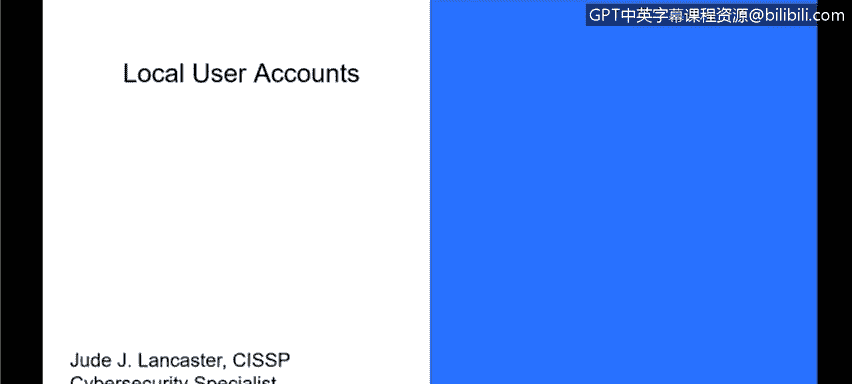
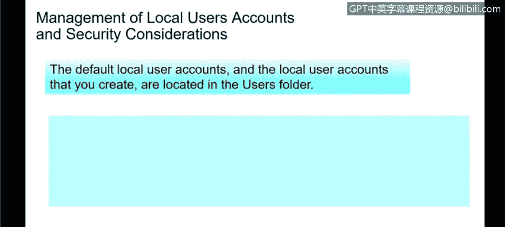
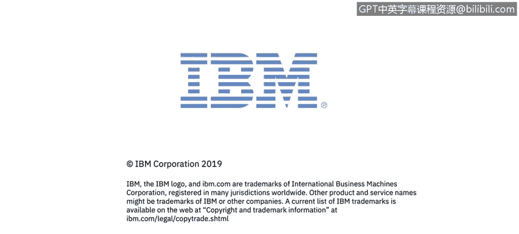

# 课程3：《网络安全合规框架与系统管理》：26：本地用户帐户

在本节课程中，我们将学习Windows操作系统中的本地用户帐户。我们将定义本地用户，并探讨在管理这些帐户时需要考虑的安全因素。

## 什么是本地用户帐户？👤

上一节我们介绍了用户帐户的基本概念，本节中我们来看看一种特定类型的帐户——本地用户帐户。

本地用户帐户是指存储在Windows工作站或服务器本地的帐户。使用此类帐户登录的用户，其身份验证和权限管理完全由本地计算机处理。这类帐户主要用于访问该特定PC上的本地资源，例如个人文件或安装的应用程序，而未必能用于访问网络资源。

可以将此想象为您家中仅连接互联网、未接入公司网络的个人电脑。您只能使用这台电脑上的本地资源。

## 默认的本地用户帐户

Windows系统在安装时会自动创建几个默认的本地用户帐户。这些帐户主要可以分为两类：默认本地用户帐户和本地系统帐户。

以下是默认创建的几个主要本地用户帐户：

*   **管理员帐户**：此帐户拥有对本地环境中所有资源的完全访问权限。
*   **来宾帐户**：这是一个权限受限的帐户，通常供临时用户使用。
*   **帮助助手帐户** 与 **默认帐户**：这些是Windows自动创建的帐户，但实际使用频率很低。

在大多数情况下，登录系统的用户要么属于管理员帐户，要么属于来宾帐户。默认情况下，用户通常会以管理员身份登录自己的本地系统，以便安装应用程序和完全控制系统。

## 本地系统帐户

除了上述可见的用户帐户外，Windows还会在后台创建一些用于系统操作的本地系统帐户。这些帐户对用户不可见，也无法像普通用户一样登录。

以下是几个关键的本地系统帐户：

*   **系统帐户**：用于在无需用户登录的情况下运行系统服务和计划任务。
*   **网络服务帐户**：允许服务以计算机身份访问网络资源。
*   **本地服务帐户**：一种权限受限的本地帐户，用于运行不需要网络访问的服务。

这些帐户在后台运行，是Windows系统正常功能的一部分，不属于常规的用户管理范畴。

## 本地用户帐户的安全考量🔒

在管理本地系统（非Active Directory域环境）时，必须考虑本地用户帐户的安全问题。所有本地用户的数据默认存储在 `C:\Users` 目录下。

为确保安全，请遵循以下最佳实践：

*   **限制和保护管理员权限**：严格控制拥有本地管理员权限的帐户数量。
*   **实施用户文件夹访问控制**：确保在多用户系统中，每个用户只能访问自己的用户文件夹，无法查看他人文件。这可以通过设置正确的文件系统权限来实现。
*   **强制执行密码策略**：为具有管理员权限的本地帐户设置复杂且唯一的密码。这包括密码长度、复杂性（如包含大小写字母、数字和符号）以及定期更换的要求。
*   **限制远程访问**：对于纯粹的本地系统，应关闭或严格控制远程访问功能（如远程桌面），防止他人远程入侵您的设备。
*   **拒绝本地管理员帐户的网络登录**：在企业或国家网络环境中，本地管理员帐户不应被允许用于访问网络资源。网络资源的访问权限应由目录服务（如我们稍后将讨论的Active Directory）统一控制。

遵循这些措施能有效提升本地系统的安全性。

## 总结

本节课中我们一起学习了Windows本地用户帐户。我们明确了本地用户帐户的定义，了解了系统默认创建的各类帐户（包括用户帐户和系统帐户），并重点讨论了管理本地用户帐户时必须考虑的关键安全措施，例如权限控制、密码策略和访问限制。理解这些内容是进行有效系统管理和维护网络安全的基础。