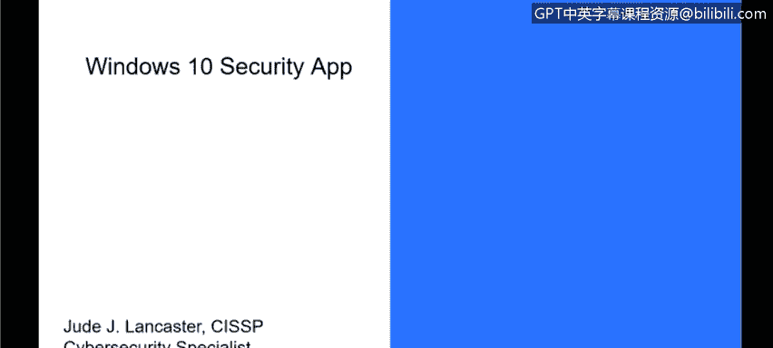
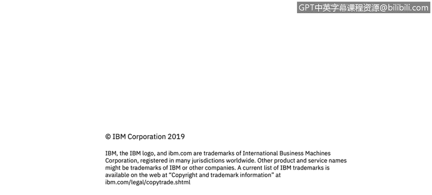

# 课程3：《网络安全合规框架与系统管理》：27：Windows 10安全应用 🛡️

在本节课中，我们将学习Windows 10操作系统内置的安全应用。这个应用集成了多种安全功能，为个人用户和企业环境提供了全面的保护。我们将逐一了解其主要组成部分及其作用。

## 概述

Windows 10是目前大多数组织使用的主流操作系统。虽然Windows 7仍有使用，但许多组织已升级至Windows 10。微软已将Windows 10确立为未来的核心操作系统，并通过定期发布新版本（称为“构建版本”）进行持续更新。本节课重点介绍自构建版本1703起引入的“Windows安全”应用。

## Windows安全应用的核心功能

Windows安全应用整合了过去需要第三方软件来实现的多种安全功能。以下是其主要组成部分：

上一节我们介绍了Windows安全应用的背景，本节中我们来看看它的具体功能模块。

### 1. 病毒和威胁防护
这是该应用的核心防病毒组件。许多组织正从McAfee、赛门铁克等第三方服务转向使用Windows内置的防病毒功能。它包含**Windows Defender防病毒软件**和**Windows Defender Exploit Guard**，能有效防护恶意软件和漏洞攻击。

### 2. 账户保护
此功能增强了登录安全性。以下是其主要特性：
*   允许设置PIN码代替传统密码。
*   支持与指纹读取器等硬件设备集成，实现生物识别登录。

### 3. 防火墙和网络保护
此模块负责管理本地计算机的防火墙设置，控制网络入站和出站连接，是抵御网络攻击的重要屏障。

### 4. 应用和浏览器控制
此功能通过**Microsoft Defender SmartScreen**等技术提供额外保护层。其作用包括：
*   阻止安装未经微软验证或批准的应用程序。
*   确保尝试安装的软件来自已知的发布者或开发者。

### 5. 设备性能和运行状况
此部分提供系统维护信息，旨在提升系统的可用性和稳定性。其监控内容包括：
*   驱动程序状态。
*   存储空间。
*   Windows更新问题。

### 6. 家庭选项
针对家庭用户，此功能提供了家长控制工具，允许父母：
*   控制孩子可以在电脑上访问的内容。
*   更好地了解和监管孩子在家庭电脑上的活动。

## 总结

本节课我们一起学习了Windows 10内置的“Windows安全”应用。我们了解到，它将病毒防护、账户保护、防火墙、应用控制、设备健康监控以及家庭选项等多种安全功能集成于一个统一的界面中。对于从个人用户到企业组织的广泛场景，该应用都提供了一套基础且有效的安全解决方案，减少了对多个独立第三方安全软件的依赖。理解这些内置工具是管理和维护Windows 10系统安全的重要一步。