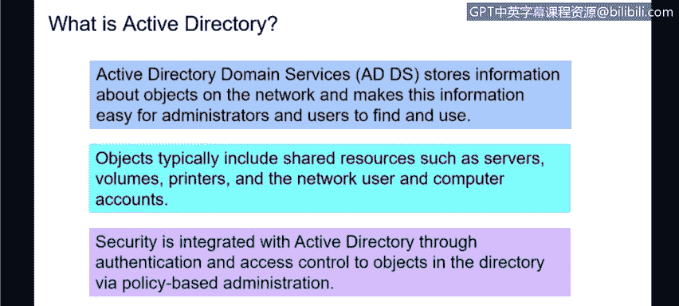

# 课程3：《网络安全合规框架与系统管理》：28：Active Directory的功能 🔐

在本节课中，我们将学习如何描述Active Directory。Active Directory是大多数企业用于管理网络用户、权限和资源的核心目录服务系统。

---

上一节我们介绍了目录服务的基本概念，本节中我们来看看Active Directory的具体功能。

Active Directory，简称AD，是一个存储网络对象信息的系统。它使管理员和用户能够轻松查找和使用这些信息。AD控制着诸如网络文件夹、网络打印机等用户工作所需的各种资源，并存储这些资源的信息及其访问权限。

目前，许多组织，包括IBM，正从本地部署的物理服务器转向基于云的目录服务，即Azure Active Directory。这是一种由微软提供的云目录服务。例如，当用户登录笔记本电脑时，实际上是登录到位于微软云上的Active Directory。权限则由管理员通过云端的AD控制台进行设置。这种模式更为便捷。

以下是Active Directory中包含的主要对象类型：
*   **服务器**
*   **卷**（驱动器或文件夹）
*   **打印机**
*   **网络和计算机账户**

Active Directory能够同时控制用户账户和计算机账户。这意味着，即使用户拥有有效的AD账户，如果其登录的计算机未在AD中注册，用户也将无法登录。反之亦然，如果计算机在AD中注册，但没有对应的用户账户，同样无法完成登录。

Active Directory的一个优势是其集成的安全性。当用户输入密码或使用指纹时，实际上是在访问Active Directory。AD会告知用户正在登录的设备（如笔记本电脑），该用户可以访问哪些资源。

以下是Active Directory的一些关键特性：
*   **规则与架构**：AD本质上是一套规则或架构，由AD管理员控制，用于定义用户和组的访问权限。它包含数百种设置，可对用户在AD环境中的行为进行精细控制。
*   **安全策略管理**：它控制着密码策略、密码复杂度等所有与安全相关的设置。
*   **全局目录**：用户可以通过全局目录查看自己有权访问的资源，如其他用户、计算机、服务器和打印机。
*   **查询机制**：用户可以搜索AD，以查找所需的服务器、打印机等资源。
*   **复制服务**：对于大型AD或需要灾难恢复的环境，AD可以将数据复制到多个服务器上。这些服务器可以地理分布，以分担负载并提高可用性。

正如之前提到的，随着许多组织转向基于云的Azure AD，由微软在后台处理高可用性和冗余，对本地复制的需求正在减少。

---

本节课中我们一起学习了Active Directory的核心功能。我们了解到AD是一个管理网络对象和权限的目录服务，它包含用户、计算机、服务器等多种对象，并通过集成的安全机制、全局目录和复制服务等特性，为企业网络提供集中化的管理和控制。