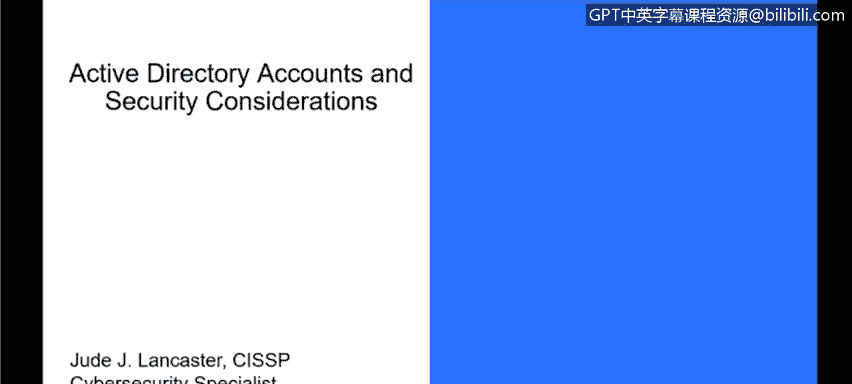
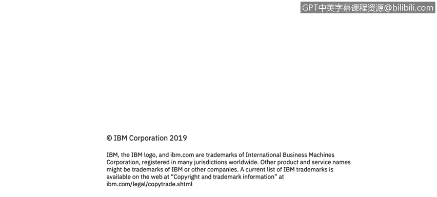

# 课程3：《网络安全合规框架与系统管理》：29：Active Directory账户与安全注意事项 🔐

在本节课程中，我们将学习Active Directory中的账户类型，并探讨保护这些账户，特别是高权限域账户的安全注意事项。理解这些概念对于构建安全的网络环境至关重要。

---

## Active Directory账户类型

上一节我们介绍了本地账户，本节中我们来看看Active Directory中的账户类型。Active Directory账户与本地账户类似，但由域集中管理。

以下是几种主要的Active Directory账户类型：

*   **管理员账户**：此账户控制对环境中资源的访问权限，类似于本地管理员账户。
*   **来宾账户**：此账户为临时或低权限访问提供途径，类似于本地来宾账户。
*   **帮助助手账户**：当用户需要远程协助其PC时，可能会登录此账户。
*   **KRB TGT账户**：这是一个系统账户，并非供最终用户登录使用，主要在环境内部用于特定系统功能。

此外，Active Directory允许在域内管理本地账户设置。当管理员通过Active Directory为用户分配PC时，该PC默认的本地账户将由Active Directory集中管理。这意味着，即使我是域用户，我可能对自己机器也没有管理员权限，因为这一切都通过Active Directory为我的本地机器进行控制。实际上，一旦PC加入域，大多数最终用户都没有对其PC的完全控制权，这是为了防止他们执行可能危害环境的操作。管理员可以从Active Directory远程管理这些默认本地账户，例如禁用来宾账户或在系统上添加新账户。

Active Directory账户还用于管理域控制器。显然，这需要由AD管理员来执行，他们负责控制登录凭据和用户的系统登录方式。

---

## 保护域账户：账户分离

接下来，我们讨论如何保护域账户。域账户是指可以访问网络资源的账户。首要的安全措施是将管理员账户与普通用户账户分离。

在大多数情况下，用户应以标准用户身份登录，而非使用特权账户。特权账户是指管理员账户或具有不同管理级别的账户。即使某人属于管理员组，其在该组内也可能拥有不同的管理级别。

以下是关于创建和管理管理员账户的建议层级：

*   **最低要求**：为需要访问AD中系统和资源的**域管理员**、**企业管理员**或其他管理员角色创建独立的账户。这是最基本的要求。
*   **更好做法**：为管理员创建权限更受限制的独立账户。例如，一个管理员可能只能访问特定的工作站或环境中的特定资源，而非所有资源。这通常通过**组织单元**来实现。您可以将OU视为一个部门（这是一种简化理解）。例如，您可以有市场部OU、销售部OU。通过限制管理员只能访问特定OU，而非所有OU，可以更好地保护环境。
*   **理想做法**：从安全角度出发，理想情况是让拥有多项职责的管理员使用多个独立的账户。例如，一个管理员可能有一个账户用于访问某类资源，另一个账户用于访问其他资源。这可以保护环境并提高安全性。这些不同的账户在环境中将具有不同的**信任级别**。

当然，环境中还存在大量的**标准用户账户**。这些账户用于日常业务，如收发电子邮件、网页浏览和使用特定的业务线应用程序（如HR系统）。他们可以访问授权应用，但通常无法控制自己PC上的设置。

---

## 保护域账户：限制管理工作站

另一种保护域账户和限制其访问的方法是，创建没有互联网和电子邮件访问权限的工作站主机。

这适用于那些需要从特定工作站执行管理职责，但可能无法物理接触服务器的人员。为了保护服务器，可以设置一个终端或PC，该设备只能访问网络上的特定服务器，而无法访问整个互联网。这样，即使管理员在浏览网站时不慎感染恶意软件，也无法意外地将威胁传播到这些服务器，从而保护了关键的AD资源。

以下是关于配置管理工作站的建议层级：

*   **最低要求**：构建没有互联网访问权限（包括网页浏览和电子邮件）的管理工作站。
*   **更好做法**：确保这些系统上的管理员**不能**成为本地管理员组的成员。这样，他们可以管理目标服务器，但无法更改他们正在登录的本地系统的设置以绕过限制。因为一旦成为本地系统的管理员，就拥有完全控制权并可以更改设置。
*   **理想做法**：理想情况下，可以限制工作站除了连接到管理员用于管理的服务器和域控制器之外，没有任何其他网络连接。

在实际操作中，很少有组织能做到“更好”或“理想”的级别。大多数组织允许管理员从自己的本地系统登录，并信任这些环境管理者不会做出危及环境的愚蠢行为。然而，上述建议是良好的安全实践，在政府或其他需要高级别安全性的行业中尤其值得考虑。

---

## 保护域账户：限制管理员登录

保护敏感域账户的下一步是限制管理员对服务器的登录访问。

具体而言，即限制管理员使用其管理员账户登录到**低信任度**的服务器和工作站。举例来说，如果我是域管理员，我不会用我的域管理员账户登录本地电脑来查收邮件、浏览网页或撰写简历。这就是之前提到的拥有多个账户的最佳实践：用户拥有标准用户账户和域管理员账户。上班时，我使用标准用户账户登录；只有当我需要执行管理任务时，例如登录域控制器或服务器进行维护，我才会使用域管理员凭据。

以下是限制管理员登录的指导原则：

*   **最低要求**：限制域管理员访问不在特定Active Directory控制下的**组织单元**中的服务器和工作站。这提供了一层保护。
*   **更好做法**：限制域管理员登录到**非域控制器**的服务器和工作站。这样，AD管理员或域管理员将无法登录不属于域的部分，提供更多保护。
*   **理想做法**：对于服务器管理员，不允许他们登录到特定的工作站。例如，如果我是Windows服务器管理员，组织除了我自己的工作站外，不希望我能够登录其他工作站。而我登录自己的工作站仅是为了处理日常工作。这是域账户的理想安全状态。

---

## 保护域账户：禁用账户委派

我们要讨论的第四项保护敏感域账户的措施是，**禁用管理员账户的账户委派权限**。

在Active Directory中，用户账户可以被设置为“信任委派”，这意味着一个账户可以委派另一个账户执行某些操作。这实质上赋予了模仿通过身份验证访问网络其他资源的账户的能力。为了避免这种风险，您可以在Active Directory中将敏感账户配置为**不可委派**。这意味着该账户不能被委派给其他账户使用，必须通过该账户本身登录才能执行操作。这可以防止潜在的账户冒充行为引发安全问题。

您只需要对敏感资源执行此操作，例如域控制器以及任何您认为敏感、需要关闭委派的服务器。对于普通用户需要登录的服务器，保持委派开启即可。

---

## 课程总结

本节课中，我们一起学习了Active Directory的核心账户类型，并深入探讨了保护域账户，尤其是高权限账户的多层安全策略。我们了解到，通过**账户分离**、**限制管理工作站**的访问、**约束管理员登录**范围以及**禁用敏感账户的委派**，可以显著提升Active Directory环境的安全性。这些实践是构建健壮网络安全防御体系的基础。