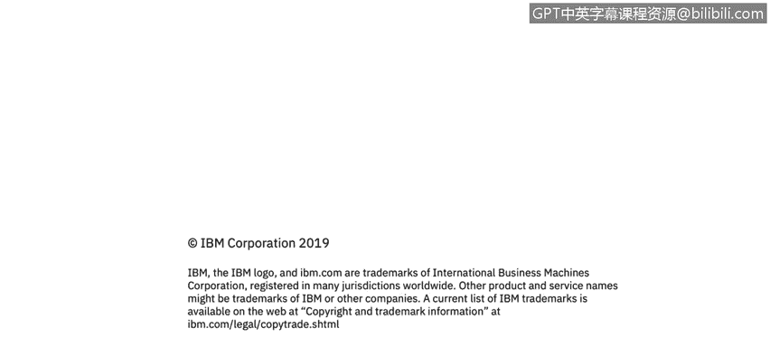

# 课程3：《网络安全合规框架与系统管理》：30：Windows管理中心概述 🖥️

在本节课程中，我们将学习Windows管理中心的基础知识，并了解如何使用Active Directory组来管理账户和服务器。我们将首先介绍Active Directory中的两种组类型，然后详细探讨Windows管理中心的功能和用途。

---

上一节我们介绍了网络安全合规的基本框架，本节中我们来看看Windows环境下的具体管理工具。首先，我们需要理解Active Directory中用于组织和管理用户的核心概念——组。

在Active Directory中，管理职责主要分为两类：**服务管理员**和**数据管理员**。服务管理员负责管理环境中的访问权限和设备操作权限，例如用户能访问什么资源或在设备上执行什么操作。数据管理员则负责管理对环境中数据的访问权限，例如客户记录、员工档案或其他普通终端用户无需访问的敏感信息。

为了管理这些职责，Active Directory使用两种类型的组：
*   **通讯组**：用于创建电子邮件分发列表。
*   **安全组**：用于为共享资源分配权限。

组织中的每个人通常都属于某个通讯组，因为大多数组织通过Active Directory来控制电子邮件分发。当你登录到域中的计算机时，系统会识别你的Active Directory账户，并据此将电子邮件（例如通过Microsoft Outlook）投递给你。

安全组则用于控制对共享资源的访问。如果我属于某个安全组，就意味着我拥有访问该组内特定共享资源（如文件服务器、特定打印机等）的权限。实际分配权限的是Active Directory管理员，但安全组是权限控制的载体。

---

接下来，我们讨论这些组的“作用域”。在Active Directory中创建的每个组都有一个作用域，它定义了该组在域中的有效范围及其能执行的操作。

Active Directory定义了三种作用域：
*   **通用**
*   **全局**
*   **域本地**

对于大多数用户而言，无需深入了解这些作用域的细节。但需要知道的是，当首次创建Active Directory域时，系统会预定义一些默认组（如“域管理员”组）。这些预定义的安全组有助于控制对共享资源的访问以及域范围内的特定管理权限。

---

在了解了Active Directory组的基本概念后，我们来看看用于管理这些服务器和资源的核心工具——Windows管理中心。

Windows管理中心是随Windows Server 2016引入的一款基于浏览器的管理工具。它为你提供了对服务器基础设施各个方面的完全控制。该工具在管理私有网络中的服务器时尤其有用，因为这些服务器虽然连接到你的域，但可能并未接入互联网。许多组织出于安全考虑，不会将服务器直接连接到互联网。

Windows管理中心允许你远程管理这些服务器，即使它们没有互联网连接。这是在Active Directory环境中，组织管理Windows服务器的主要方式之一（当然，也可能辅以其他工具）。

---

**总结**

本节课中我们一起学习了：
1.  Active Directory中的两种管理职责：**服务管理员**与**数据管理员**。
2.  Active Directory中的两种组类型：用于邮件分发的**通讯组**和用于权限管理的**安全组**。
3.  组的作用域概念（通用、全局、域本地）及其预定义默认组的作用。
4.  **Windows管理中心**作为一个基于浏览器的强大工具，用于全面管理Windows服务器，特别是在未连接互联网的私有网络环境中。

通过掌握这些概念和工具，你将能够更有效地在Windows和Active Directory环境中执行系统管理和安全控制任务。